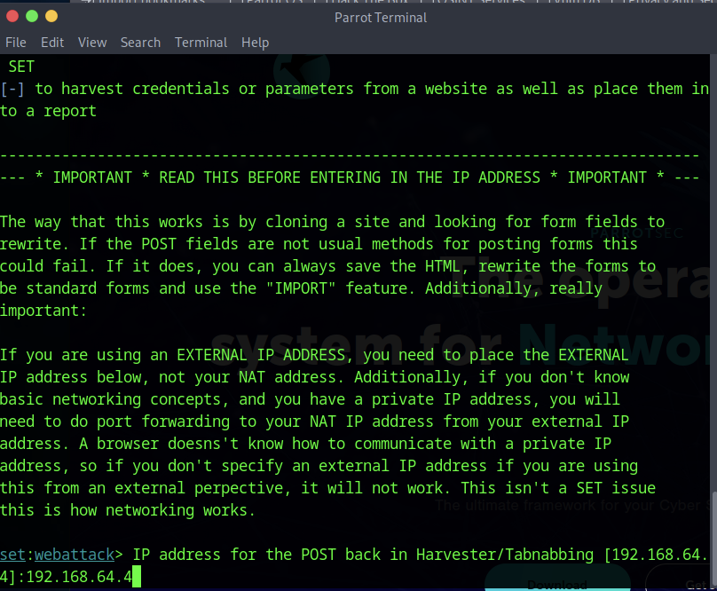
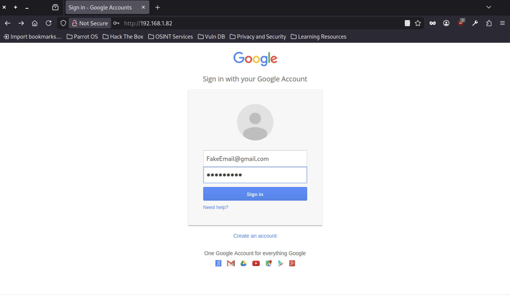
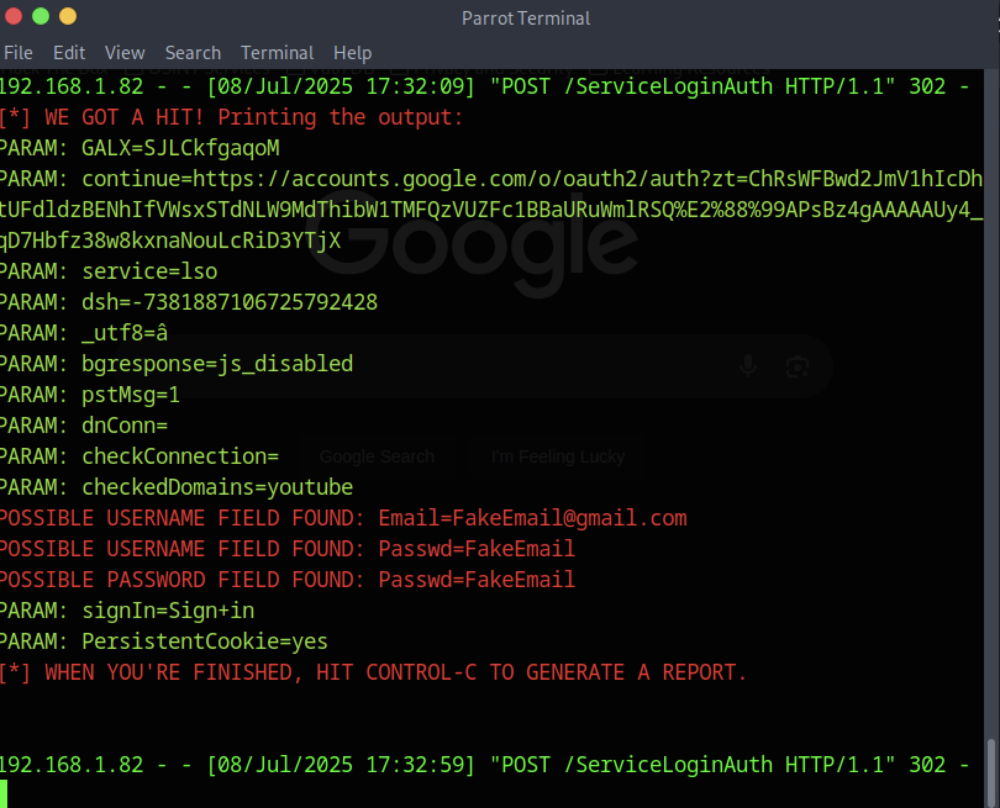
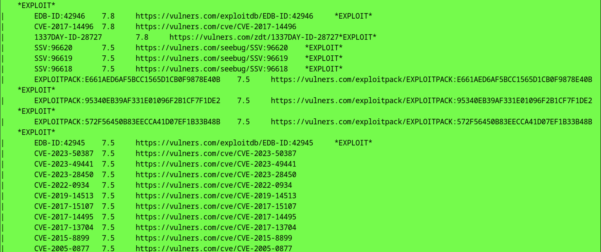
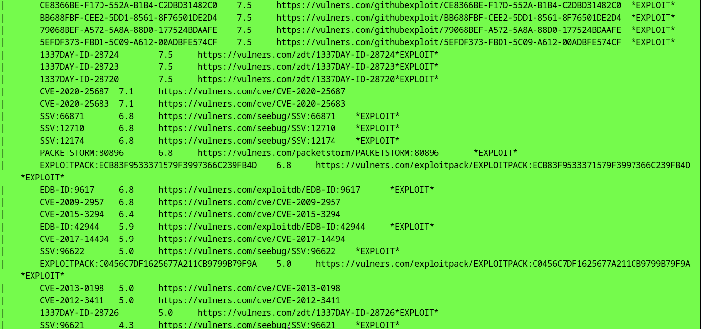
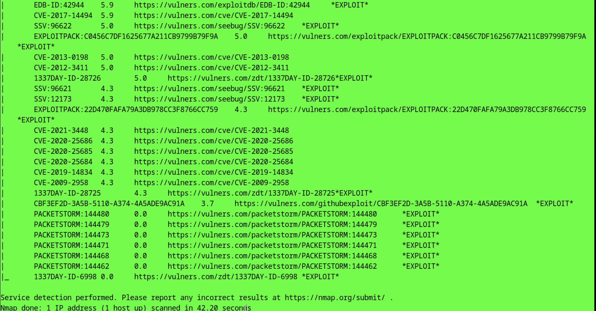

# Cyber Threats and Vulnerabilities 1

# ✅ Criteria Breakdown & Deliverables

## 🔍 1. Identify and Analyze Cyber Threats

- [X] **Malware Analysis**
  - [x] Analyze a malware sample using:
    - VirusTotal **or** Any.Run / Hybrid Analysis
  - [X] Document:
    - [x] Detection results  
    - [x] Behavioral indicators  
    - [x] Potential impact  

- [X] **Phishing Simulation**
  - [x] Create 1 phishing template using Social Engineering Toolkit (SET)
  - [X] Environment: Kali Linux or Parrot OS

- [X] **APT Campaign Mapping**
  - [X] Map 1 real-world APT campaign to MITRE ATT&CK framework

#### StealC Malware Samples
https://bazaar.abuse.ch/sample/8301936f439f43579cffe98e11e3224051e2fb890ffe9df680bbbd8db0729387/

#### Virus Total Analysis
https://www.virustotal.com/gui/file/8301936f439f43579cffe98e11e3224051e2fb890ffe9df680bbbd8db0729387

#### Cape Sandbox Behavior Analysis
https://www.capesandbox.com/analysis/13533/

#### Comprehensive Malware Analysis Report

**File SHA-256:** `8301936f439f43579cffe98e11e3224051e2fb890ffe9df680bbbd8db0729387`

---

### Detection Results

#### VirusTotal

- **Detection Rate:** 10 / 70 antivirus engines flagged the file.
- **Notable Detections:**
  - `Trojan:Win32/Emotet`
  - `Trojan.GenericKD.48805871`
  - `W32/Emotet.B.gen!Eldorado`

> These detections suggest association with the Emotet malware family, known for distributing other malware and spam campaigns.

---

### Behavioral Indicators

#### VirusTotal

- **Network Activity:** Attempts to establish connections with remote servers, often for command and control purposes.
- **Persistence Mechanisms:** Modifies system settings to ensure it remains active after system reboots.
- **Payload Delivery:** Downloads and executes additional malicious payloads, such as ransomware or information stealers.
- **Email Propagation:** Spreads via malicious email attachments or links, often masquerading as legitimate documents.

#### CAPE Sandbox

- **Execution Behavior:** The file was executed in a controlled environment to observe its behavior.
- **Network Activity:** Established connections to external servers, indicating potential command and control communication.
- **File System Changes:** Created or modified files in system directories, suggesting attempts to maintain persistence.
- **Registry Modifications:** Altered registry keys to ensure execution on system startup.

> These behaviors align with typical characteristics of the Emotet malware family.

---

#### Potential Impact

- **Data Theft:** Harvests sensitive information, including login credentials and personal data.
- **System Compromise:** Creates backdoors, allowing attackers to gain unauthorized access to the infected system.
- **Lateral Movement:** Once inside a network, Emotet can spread to other systems, increasing the scope of the attack.
- **Financial Loss:** Facilitates the delivery of other malicious payloads, leading to significant financial losses through fraud or data breaches.

---

#### Recommendations

- **Immediate Action:** If this file is detected on your system, isolate the affected machine to prevent further spread.
- **Antivirus Scan:** Run a full system scan using reputable antivirus software to detect and remove any associated threats.
- **Update Systems:** Ensure that all software, including the operating system and applications, are up to date with the latest security patches.
- **Monitor Network Traffic:** Look for unusual outbound connections that may indicate communication with malicious servers.
- **User Awareness:** Educate users about the dangers of opening unsolicited email attachments or clicking on unknown links.

---

#### **Phishing Simulation**

Using the Social Engineering Toolkit we can simulate a phishing attack

We would type sudo su in terminal and then setoolkit 

-> 1) Social-Engineering Attacks 
-> 2) Website Attack Vectors 
-> 3) Credential Harvester Exploit Method
-> 1) Web Templetes
-> set:webattack : (Input our IP Address)

-> 2) Google

#### APT Campaign Mapping*

🎯 1. MintsLoader

A cybercriminal loader-as-a-service group that distributes payloads via compromised websites, typosquatted domains, malicious ads, and phishing-like campaigns.
Notably, they've deployed StealC as part of their malware payloads in PPI (pay‑per‑install) schemes 
misp-galaxy.org

🎯 2. “Tusk” (Russian-speaking cybercriminal cluster)

This group operates a multifaceted info‑stealer campaign using social-engineered phishing sites impersonating brands, game launchers, etc.
Its multi‑stage downloader infrastructure has delivered StealC alongside other stealers like DanaBot 

Initial Access → Phishing (T1566)
Execution and Persistence → Fileless loaders
Credential Access → StealC behavior

Map their techniques using ATT&CK TIDs:
T1566 – Phishing
T1204 – User Execution
T1003 – Credential Access
T1071/T1041 – C2 & Exfiltration

## 🛠️ 2. Apply Vulnerability Assessment Techniques

- [x] **Vulnerability Scan**
  - [x] Conduct scan using Nmap or OpenVAS
  - [x] Document:
    - [x] Scan configuration
    - [x] Summary of findings
    - [x] Vulnerability classification

- [x] **Asset Discovery**
  - [x] Perform asset discovery scan
  - [x] Document:
    - [x] Discovered systems and services
    - [x] Critical asset identification
    - [x] Basic network mapping

- [x] **Documentation**
  - [x] Explain methodology used
  - [x] Describe potential security implications

### **Vulnerability Scan**

In ParrotOS Terminal `nmap -sC -sV 192.168.1.82`

In ParrotOS Terminal `nmap -sC -sV --script vuln 192.168.1.82`

### ✅ Vulnerability Scan Summary

#### Target: `192.168.1.82`
- **Service Detected:** DNS (`port 53`) running `dnsmasq 2.90`
- **Status:** Open
- **Vulnerability Findings:**
  - Multiple known CVEs:
    - `CVE-2017-14491` – Remote Code Execution via crafted DNS requests
    - `CVE-2017-14493`, `CVE-2020-25682`, `CVE-2020-25683`, `CVE-2020-25684`, etc.
  - High severity vulnerabilities with CVSS scores between **7.5 and 10.0**
  - Public exploits available on:
    - ExploitDB
    - GitHub
    - PacketStorm
    - Vulners

#### 🗂 Vulnerability Classification

| CVE / ID                      | CVSS Score | Description                                          | Exploit Available | Reference URL |
|------------------------------|------------|------------------------------------------------------|-------------------|----------------|
| CVE-2017-14491               | 9.8        | RCE via crafted DNS request                          | ✅                | https://vulners.com/cve/CVE-2017-14491 |
| CVE-2017-14493               | 9.8        | DoS via malformed DNS                                | ✅                | https://vulners.com/cve/CVE-2017-14493 |
| CVE-2017-14492               | 9.8        | Heap-based buffer overflow                           | ✅                | https://vulners.com/cve/CVE-2017-14492 |
| CVE-2020-25682               | 8.3        | Buffer overflow in DNS query                         | ✅                | https://vulners.com/cve/CVE-2020-25682 |
| CVE-2020-25683               | 8.1        | Integer underflow                                    | ✅                | https://vulners.com/cve/CVE-2020-25683 |
| CVE-2020-25684               | 8.1        | Use-after-free vulnerability                         | ✅                | https://vulners.com/cve/CVE-2020-25684 |
| CVE-2023-50387               | 7.5        | Response validation bypass                           | ✅                | https://vulners.com/cve/CVE-2023-50387 |
| CVE-2023-49441               | 7.5        | DNS rebinding via cache mismanagement                | ✅                | https://vulners.com/cve/CVE-2023-49441 |
| CVE-2023-28450               | 7.5        | Heap corruption vulnerability                        | ✅                | https://vulners.com/cve/CVE-2023-28450 |
| CVE-2022-0934               | 7.5        | DNS packet parsing flaw                              | ✅                | https://vulners.com/cve/CVE-2022-0934 |
| CVE-2019-14513              | 7.5        | Buffer write overflow                                | ✅                | https://vulners.com/cve/CVE-2019-14513 |
| CVE-2017-15107              | 7.5        | Malformed query crash                                | ✅                | https://vulners.com/cve/CVE-2017-15107 |
| CVE-2017-14495              | 7.5        | Memory disclosure vulnerability                      | ✅                | https://vulners.com/cve/CVE-2017-14495 |
| CVE-2017-13704              | 7.5        | Invalid packet crash                                 | ✅                | https://vulners.com/cve/CVE-2017-13704 |
| CVE-2015-8899               | 7.5        | Memory corruption flaw                               | ✅                | https://vulners.com/cve/CVE-2015-8899 |
| CVE-2005-0877               | 7.5        | Old dnsmasq overflow                                 | ✅                | https://vulners.com/cve/CVE-2005-0877 |
| CVE-2017-14496              | 7.8        | NULL pointer dereference                             | ✅                | https://vulners.com/cve/CVE-2017-14496 |
| CVE-2013-0198               | 5.0        | DoS via crafted request                              | ✅                | https://vulners.com/cve/CVE-2013-0198 |
| CVE-2012-3411               | 5.0        | Denial-of-service on malformed query                 | ✅                | https://vulners.com/cve/CVE-2012-3411 |
| CVE-2009-2957               | 6.8        | DNS response overflow vulnerability                  | ✅                | https://vulners.com/cve/CVE-2009-2957 |
| CVE-2021-3448               | 4.3        | Cache misconfiguration                               | ✅                | https://vulners.com/cve/CVE-2021-3448 |
| CVE-2020-25685              | 4.3        | Misleading DNS response                              | ✅                | https://vulners.com/cve/CVE-2020-25685 |
| CVE-2020-25686              | 4.3        | Faulty cache key handling                            | ✅                | https://vulners.com/cve/CVE-2020-25686 |
| CVE-2019-14834              | 4.3        | Malformed packet DoS                                 | ✅                | https://vulners.com/cve/CVE-2019-14834 |
| CVE-2009-2958               | 4.3        | Memory exhaustion via recursive query                | ✅                | https://vulners.com/cve/CVE-2009-2958 |

> ✅ = Exploit publicly available

---
#### Target: `demo.owasp-juice.shop`
- **Service Detected:** Host up, no vulnerable services found
- **Pre-scan Result:** 
  - Avahi DoS check (`CVE-2011-1002`) — Not vulnerable

---

#### 🌐 Asset Discovery Summary

#### Network: `192.168.1.0/24`
- **Live Hosts Detected:** 10+
- **Discovered Devices:**
  - 📱 `192.168.1.11` — iPhone (Apple)
  - 📱 `192.168.1.17` — iPhone
  - 💻 `192.168.1.19` — MacBook (`Romans-Air`)
  - 💻 `192.168.1.56` — MacBook (`Jamess-MBP`)
  - 🖥 `192.168.1.20` — Hewlett-Packard
  - 🌐 `192.168.1.1` — Ubee Gateway
  - ⚠️ `192.168.1.82` — Vulnerable DNS Host (`dnsmasq 2.90`)

## 🧠 3. Implement Threat Intelligence Principles

- [ ] **IoC Analysis**
  - [ ] Analyze 2 Indicators of Compromise (IoCs)
  - [ ] Document:
    - [ ] Detection methods
    - [ ] Threat indicators

- [ ] **OpenCTI Setup**
  -[x] Install OpenCTI using Docker or native system
  - [ ] Configure at least 2 connectors
  - [ ] Document:
    - [ ] Platform setup
    - [ ] Connector integration
    - [ ] Basic usage demonstration
    - [ ] Screenshots or logs showing functionality

#### OpenCTI Setup

` sudo apt update `
` sudo apt upgrade -y `

Install Docker and Docker Compose in ParrotOS first.

` sudo apt install docker.io docker-compose git -y `

Add ParrotOS "user" to Docker group.

` sudo usermod -aG docker $USER `
` newgrp docker `

Clone the OpenCTI Docker repository

` git clone https://github.com/OpenCTI-Platform/docker.git openctidocker `
` cd opencti-docker `
` cp .env.sample .env `

Edit your email and password

` nano .env ` 

Launch OpenCTI

` docker-compose pull `
` docker-compose up -d `

This will launch:
- ElasticSearch
- MinIO
- RabbitMQ
- Redis
- PostgreSQL
- OpenCTI
- Worker Processes

Note: There is a known problem with ParrotOS (and some debian based distros like Kali Linux) where AppArmor is not fully configured and causes conflict with docker. 

To bypass this error edit the `docker-compose.yml` file and add the configuration below to each docker service.

security_opt:
  - seccomp: unconfined
  - apparmor: unconfined

  Disable AppArmor

## Connectors

### Mitre Atlas
https://github.com/OpenCTI-Platform/connectors/blob/master/external-import/mitre-atlas

### VirusTotal
https://github.com/OpenCTI-Platform/connectors/blob/master/external-import/virustotal-livehunt-notifications

### ThreatFox
https://github.com/OpenCTI-Platform/connectors/tree/master/external-import/threatfox

### ⚠️ 4. Develop and Apply Risk Management Strategies

- [ ] **Risk Identification**
  - [ ] Identify 2 critical risks from vulnerability scan results
  - [ ] Provide:
    - [ ] Explanations
    - [ ] Treatment recommendations
    - [ ] Basic mitigation steps

- [ ] **Risk Monitoring**
  - [ ] Create 1 procedure for tracking identified risks

- [ ] **Documentation**
  - [ ] Justify decisions made
  - [ ] Clearly present assessments and procedures

---

### 🛡️ 5. Implement Security Monitoring and Incident Response

- [ ] **Security Monitoring**
  - [ ] Setup basic monitoring use case
  - [ ] Include:
    - [ ] Detection rules
    - [ ] Alert prioritization process
    - [ ] Response procedures

- [ ] **Incident Response**
  - [ ] Simulate 1 incident response scenario
  - [ ] Document:
    - [ ] Incident classification
    - [ ] Steps taken
    - [ ] Lessons learned

- [ ] **Evidence**
  - [ ] Provide logs, screenshots, or config files to show functionality

---

