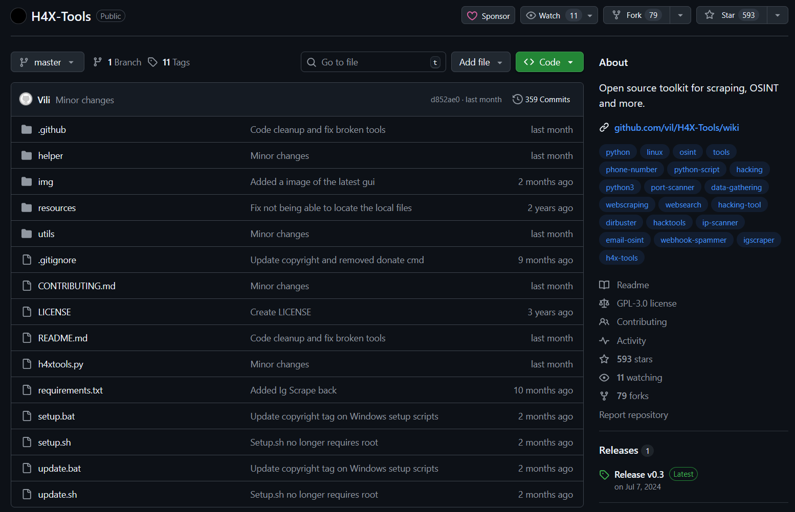

# GitHub Open Source Contribution

## Table of Contents

1. [What is a GitHub Contribution](#1-what-is-a-github-contribution)
2. [How to Contribute](#2-how-to-contribute)
3. [What Was Contributed](#3-what-was-contributed)
4. [Technical Implementation](#4-technical-implementation)
5. [Usage Examples](#5-usage-examples)
6. [Testing](#6-testing)
7. [Pull Request](#7-pull-request)

---

## 1. What is a GitHub Contribution

A GitHub contribution is a code change, bug fix, feature addition, or documentation improvement submitted to an open source project. Contributors fork a repository, make changes in their own copy, and submit a Pull Request (PR) for the maintainers to review and merge.

Open source contributions allow developers to:
- Improve existing software tools
- Learn from real-world codebases
- Collaborate with other developers
- Build a portfolio of work
- Give back to the community

---

## 2. How to Contribute

### Standard Contribution Workflow

1. **Fork the Repository**
   - Navigate to the target repository
   - Click the "Fork" button to create your own copy

2. **Clone Your Fork**
   ```bash
   git clone https://github.com/AntoTheSol/H4X-Tools.git
   cd H4X-Tools
   ```

3. **Create a Feature Branch**
   ```bash
   git checkout -b feature/H4X-contribution
   ```

4. **Make Changes**
   - Modify the necessary files
   - Test your changes locally
   - Ensure code follows project style guidelines

5. **Commit Changes**
   ```bash
   git add .
   git commit -m "Added url export to webscrape.py, created export function export_links() and modified scrape() function."
   ```

6. **Push to Your Fork**
   ```bash
   git push origin feature/H4x-contribution
   ```

7. **Create a Pull Request**
   - Navigate to your fork on GitHub
   - Click "Compare & Pull Request"
   - Provide a clear description of changes
   - Submit the PR for review

---

## 3. What Was Contributed

### Project Information

**Repository:** https://github.com/vil/H4X-Tools




**Feature Added:** Export Functionality for Web Scraper

### Problem Statement

The original H4X-Tools web scraper displayed scraped links only in the terminal output. Users had no way to save, analyze, or share the collected data after the program closed. This limitation made it difficult to:
- Perform later analysis on scraped links
- Share findings with team members
- Import data into other security tools
- Maintain records of reconnaissance activities

### Solution

Added export functionality that allows users to save scraped links to files in three different formats:
- **TXT:** Plain text format for simple viewing and sharing
- **CSV:** Comma-separated values for spreadsheet analysis
- **JSON:** Structured data format for programmatic processing

### Key Features

- Interactive export prompts after scraping completes
- User-selectable export format
- Organized output directory (`scraped_data/`)
- Automatic filename generation with timestamps
- Metadata inclusion (source URL, date, link count)
- No additional dependencies required

---

## 4. Technical Implementation

### Files Modified

**File:** `utils/web_scrape.py`

### Changes Made

#### 1. New Function: `export_links()`

A new function was created to handle all export operations:

```python
def export_links(links: set, base_url: str, format_type: str = "txt") -> None:
    """
    Exports scraped links to a file in the specified format.
    
    :param links: Set of scraped links
    :param base_url: Base URL that was scraped
    :param format_type: Export format ('txt', 'csv', or 'json')
    """
    if not links:
        printer.warning("No links to export!")
        return
    
    # Create output directory if it doesn't exist
    output_dir = Path("scraped_data")
    output_dir.mkdir(exist_ok=True)
    
    # Generate filename with timestamp
    timestamp = datetime.now().strftime("%Y%m%d_%H%M%S")
    domain = urlparse(base_url).netloc.replace(".", "_")
    filename = f"{domain}_{timestamp}"
    
    try:
        if format_type.lower() == "txt":
            filepath = output_dir / f"{filename}.txt"
            with open(filepath, "w", encoding="utf-8") as f:
                f.write(f"Scraped links from: {base_url}\n")
                f.write(f"Date: {datetime.now().strftime('%Y-%m-%d %H:%M:%S')}\n")
                f.write(f"Total links: {len(links)}\n")
                f.write("-" * 80 + "\n\n")
                for link in sorted(links):
                    f.write(f"{link}\n")
            printer.success(f"Links exported to {Style.BRIGHT}{filepath}{Style.RESET_ALL}")
        
        elif format_type.lower() == "csv":
            filepath = output_dir / f"{filename}.csv"
            with open(filepath, "w", newline="", encoding="utf-8") as f:
                writer = csv.writer(f)
                writer.writerow(["URL", "Domain", "Path"])
                for link in sorted(links):
                    parsed = urlparse(link)
                    writer.writerow([link, parsed.netloc, parsed.path])
            printer.success(f"Links exported to {Style.BRIGHT}{filepath}{Style.RESET_ALL}")
        
        elif format_type.lower() == "json":
            filepath = output_dir / f"{filename}.json"
            link_data = {
                "metadata": {
                    "source_url": base_url,
                    "scraped_date": datetime.now().isoformat(),
                    "total_links": len(links)
                },
                "links": [
                    {
                        "url": link,
                        "domain": urlparse(link).netloc,
                        "path": urlparse(link).path,
                        "scheme": urlparse(link).scheme
                    }
                    for link in sorted(links)
                ]
            }
            with open(filepath, "w", encoding="utf-8") as f:
                json.dump(link_data, f, indent=2, ensure_ascii=False)
            printer.success(f"Links exported to {Style.BRIGHT}{filepath}{Style.RESET_ALL}")
    
    except Exception as e:
        printer.error(f"Error exporting links: {e}")
```

**Function Responsibilities:**
- Validates that links exist before exporting
- Creates output directory if it doesn't exist
- Generates timestamped filenames to prevent conflicts
- Handles three different export formats
- Provides user feedback via printer messages
- Includes comprehensive error handling

#### 2. Modified Function: `scrape()`

The existing `scrape()` function was modified to add export prompts after scraping completes:

```python
@timer.timer(require_input=True)
def scrape(url: str) -> None:
    """
    Scrapes links from the given url.

    :param url: url of the website.
    """
    base_url = urlparse(url).netloc
    printer.debug(f"Scraping {base_url}")

    try:
        # ... existing scraping code ...
        
        # NEW: Export functionality
        if scraped_links:
            export_response = printer.inp("\nDo you want to export the scraped links? (y/N) : ")
            if export_response.lower() == 'y' or export_response.lower() == "yes":
                printer.info("Available export formats:")
                printer.info("  1. TXT (plain text)")
                printer.info("  2. CSV (comma-separated values)")
                printer.info("  3. JSON (structured data)")
                
                format_choice = printer.inp("Choose format (1/2/3) [default: 1] : ").strip()
                
                format_map = {
                    "1": "txt",
                    "2": "csv",
                    "3": "json",
                    "": "txt"  # default
                }
                
                export_format = format_map.get(format_choice, "txt")
                export_links(scraped_links, url, export_format)
            
            # Clear scraped links for next run
            scraped_links.clear()
        
    except Exception as e:
        printer.error(f"Error : {e}")
    except KeyboardInterrupt:
        printer.error(f"Cancelled..!")
```

**Modifications Made:**
- Added post-scraping export prompt
- Implemented format selection menu
- Integrated export_links() function call
- Added cleanup to clear scraped_links set
- Maintained backward compatibility (export is optional)

#### 3. New Imports

Added necessary imports at the top of the file:

```python
import json
import csv
from datetime import datetime
from pathlib import Path
```

**Note:** All new dependencies are Python standard library modules, so no changes to `requirements.txt` were needed.

### Code Architecture

The implementation follows these design principles:
- **Separation of Concerns:** Export logic is isolated in its own function
- **User Choice:** Export is optional and user-controlled
- **Error Handling:** Comprehensive try-except blocks for file operations
- **Flexibility:** Multiple format options for different use cases
- **Maintainability:** Clean, documented code following project style

---

## 5. Usage Examples

### Running the Web Scraper with Export


1. Start H4X-Tools and select option 11 (Web Scrape)
2. Enter the target URL to scrape
3. Choose whether to scrape linked pages recursively
4. Wait for scraping to complete


5. When prompted, choose to export the links (y/N)
6. Select the desired export format (1/2/3)
7. The file is saved to the `scraped_data/` directory


Note: Added `scraped_data` folder to .gitignore file to prevent pushing to repository.


### Export Format Examples

#### TXT Format Output
```text
Scraped links from: https://github.com/AntoTheSol/H4X-Tools
Date: 2025-10-22 23:17:02
Total links: 119
--------------------------------------------------------------------------------

https://GitHub.com/vil/H4X-Tools/commit/
https://GitHub.com/vil/H4X-Tools/network/
https://GitHub.com/vil/H4X-Tools/stargazers/
https://docs.github.com
https://docs.github.com/
https://docs.github.com/search-github/github-code-search/understanding-github-code-search-syntax
...
```

#### CSV Format Output
```csv
URL,Domain,Path
https://github.com/vil/H4X-Tools,github.com,/vil/H4X-Tools
https://github.com/vil/H4X-Tools/issues,github.com,/vil/H4X-Tools/issues
https://github.com/vil/H4X-Tools/wiki,github.com,/vil/H4X-Tools/wiki
```

#### JSON Format Output
```json
{
  "metadata": {
    "source_url": "https://github.com/AntoTheSol/H4X-Tools",
    "scraped_date": "2025-10-22T23:17:02.123456",
    "total_links": 119
  },
  "links": [
    {
      "url": "https://github.com/vil/H4X-Tools",
      "domain": "github.com",
      "path": "/vil/H4X-Tools",
      "scheme": "https"
    }
  ]
}
```

---

## 6. Testing

### Test Environment

- **Operating System:** Windows 10/11
- **Python Version:** 3.x
- **Tool Version:** H4X-Tools v0.3.2

### Test Cases Executed

1. **Basic Export Functionality**
   - Scraped a small website (< 50 links)
   - Successfully exported to all three formats
   - Verified file creation in `scraped_data/` directory
   - Confirmed proper formatting in each file type

2. **Large Dataset Export**
   - Scraped GitHub repository page (119 links)
   - Tested with recursive scraping option
   - Verified performance with larger datasets
   - Confirmed no memory issues or crashes

3. **Edge Cases**
   - Tested declining export option (no files created)
   - Verified behavior with empty link sets
   - Tested special characters in URLs
   - Confirmed timestamp uniqueness prevents file conflicts

4. **Format Validation**
   - TXT: Human-readable with proper metadata
   - CSV: Successfully imported into Excel
   - JSON: Valid JSON structure, parseable by Python

### Test Results

All test cases passed successfully. The export functionality:
- Works reliably across different dataset sizes
- Handles edge cases appropriately
- Produces properly formatted output files
- Integrates seamlessly with existing H4X-Tools workflow

---

## 7. Pull Request

### Pull Request Message

```text

Adds ability to export scraped links to TXT, CSV, or JSON files.

- Added export_links() function
- Modified scrape() to prompt for export after scraping
- Files saved to scraped_data/ with timestamps
- No new dependencies
- Backward compatible
- Added scraped_data folder in .gitignore

```


## Conclusion

This contribution enhances H4X-Tools by adding essential data persistence functionality to the web scraper. The implementation follows software engineering best practices, maintains backward compatibility, and provides users with flexible options for saving and analyzing their OSINT data.

The feature has been thoroughly tested and is ready for integration into the main H4X-Tools repository.

---

## References

- **H4X-Tools Repository:** https://github.com/vil/H4X-Tools
- **Python CSV Documentation:** https://docs.python.org/3/library/csv.html
- **Python JSON Documentation:** https://docs.python.org/3/library/json.html
- **Open Source Contribution Guide:** First Contributions - https://github.com/firstcontributions/first-contributions