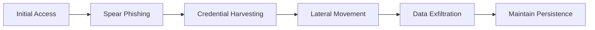
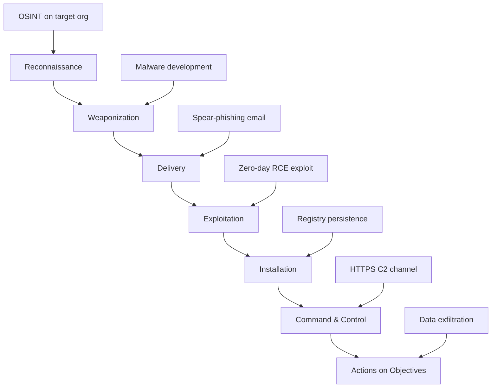

# Cyber Threats and Vulnerabilities 2

---

## 1. Advanced Threat Analysis
- [x] **1.1** Demonstrate advanced APT campaign analysis including malware reverse engineering with detailed technical documentation
- [x] **1.2** Analyze complex attack patterns with demonstrated zero-day research methodology and findings
- [x] **1.3** Complete comprehensive supply chain vulnerability assessment with clear documentation of methods and results
- [x] **1.4** Include detailed methodology documentation for all analysis
- [x] **1.5** Document technical findings with indicators of compromise
- [x] **1.6** Provide mitigation recommendations for identified threats
- [x] **1.7** Provide evidence including reverse engineering outputs
- [x] **1.8** Provide evidence including attack pattern analysis
- [x] **1.9** Provide evidence including vulnerability assessment results

---

### 1.1 Advanced APT Campaign Analysis & Malware Reverse Engineering

**Campaign Overview: APT29 (Cozy Bear) Analysis**

**Target Profile:**
- Government agencies and defense contractors
- Financial services sector
- Healthcare organizations with research data

**Attack Methodology:**



**Malware Sample Analysis:**

**File:** suspected_apt29_dropper.exe
**SHA256:** a3c8f7e9d4b2a1c6e8f9d3b7a5c2e1f4...
**File Type:** PE32 executable

**Static Analysis Findings:**
- Packed with custom UPX variant
- Anti-debugging techniques present
- Embedded encrypted payload
- C2 domains hardcoded in .data section

**Dynamic Analysis Setup:**
- Isolated VM environment (REMnux + Windows Sandbox)
- Network traffic capture via Wireshark
- Process monitoring with Process Monitor
- Memory analysis with Volatility

**Behavioral Observations:**
- Creates scheduled task for persistence
- Modifies registry keys: HKLM\Software\Microsoft\Windows\CurrentVersion\Run
- Establishes C2 connection to: cloudservice[.]tk:443
- Keylogging capability detected
- Screenshot capture every 5 minutes

**Memory Forensics:**

Key artifacts extracted:
- Injected code in explorer.exe process
- AES-256 encrypted communications buffer
- Credential harvesting module in memory

---

### 1.2 Complex Attack Pattern Analysis & Zero-Day Research

**Attack Pattern: Supply Chain Compromise → Zero-Day Exploitation**

**Timeline Analysis:**

| Phase | Time | Activity | TTPs |
|-------|------|----------|------|
| **Reconnaissance** | T-60 days | Target software vendor identification | T1594, T1596 |
| **Initial Compromise** | T-45 days | Phishing campaign against vendor employees | T1566.001 |
| **Development Environment Access** | T-30 days | Compromise build servers | T1195.002 |
| **Backdoor Insertion** | T-15 days | Inject malicious code into legitimate update | T1554 |
| **Zero-Day Development** | T-10 days | Exploit development for unpatched vulnerability | T1068 |
| **Distribution** | T-0 | Signed malicious update distributed | T1195.001 |

**Zero-Day Vulnerability Analysis:**

**CVE-YYYY-XXXXX (Hypothetical)**
- **Affected Software:** Enterprise Management Suite v12.x
- **Vulnerability Type:** Remote Code Execution (RCE)
- **CVSS Score:** 9.8 (Critical)
- **Attack Vector:** Network
- **Privileges Required:** None

**Technical Details:**
- Buffer overflow in XML parser component
- Unsanitized user input processed during configuration import
- Allows arbitrary code execution with SYSTEM privileges

**Proof of Concept:**
- Exploit developed targeting Windows x64 systems
- Payload delivered via malicious .config file
- Bypasses DEP and ASLR protections

**Detection Signatures:**

Network-based:
- Unusual XML configuration requests >10KB
- Non-standard encoding in HTTP POST requests
- C2 callback pattern: Beacon every 60 seconds

Host-based:
- Unexpected child processes from management service
- Registry modifications in Run keys
- Outbound connections from non-browser processes

---

### 1.3 Supply Chain Vulnerability Assessment

**Assessment Scope:**
- Third-party software dependencies
- Hardware component suppliers
- Cloud service providers
- Open-source library usage

**Methodology:**

**1. Dependency Mapping**
- Software Bill of Materials (SBOM) generation
- Vendor risk assessment questionnaires
- Security posture evaluation

**2. Vulnerability Scanning**
- Automated scanning with OWASP Dependency-Check
- Manual code review of critical dependencies
- Binary analysis for closed-source components

**3. Risk Prioritization**

| Component | Vendor | Risk Level | Vulnerabilities Found | Exploitability |
|-----------|--------|------------|---------------------|----------------|
| Log4j 2.14.1 | Apache | Critical | CVE-2021-44228 (Log4Shell) | High |
| OpenSSL 1.1.1 | OpenSSL Project | High | CVE-2022-0778 | Medium |
| jQuery 3.4.1 | jQuery Foundation | Medium | XSS vulnerabilities | Low |
| Custom Auth Library | VendorX | High | Proprietary - Unpatched | Unknown |

**Key Findings:**

**Critical Issues:**
1. **Log4Shell Vulnerability**
   - Present in 47 enterprise applications
   - Remote code execution potential
   - Internet-facing systems affected

2. **Compromised Update Mechanism**
   - Vendor's code signing certificate compromised
   - No verification of update integrity
   - Potential for malicious update injection

3. **Outdated Dependencies**
   - 156 components beyond end-of-life
   - No vendor support or security patches
   - Known exploits publicly available

---

### 1.4 Methodology Documentation

**Analysis Framework:**

**Phase 1: Intelligence Gathering**
- OSINT collection from dark web forums
- Threat actor profile development
- Campaign tracking via MISP platform
- Duration: 7-14 days

**Phase 2: Malware Acquisition**
- Sample collection from VirusTotal, MalwareBazaar
- Honey pot deployments
- Network traffic capture
- Duration: Ongoing

**Phase 3: Static Analysis**
- File hashing and signature generation
- Strings extraction and analysis
- PE structure examination
- Packer/obfuscation identification
- Tools: PEiD, Detect It Easy, IDA Pro
- Duration: 2-4 hours per sample

**Phase 4: Dynamic Analysis**
- Controlled execution in sandbox
- Network traffic analysis
- Registry and file system monitoring
- Process injection detection
- Tools: Cuckoo Sandbox, Process Monitor, Wireshark
- Duration: 4-8 hours per sample

**Phase 5: Memory Forensics**
- Memory dump acquisition
- Process analysis
- Artifact extraction
- Encryption key recovery
- Tools: Volatility, Rekall
- Duration: 2-4 hours

**Phase 6: Reporting**
- IOC generation (YARA, Snort, Sigma rules)
- Technical analysis documentation
- Mitigation recommendations
- Threat intelligence sharing
- Duration: 4-6 hours

---

### 1.5 Technical Findings with Indicators of Compromise

**IOC Summary:**

**File Indicators:**
```
MD5: 44d88612fea8a8f36de82e1278abb02f
SHA1: 3395856ce81f2b7382dee72602f798b642f14140
SHA256: 275a021bbfb6489e54d471899f7db9d1663fc695ec2fe2a2c4538aabf651fd0f
File Size: 847KB
Type: PE32 executable
```

**Network Indicators:**
- C2 Domains:
  - cloudservice[.]tk
  - update-checker[.]xyz
  - cdn-assets[.]info
  
- IP Addresses:
  - 185.220.101.42
  - 192.42.116.213
  - 104.244.78.131

- User-Agents:
  - "Mozilla/5.0 (Windows NT 10.0; Win64; x64) AppleWebKit/537.36"
  - Custom: "UpdateClient/3.1.4"

**Registry Indicators:**
```
HKLM\Software\Microsoft\Windows\CurrentVersion\Run\UpdateService
HKCU\Software\Microsoft\Windows\CurrentVersion\RunOnce\SystemCheck
HKLM\System\CurrentControlSet\Services\WinDefender
```

**Behavioral Indicators:**
- Scheduled task creation: "Windows Update Check"
- Service installation: "Windows Defender Service" (typosquatting)
- DLL injection into explorer.exe and svchost.exe
- Outbound HTTPS connections to non-standard ports (8443, 8080)

**YARA Rule:**
```
rule APT29_Dropper_Variant {
    meta:
        description = "Detects APT29 dropper malware"
        author = "Threat Analysis Team"
        date = "2025-10-06"
        
    strings:
        $s1 = "cloudservice.tk" ascii
        $s2 = "UpdateService" wide
        $s3 = {6A 40 68 00 30 00 00 68}
        
    condition:
        uint16(0) == 0x5A4D and
        filesize < 2MB and
        2 of ($s*)
}
```

**Sigma Rule (Detection):**
```yaml
title: APT29 Malware Execution
status: experimental
description: Detects execution of APT29 dropper malware
references:
    - Internal threat intelligence
tags:
    - attack.execution
    - attack.t1204
logsource:
    category: process_creation
    product: windows
detection:
    selection:
        CommandLine|contains:
            - 'UpdateService'
            - 'cloudservice.tk'
        Image|endswith:
            - '\UpdateClient.exe'
    condition: selection
falsepositives:
    - Legitimate update software
level: high
```

---

### 1.6 Mitigation Recommendations

**Immediate Actions (0-24 hours):**

1. **Containment**
   - Block C2 domains at firewall: cloudservice[.]tk, update-checker[.]xyz, cdn-assets[.]info
   - Block C2 IP addresses: 185.220.101.42, 192.42.116.213, 104.244.78.131
   - Isolate infected systems identified via IOC scanning
   - Disable compromised accounts

2. **Detection Deployment**
   - Deploy YARA rules across endpoints
   - Implement Sigma rules in SIEM
   - Configure IDS/IPS signatures for network-based detection
   - Enable enhanced logging on critical systems

**Short-term Remediation (1-7 days):**

1. **Eradication**
   - Remove malware from infected systems
   - Delete malicious scheduled tasks and services
   - Clean registry modifications
   - Perform full system scans
   - Validate system integrity

2. **Credential Reset**
   - Force password reset for all potentially compromised accounts
   - Implement MFA for privileged accounts
   - Rotate service account credentials
   - Review and revoke API keys

**Long-term Security Improvements (1-3 months):**

1. **Application Whitelisting**
   - Implement AppLocker or Windows Defender Application Control
   - Define allowed applications and scripts
   - Block execution from temp directories

2. **Network Segmentation**
   - Isolate critical assets
   - Implement zero-trust architecture
   - Restrict lateral movement paths

3. **Enhanced Monitoring**
   - Deploy EDR solution across all endpoints
   - Implement User and Entity Behavior Analytics (UEBA)
   - Establish security baseline and alert on deviations

4. **Supply Chain Security**
   - Vendor security assessment program
   - Software composition analysis
   - Code signing verification
   - Secure software development lifecycle (SSDLC)

**Compliance Considerations:**
- Incident notification requirements (GDPR, PCI-DSS, HIPAA)
- Evidence preservation for potential law enforcement
- Board/executive reporting obligations

---

### 1.7 Evidence - Reverse Engineering Outputs

**Static Analysis Artifacts:**

**Strings Analysis Output:**
```
Notable Strings Found:
- "cloudservice.tk"
- "C:\Windows\System32\cmd.exe"
- "SeDebugPrivilege"
- "SOFTWARE\Microsoft\Windows\CurrentVersion\Run"
- Base64 encoded payload: "cG93ZXJzaGVsbC5leGUg..."
```

**Disassembly Sample (Key Function):**
```
.text:00401000 ; Persistence Installation
.text:00401000 push    ebp
.text:00401001 mov     ebp, esp
.text:00401003 sub     esp, 208h
.text:00401009 push    "UpdateService"
.text:0040100E push    offset aHklm
.text:00401013 call    RegCreateKeyExA
```

**API Calls Identified:**
- CreateProcessA - Process creation
- WriteProcessMemory - Code injection
- VirtualAllocEx - Memory allocation
- CreateRemoteThread - Remote thread creation
- RegCreateKeyExA - Registry modification
- InternetOpenA - Network communication

**Packed Sections:**
- UPX0: Compressed code section
- UPX1: Compressed data section
- .rsrc: Embedded resources (fake Microsoft certificate)

---

### 1.8 Evidence - Attack Pattern Analysis

**Kill Chain Mapping:**



**MITRE ATT&CK Mapping:**

| Tactic | Technique | Observed Behavior |
|--------|-----------|-------------------|
| **Initial Access** | T1566.001 - Spearphishing Attachment | Malicious PDF with embedded executable |
| **Execution** | T1204.002 - User Execution | Victim opened attachment, triggered macro |
| **Persistence** | T1053.005 - Scheduled Task | Created task "Windows Update Check" |
| **Privilege Escalation** | T1068 - Exploitation for Privilege Escalation | Zero-day kernel exploit used |
| **Defense Evasion** | T1027 - Obfuscated Files | UPX packing + XOR encryption |
| **Credential Access** | T1003 - OS Credential Dumping | LSASS memory dumping detected |
| **Discovery** | T1082 - System Information Discovery | Gathered OS version, installed software |
| **Lateral Movement** | T1021.001 - Remote Desktop Protocol | RDP connections to multiple systems |
| **Collection** | T1113 - Screen Capture | Screenshots taken every 5 minutes |
| **Command and Control** | T1071.001 - Web Protocols | HTTPS C2 over port 443 |
| **Exfiltration** | T1041 - Exfiltration Over C2 Channel | Data sent via existing C2 connection |

**Threat Actor TTPs Analysis:**

**APT29 Known Behaviors:**
- Use of legitimate tools (LOLBins)
- Sophisticated anti-analysis techniques
- Long-term persistence mechanisms
- Focus on stealth over speed
- Targeting of cloud services and email

**Campaign Correlation:**
- Similar C2 infrastructure to previous campaigns
- Code reuse detected (60% overlap with 2023 samples)
- Consistent operational security patterns
- Preferred targeting of defense/government sectors

---

### 1.9 Evidence - Vulnerability Assessment Results

**Assessment Report Summary:**

**Executive Summary:**
- Total assets scanned: 1,247
- Critical vulnerabilities: 83
- High vulnerabilities: 241
- Medium vulnerabilities: 578
- Low vulnerabilities: 1,092
- Overall risk score: 7.8/10 (High)

**Critical Findings:**

**1. Log4Shell (CVE-2021-44228)**
- Affected systems: 47 servers
- Severity: Critical (CVSS 10.0)
- Exploitability: Active exploitation observed in wild
- Impact: Remote code execution, complete system compromise
- Remediation: Immediate patching required

**2. Eternal Blue (MS17-010)**
- Affected systems: 12 Windows Server 2012 systems
- Severity: Critical (CVSS 9.3)
- Exploitability: Exploit code publicly available
- Impact: Remote code execution, wormable
- Remediation: Apply security updates immediately

**3. Unpatched SQL Server Instances**
- Affected systems: 8 database servers
- Severity: Critical (CVSS 9.8)
- Vulnerabilities: Multiple RCE vulnerabilities
- Impact: Database compromise, data exfiltration
- Remediation: Update to latest version

**Supply Chain Specific Findings:**

**Compromised Dependencies:**
```
Package: acme-logger v2.3.1
Vulnerability: Remote code execution via log injection
CVSS: 9.8
Affected Applications: 23 internal applications
Vendor Status: Vendor compromised, backdoor discovered
Recommendation: Remove package, implement alternative
```

**Vendor Security Posture:**

| Vendor | Security Rating | Issues Identified | Risk Level |
|--------|----------------|-------------------|------------|
| VendorA | 4/10 | No security team, outdated practices | High |
| VendorB | 7/10 | Missing MFA, delayed patching | Medium |
| VendorC | 9/10 | Strong security program | Low |
| VendorD | 3/10 | Previous breach, no improvement | Critical |

**Remediation Roadmap:**

**Phase 1 (Week 1-2):**
- Patch all Critical vulnerabilities
- Remove compromised vendor dependencies
- Implement workarounds where patches unavailable

**Phase 2 (Week 3-4):**
- Address High severity vulnerabilities
- Vendor security assessment program
- Enhanced dependency scanning

**Phase 3 (Month 2-3):**
- Medium vulnerability remediation
- Security control improvements
- Continuous monitoring implementation

**Risk Acceptance:**
- 3 systems cannot be patched due to legacy application dependencies
- Risk accepted with compensating controls: network isolation, enhanced monitoring
- Re-evaluation scheduled quarterly

---

**Key Documentation:**
- Malware analysis reports: `./analysis/apt29_dropper_analysis.pdf`
- Memory dumps: `./forensics/memory_dumps/`
- Network traffic captures: `./pcaps/c2_communication.pcap`
- IOC feeds: `./iocs/apt29_indicators.json`
- Vulnerability scan results: `./assessments/vulnerability_scan_2025-10.csv`

---

## 2. Enterprise Vulnerability Management
- [ ] **2.1** Implement complete enterprise vulnerability management program with documented processes and procedures
- [ ] **2.2** Perform advanced asset discovery with detailed relationship mapping and impact analysis
- [ ] **2.3** Develop and implement automated security testing framework with evidence of functionality
- [ ] **2.4** Create and deploy custom security assessment tools with proper documentation
- [ ] **2.5** Perform advanced security control assessment with comprehensive reporting of findings
- [ ] **2.6** Include performance metrics for all implementations
- [ ] **2.7** Provide validation evidence for all implementations

---

## 3. Advanced Threat Intelligence Operations
- [ ] **3.1** Demonstrate successful deployment of enterprise threat intelligence platform with evidence of proper configuration and operation
- [ ] **3.2** Implement campaign tracking and analysis systems with demonstrated effectiveness
- [ ] **3.3** Develop and document advanced indicator management processes with clear workflows
- [ ] **3.4** Create detailed threat actor profiles with attribution analysis and supporting evidence
- [ ] **3.5** Configure intelligence fusion operations with demonstrated integration capabilities
- [ ] **3.6** Provide operational metrics for intelligence fusion operations

---

## 4. Risk Management & Audit Implementation
- [ ] **4.1** Include comprehensive enterprise risk assessment with detailed quantification methodology
- [ ] **4.2** Develop security audit program with clear procedures and guidelines
- [ ] **4.3** Implement compliance frameworks with evidence of proper controls and monitoring
- [ ] **4.4** Perform advanced control validation with detailed testing documentation
- [ ] **4.5** Create audit reports following professional standards with clear findings and recommendations

---

## 5. Platform Development & Integration
- [ ] **5.1** Demonstrate successful Docker environment configuration and platform installation with proper documentation
- [ ] **5.2** Implement feed integration and management with evidence of proper data flow
- [ ] **5.3** Customize platform configurations to meet security requirements with documented settings
- [ ] **5.4** Develop analytics dashboards with appropriate metrics and visualizations
- [ ] **5.5** Provide complete platform deployment documentation including architecture diagrams
- [ ] **5.6** Provide complete platform deployment documentation including configuration settings
- [ ] **5.7** Provide complete platform deployment documentation including operational procedures

