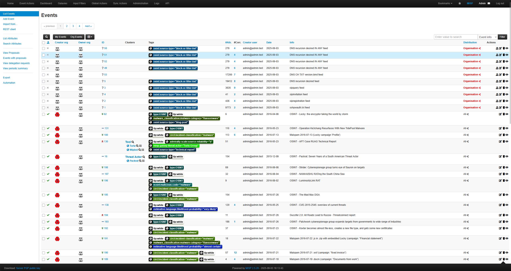
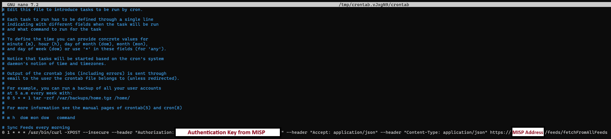
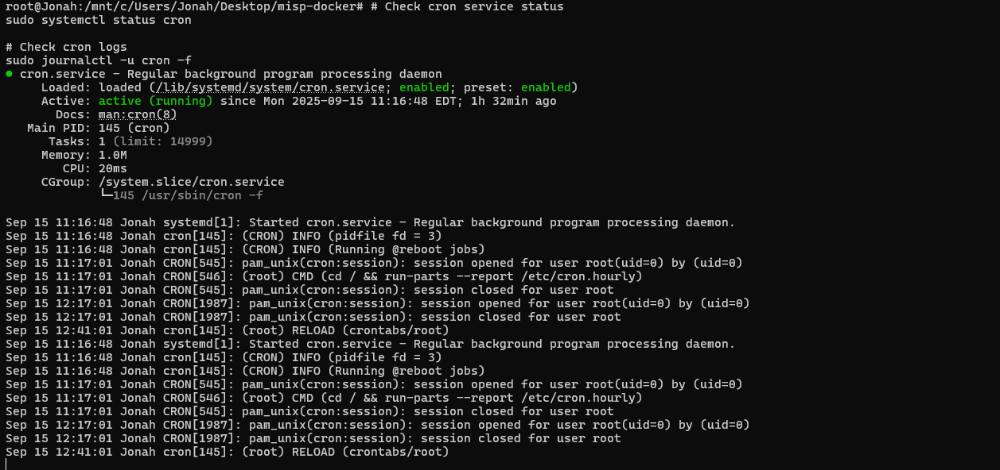

# How do I integrate MISP with Wazuh?

**MISP** is short for **Malware Information Sharing Platform** and when paired with a **SIEM (Security Information and Event Manager)** software we can match already caught IoCs from other individuals to the events occuring on our monitored computer systems. 

The SIEM software being used is **Wazuh** which is a free and open source program that when installed will allow us to have a manager and a series of endpoints that are installed on the machines we want to protect. The version of Wazuh we are using can also be setup with **docker-desktop** as a container so when we open docker-desktop it should allow us to open both technologies at the same time.

When MISP is paired with Wazuh it will enrich the logs we are already receiving and will save me time from having to manually look up the information.

---

## Why did I chose MISP?

#### 1. Enhanced Alert Quality & Context
- **Automated IOC enrichment** - Alerts come pre-loaded with threat context instead of requiring manual lookups
- **Automated IoC Check** - No manual copy/paste of IOCs for lookups

#### 2. Faster Incident Response
- **Pre-built threat profiles** - Instant access to known TTPs for faster analysis

#### 3. Detection Coverage
- **Community intelligence** - Benefit from threat sharing with other organizations

#### 4. Operational Benefits
- **Reduced alert fatigue** - Better quality alerts mean fewer unnecessary investigations

#### 5. Investigation Support
- **Pivot capabilities** - Jump from one indicator to related threats quickly

Overall it transforms reactive alert processing into proactive, intelligence-driven security operations.

---

## How did I install it?

Since I am using **docker-desktop** already it is best to use **MISP-Docker** which is readily available at **https://github.com/misp/misp-docker** then navigating to the generated directory.

```bash
cd Desktop
git clone https://github.com/misp/misp-docker
cd misp-docker
git docker-compose pull
git docker-compose up
```

---

## What were my largest difficulties?

- Port 443 Error as Wazuh is already using this port, meaning we need to configure MISP to use localhost:444
- Improper build configurations with docker-compose.yml
- Permission errors when trying to build/access certain files and folders
- Authentication Error with redis

### Port 443 Error & proper build configuration

Due to the fact that my Wazuh Manager was using port 443, it caused installation issues with MISP so I had to change the port to 444. Originally under ports it was `443:443` and was changed to be `444:443`. This way MISP can be utilized under a different port without complications with wazuh.

```text

misp-core:
    image: ghcr.io/misp/misp-docker/misp-core:${CORE_RUNNING_TAG:-latest}

...

    ports:
      - "80:80"
      - "444:443"

...

```

In the .env file change the `BASE_URL` to `https:localhost:444` and add `CORE_RUNNING_TAG=latest` because in the original configuration it contained both an image reference AND a build context in docker-compose.yml:

```test
image: ghcr.io/misp/misp-docker/misp-core:${CORE_RUNNING_TAG:-latest}
build:
  context: core/.
```

### MISP Docker Clean Restart Solution

#### Log File Error

```test
Warning Error: copy(/var/www/MISP/app/Config/config.backup.php): Failed to open stream: Permission denied
```

### Issue
MISP-Docker container failing to start due to permission errors and missing SysLogLogable plugin (however this could be a red herring issue caused by permission errors).

The core issue was file ownership and permissions. Here's what was happening:
The Problem

- Your original directories were created with your user's permissions (likely UID 1000)
- The MISP container runs as `www-data` user (UID 33)
- When the container tried to write configuration files, it got "Permission denied" errors
- This caused the cascade of failures you see in the logs

#### Root Causes
- Incorrect file ownership on mounted volumes
- Docker image/build configuration conflicts
- Corrupted or incomplete directory structures

#### Solution Steps

#### 1. Stop MISP and Clean Docker Environment
```bash
# Stop all MISP services
docker-compose down -v

# Remove any conflicting containers and volumes
docker system prune -f
```

#### 2. Reset Directory Structure
```bash
# Remove existing directories with incorrect permissions
sudo rm -rf configs logs files ssl gnupg

# Recreate empty directories
mkdir -p configs logs files ssl gnupg

# Set correct ownership for MISP container
sudo chown -R 33:33 configs logs files gnupg ssl
```

sudo chown -R www-data:www-data configs logs files gnupg ssl

#### 3. Start MISP Fresh
```bash
# Launch MISP with clean environment
docker-compose up -d
```

##### What This Fixes

##### Container Cleanup
- Removes corrupted containers and volumes
- Clears Docker cache that might contain bad data
- Ensures fresh container state

##### Directory Reset
- Eliminates directories with incorrect permissions
- Creates clean, empty directory structure
- Removes any corrupted configuration files

##### Permission Alignment
The `chown -R 33:33` command sets ownership to match MISP's internal user:
- **33**: UID for `www-data` user inside container
- **33**: GID for `www-data` group  
- **-R**: Applied recursively to all subdirectories

##### Directory Functions
- **configs/**: Database settings, encryption keys, configuration backups
- **logs/**: Application and error logs
- **files/**: Uploaded files, temporary data, cached content
- **gnupg/**: GPG keys for encryption
- **ssl/**: SSL certificates

##### Verification
Check ownership after running the fix:
```bash
ls -la configs logs files gnupg ssl
```
Should show `33 33` or `www-data www-data` as owner.

## Using MISP

#### Log-in

There is a default login username and password already that we will use but can be changed at a later date.

```text

# Username:
admin@admin.test

# Password:
admin

```



---

## Troubleshooting: Authentication Keys Error

**Issue encountered:**  
MISP authentication keys page showing internal error and Redis connection failures.

**Error symptoms:**
- [ ] Internal server error when accessing `/auth_keys/index`
- [ ] Redis connection refused errors in logs
- [ ] "Value not set" errors for Redis configuration
- [ ] File permission denied errors for config backup

**Root cause identified:**  
MISP's internal Redis configuration was incorrect (`127.0.0.1`) despite correct environment variables in `.env` file.

**Required .env Redis configuration:**

```bash
# Redis settings in .env file
REDIS_HOST=redis
REDIS_PORT=6379
REDIS_PASSWORD=redispassword
```

Note: These environment variables set the container-level configuration, but MISP's internal application settings must be configured separately.

**What triggers this issue:**  
Container restarts or fresh installations where MISP's internal settings don't automatically sync with environment variables.

**Error log samples:**

```bash
# Redis connection error
[RedisException] Connection refused
Error in: /var/www/MISP/app/Lib/Tools/RedisTool.php, Line: 39

# Permission error
Warning Error: copy(/var/www/MISP/app/Config/config.backup.php): Failed to open stream: Permission denied

# Configuration error
{
    "value": "127.0.0.1",
    "error": 1,
    "errorMessage": "Value not set.",
    "setting": "MISP.redis_host"
}
```

**Where this occurs in the system:**  
Authentication key management requires Redis connectivity for caching and session management.

---

## Solution Steps

**Did you verify Redis connectivity first?**
- [x] Yes
- [ ] No

**Test Redis connection:**

```bash
# Verify Redis container is running and accessible
docker exec misp-docker-misp-core-1 php -r "
\$redis = new Redis();
\$result = \$redis->connect('redis', 6379);
if (\$result) {
    echo 'Connected to Redis: YES\n';
    \$auth = \$redis->auth('redispassword');
    echo 'Authentication: ' . (\$auth ? 'SUCCESS' : 'FAILED') . '\n';
} else {
    echo 'Connection to Redis: FAILED\n';
}
"
```

**Step 1: Fix file permissions**

```bash
# Create config backup file with proper permissions
docker exec misp-docker-misp-core-1 touch /var/www/MISP/app/Config/config.backup.php
docker exec misp-docker-misp-core-1 chown www-data:www-data /var/www/MISP/app/Config/config.backup.php
docker exec misp-docker-misp-core-1 chmod 664 /var/www/MISP/app/Config/config.backup.php
```

**Step 2: Set correct Redis configuration in MISP**

```bash
# Update MISP's internal Redis settings
docker exec misp-docker-misp-core-1 /var/www/MISP/app/Console/cake admin setSetting MISP.redis_host redis
docker exec misp-docker-misp-core-1 /var/www/MISP/app/Console/cake admin setSetting MISP.redis_password redispassword
docker exec misp-docker-misp-core-1 /var/www/MISP/app/Console/cake admin setSetting MISP.redis_port 6379
docker exec misp-docker-misp-core-1 /var/www/MISP/app/Console/cake admin setSetting MISP.redis_database 13
```

**Step 3: Verify configuration**

```bash
# Check that settings are properly saved
docker exec misp-docker-misp-core-1 /var/www/MISP/app/Console/cake admin getSetting MISP.redis_host
```

**Expected output after fix:**

```json
{
    "value": "redis",
    "errorMessage": null,
    "setting": "MISP.redis_host"
}
```

**Final verification:**  
Access `https://localhost:444/auth_keys/index` - page should load without internal errors.

---

## Reflection & Learning

**What did you learn while troubleshooting this authentication issue?**

> Docker environment variables in `.env` files don't automatically sync with application internal configurations. MISP stores settings in its own database/config system that requires separate configuration even when container environment variables are correct.

**Key insight discovered:**

> File permissions (`www-data` ownership) are critical for MISP configuration changes. The container must be able to create backup files before saving new settings.

**Anything you would do differently or improve in the future?**

> Document the Redis configuration verification process as part of initial setup rather than waiting for issues to arise. Consider creating a setup script that automatically sets internal MISP Redis configuration to match environment variables.

**Prevention for future deployments:**

```bash
# Add to post-installation checklist
docker exec misp-docker-misp-core-1 /var/www/MISP/app/Console/cake admin getSetting MISP.redis_host
# Should return "redis" not "127.0.0.1"
```

## Why are Authentication Keys important for MISP

The authentication keys section is critical for several security and operational reasons in MISP:

**API Access Control**
Authentication keys are MISP's primary method for controlling programmatic access. Without working authentication keys:

- Automated threat intelligence feeds can't sync data
- Third-party integrations (like Wazuh) can't pull IoC data
- API-based workflows for importing/exporting threat data fail

**Security Integration Pipeline**
For MISP-Wazuh integration specifically:

- Wazuh needs API access to query MISP for threat intelligence enrichment
- Automated IoC lookups require valid authentication keys to function
- Real-time threat correlation depends on seamless API connectivity

**Operational Efficiency**
Without functional authentication keys:

- Manual processes replace automation - you'd have to manually export/import threat data
- Feed synchronization fails - missing updates from threat intelligence sources
- Integration bottlenecks - other security tools can't automatically consume MISP data

**Redis Dependency**
Authentication keys specifically require Redis because:

- Session management for API requests uses Redis caching
- Rate limiting and API quotas are tracked in Redis
- Key validation and expiry tracking rely on Redis storage

---

## Troubleshooting: Feed Processing Internal Error

**Issue encountered:**  
MISP feed enable/fetch operations showing internal system error after implementing authentication keys Redis fix.

**Error symptoms:**
- [ ] Internal server error when enabling feeds
- [ ] Feed fetching fails with system error
- [ ] Background job processing errors
- [ ] Feed synchronization not working

**Root cause identified:**  
MISP uses separate Redis configurations for general operations vs background jobs. Fixing authentication keys only configured general Redis settings, leaving background job Redis unconfigured.

**What triggers this issue:**  
Occurs after configuring general Redis settings (`MISP.redis_*`) but not configuring background job Redis settings (`SimpleBackgroundJobs.redis_*`). Feed processing requires background jobs to function.

**Error log samples:**

```bash
# Background jobs Redis error
[RuntimeException] Required option `redis_host` for BackgroundJobsTool is not set.
Error in: /var/www/MISP/app/Lib/Tools/BackgroundJobsTool.php

# Feed processing error
Request URL: /feeds/fetchFromAllFeeds
Error: BackgroundJobsTool->createRedisConnection()
FeedsController->fetchFromAllFeeds()
```

**Where this occurs in the system:**  
Feed processing, background job execution, and automated synchronization tasks all depend on SimpleBackgroundJobs Redis connectivity.

---

## Solution Steps

**Did you verify which Redis settings were missing?**
- [x] Yes
- [ ] No

**Check existing background job settings:**

```bash
# List all background job related settings
docker exec misp-docker-misp-core-1 /var/www/MISP/app/Console/cake admin getSetting | grep -i background

# Identify SimpleBackgroundJobs settings
docker exec misp-docker-misp-core-1 /var/www/MISP/app/Console/cake admin getSetting | grep SimpleBackgroundJobs
```

**Step 1: Configure SimpleBackgroundJobs Redis settings**

```bash
# Set the correct background jobs Redis configuration
docker exec misp-docker-misp-core-1 /var/www/MISP/app/Console/cake admin setSetting SimpleBackgroundJobs.redis_host redis
docker exec misp-docker-misp-core-1 /var/www/MISP/app/Console/cake admin setSetting SimpleBackgroundJobs.redis_password redispassword
docker exec misp-docker-misp-core-1 /var/www/MISP/app/Console/cake admin setSetting SimpleBackgroundJobs.redis_port 6379
docker exec misp-docker-misp-core-1 /var/www/MISP/app/Console/cake admin setSetting SimpleBackgroundJobs.redis_database 1
```

**Step 2: Enable background jobs system**

```bash
# Enable SimpleBackgroundJobs functionality
docker exec misp-docker-misp-core-1 /var/www/MISP/app/Console/cake admin setSetting SimpleBackgroundJobs.enabled true
```

**Step 3: Verify configuration**

```bash
# Check that SimpleBackgroundJobs settings are properly saved
docker exec misp-docker-misp-core-1 /var/www/MISP/app/Console/cake admin getSetting SimpleBackgroundJobs.redis_host
docker exec misp-docker-misp-core-1 /var/www/MISP/app/Console/cake admin getSetting SimpleBackgroundJobs.enabled
```

**Step 4: Restart and test**

```bash
# Restart MISP to apply background job changes
docker restart misp-docker-misp-core-1

# Wait for startup
sleep 30
```

**Expected output after fix:**

```json
{
    "value": "redis",
    "errorMessage": null,
    "setting": "SimpleBackgroundJobs.redis_host"
}
```

**Final verification:**  
Feed enable/fetch operations should work without internal errors. Background jobs should process successfully.

---

## MISP Redis Configuration Architecture

**Understanding MISP's dual Redis setup:**

MISP uses **two separate Redis configurations** that must both be configured:

1. **General Redis (`MISP.redis_*`)**
   - Authentication keys
   - Session management  
   - General caching
   - User interface operations

2. **Background Jobs Redis (`SimpleBackgroundJobs.redis_*`)**
   - Feed processing
   - Background synchronization
   - Automated tasks
   - Job queue management

**Required settings for full functionality:**

```bash
# General Redis settings
MISP.redis_host=redis
MISP.redis_password=redispassword
MISP.redis_port=6379
MISP.redis_database=13

# Background Jobs Redis settings  
SimpleBackgroundJobs.redis_host=redis
SimpleBackgroundJobs.redis_password=redispassword
SimpleBackgroundJobs.redis_port=6379
SimpleBackgroundJobs.redis_database=1
SimpleBackgroundJobs.enabled=true
```

---

## Reflection & Learning

**What did you learn while troubleshooting this feed processing issue?**

> MISP's architecture separates general operations from background processing, requiring independent Redis configuration for each subsystem. A single Redis instance can serve both purposes using different database numbers, but each system must be explicitly configured even when pointing to the same Redis server.

**Key insight discovered:**

> The error message "BackgroundJobsTool" clearly indicated which subsystem was failing, leading to the discovery of SimpleBackgroundJobs as a separate configuration namespace from general MISP Redis settings.

**Anything you would do differently or improve in the future?**

> Configure both Redis subsystems simultaneously during initial setup rather than addressing them as separate issues. Create a comprehensive Redis configuration checklist covering both general operations and background jobs.

**Prevention for future deployments:**

```bash
# Complete Redis configuration verification script
echo "Checking General Redis..."
docker exec misp-docker-misp-core-1 /var/www/MISP/app/Console/cake admin getSetting MISP.redis_host

echo "Checking Background Jobs Redis..."
docker exec misp-docker-misp-core-1 /var/www/MISP/app/Console/cake admin getSetting SimpleBackgroundJobs.redis_host

echo "Verifying Background Jobs enabled..."
docker exec misp-docker-misp-core-1 /var/www/MISP/app/Console/cake admin getSetting SimpleBackgroundJobs.enabled
```

**Dependencies identified:**

> Feed functionality depends on: Authentication Keys → General Redis → Background Jobs Redis → SimpleBackgroundJobs.enabled. All components must be functional for complete feed processing capability.

---

## Automated Daily Feed Synchronization

**Purpose:**  
Set up automated daily fetching of threat intelligence feeds to keep your MISP instance current with the latest IoCs and threat data without manual intervention.

**Prerequisites:**
- [ ] MISP instance running and accessible
- [ ] Feeds configured and enabled in MISP
- [ ] Authentication keys working properly
- [ ] Background jobs Redis configured
- [ ] System with cron access (Docker host machine)

---

## Step 1: Generate MISP API Key

**Access API key management:**
1. Log into MISP instance, mine is `https://localhost:444`
2. Navigate to **Administration** → **List Auth Keys**
3. Click **Add authentication key**
4. Fill in the details:
   - **Comment**: `Daily Feed Automation`
   - **Allowed IPs**: Leave blank for any IP (or specify your server IP)
5. Click **Submit**
6. **Copy the generated API key** - you'll need this for the cron job

**Alternative: Use existing API key:**
- If you already have an API key, you can view it by clicking on your username → **My Profile** → **Auth Keys**

---

## Step 2: Test the API Call

**From your misp-docker directory, test the API:**

```bash
# Navigate to misp-docker directory
cd /path/to/misp-docker

# Test the feed fetch API call
/usr/bin/curl -XPOST --insecure --header "Authorization: YOUR_API_KEY" --header "Accept: application/json" --header "Content-Type: application/json" https://YOUR_MISP_ADDRESS/feeds/fetchFromAllFeeds
```

**Expected response:**
```json
{
    "result": "Pull queued for background execution."
}
```

**If authentication fails:**
- Verify API key is correct
- Ensure API key user has proper permissions
- Check that feeds are enabled in MISP interface

---

## Step 3: Configure the Cron Job

**Add automated daily sync:**

```bash
# Edit the system crontab
sudo crontab -e

# Add the following line (runs daily at 1:00 AM)
# Sync MISP feed daily
0 1 * * * /usr/bin/curl -XPOST --insecure --header "Authorization: YOUR_API_KEY" --header "Accept: application/json" --header "Content-Type: application/json" https://YOUR_MISP_ADDRESS/feeds/fetchFromAllFeeds
```

**Replace placeholders:**
- `YOUR_API_KEY` - Your actual MISP API key
- `YOUR_MISP_ADDRESS` - Your MISP URL (e.g., `localhost:444`)

**Cron schedule options:**
- `0 1 * * *` - Daily at 1:00 AM
- `0 */6 * * *` - Every 6 hours
- `0 2,14 * * *` - Twice daily (2:00 AM and 2:00 PM)
- `0 1 * * 0` - Weekly on Sunday at 1:00 AM



---

## Troubleshooting

**Common issues and solutions:**

**Issue: API authentication fails**
```bash
# Verify API key is correct
curl -H "Authorization: YOUR_API_KEY" https://localhost:444/users/view/me.json
```

**Issue: Feeds not updating**
- Check that feeds are enabled in MISP interface
- Verify background jobs are running: `docker ps | grep misp-core`
- Check SimpleBackgroundJobs Redis configuration

**Issue: SSL certificate errors**
- Using `--insecure` flag bypasses SSL verification
- For production, replace with proper SSL certificates

**Issue: Cron job not running**
```bash
# Check cron service status
sudo systemctl status cron

# Check cron logs
sudo journalctl -u cron -f
```



**Security considerations:**
- **API key protection**: Keep your API key secure and don't commit it to version control
- **Network security**: Consider IP restrictions for API keys in production environments
- **Regular maintenance**: Verify the cron job continues working after MISP updates

This simple automation ensures your MISP threat intelligence feeds stay current without manual intervention, supporting your SOC operations with up-to-date IoC data for Wazuh integration.

---

## 👤 Authored by: Gabriel Zepeda

🗓️ Date: [2025-09-17]  
🔁 Validated by: 