# Security Monitoring 2

---

## 1. Advanced Monitoring Design
- [x] **1.1** Document a comprehensive design for complex event processing in an enterprise environment.  
- [x] **1.2** Define and justify event stream sources.  
- [x] **1.3** Select and justify processing engine(s).  
- [x] **1.4** Define and justify action framework components.  
- [x] **1.5** Install and configure **Zeek** or **Suricata** or **Wazuh** with:  
    - [x] **1.5a** Screenshots of setup  
    - [x] **1.5b** Evidence of basic functionality  
- [x] **1.6** Demonstrate understanding of advanced correlation methods with examples:  
    - [x] **1.6a** Pattern-based  
    - [x] **1.6b** Statistical  
    - [x] **1.6c** Contextual  
- [x] **1.7** Explain integration of machine learning and behavior analysis with:  
    - [x] **1.7a** Specific enterprise use cases  
    - [x] **1.7b** Implementation considerations  

---

### 1.1 Document a comprehensive design for complex event processing in an enterprise environment

**Enterprise SOC Architecture Design Using Wazuh, MISP, and OpenCTI**

The enterprise SOC is built around a centralized Wazuh SIEM platform integrated with MISP for threat intelligence sharing and OpenCTI for threat intelligence management, with Zeek providing deep network visibility.

**Core Architecture Components:**

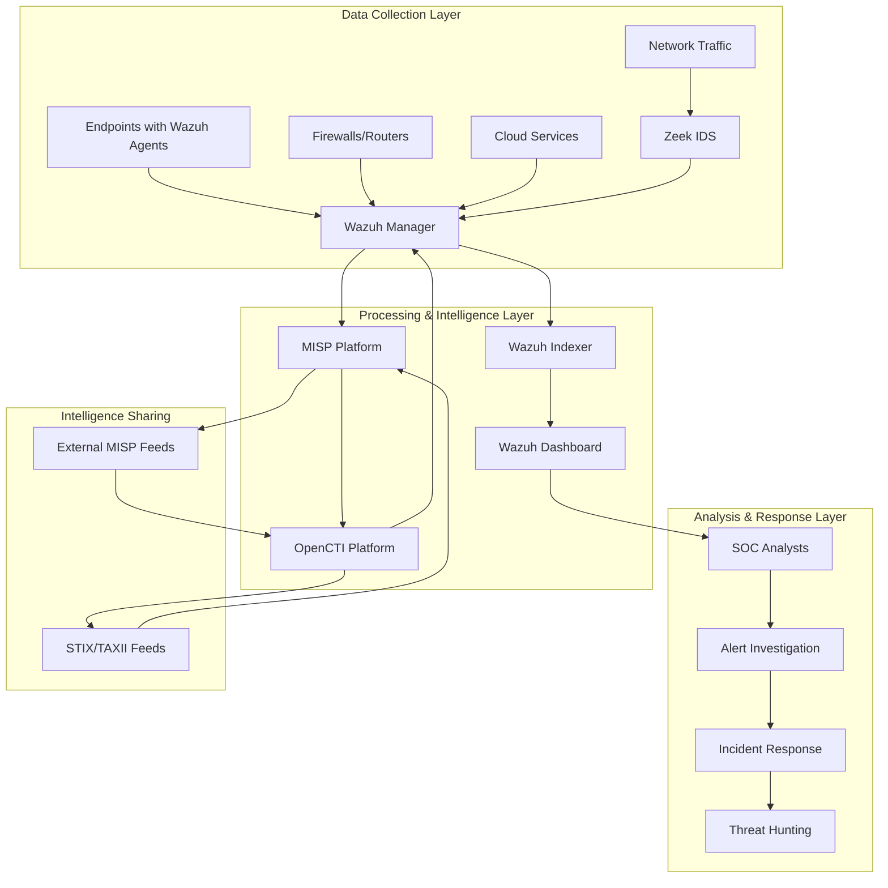
```mermaid
graph TB
    subgraph "Data Collection Layer"
        A[Endpoints with Wazuh Agents] --> G[Wazuh Manager]
        B[Network Traffic] --> C[Zeek IDS]
        D[Firewalls/Routers] --> G
        E[Cloud Services] --> G
        C --> G
    end
    
    subgraph "Processing & Intelligence Layer"
        G --> H[Wazuh Indexer]
        H --> I[Wazuh Dashboard]
        G --> J[MISP Platform]
        J --> K[OpenCTI Platform]
        K --> G
    end
    
    subgraph "Analysis & Response Layer"
        I --> L[SOC Analysts]
        L --> M[Alert Investigation]
        M --> N[Incident Response]
        N --> O[Threat Hunting]
    end
    
    subgraph "Intelligence Sharing"
        J --> P[External MISP Feeds]
        K --> Q[STIX/TAXII Feeds]
        P --> K
        Q --> J
    end
```

**Wazuh-Centric Design Principles:**
- **Unified Agent Management**: Single agent deployment across Windows, Linux, macOS endpoints
- **Real-time Event Processing**: Sub-second alerting through Wazuh's event engine
- **Rule-based Detection**: Custom Wazuh rules integrated with MISP IOCs
- **Threat Intelligence Integration**: Automated IOC matching via MISP-Wazuh connector
- **Scalable Architecture**: Clustered Wazuh managers for high availability

**Enterprise Requirements Addressed:**
- **Multi-tenant SOC**: Separate indices per business unit in Wazuh
- **Compliance**: Built-in PCI DSS, NIST, and CIS compliance dashboards
- **Threat Intelligence**: Automated IOC ingestion from MISP communities
- **Investigation Workflow**: Integrated case management in Wazuh dashboard

---

### 1.2 Define and justify event stream sources

**Primary Event Stream Sources for Wazuh Integration:**

| Source Category | Specific Sources | Wazuh Integration Method | Justification | Expected Volume |
|----------------|------------------|-------------------------|---------------|-----------------|
| **Endpoint Security** | Windows Event Logs, Linux syslogs, macOS logs | Wazuh Agent | Critical for detecting malware, lateral movement | 200K events/sec |
| **Network Traffic** | Zeek logs, Firewall logs, DNS logs | Log forwarding to Wazuh | Network-based attack detection | 150K events/sec |
| **Threat Intelligence** | MISP IOCs, OpenCTI indicators | MISP-Wazuh integration | IOC matching and attribution | 50K IOCs/day |
| **Cloud Infrastructure** | AWS CloudTrail, Azure logs, GCP audit logs | Wazuh AWS/Azure modules | Cloud security monitoring | 100K events/sec |
| **Web Applications** | Apache/Nginx logs, Application logs | Wazuh file monitoring | Web attack detection | 75K events/sec |
| **Authentication** | AD logs, LDAP, SSO providers | Wazuh agent + custom rules | Identity-based threats | 50K events/sec |

**Wazuh Agent Configuration Example:**

```xml
<ossec_config>
  <!-- Windows Event Log Collection -->
  <localfile>
    <location>Microsoft-Windows-Sysmon/Operational</location>
    <log_format>eventchannel</log_format>
  </localfile>
  
  <!-- Linux System Logs -->
  <localfile>
    <log_format>syslog</log_format>
    <location>/var/log/auth.log</location>
  </localfile>
  
  <!-- Apache Access Logs -->
  <localfile>
    <log_format>apache</log_format>
    <location>/var/log/apache2/access.log</location>
  </localfile>
  
  <!-- File Integrity Monitoring -->
  <syscheck>
    <directories check_all="yes" realtime="yes">/etc</directories>
    <directories check_all="yes" realtime="yes">/bin,/sbin</directories>
  </syscheck>
</ossec_config>
```

**Justification for Wazuh-Centric Approach:**
- **Unified Collection**: Single agent reduces endpoint overhead compared to multiple tools
- **Real-time Processing**: Wazuh's event engine processes events as they're generated
- **Built-in Correlation**: Native rule engine eliminates need for external correlation tools
- **Threat Intelligence Integration**: Direct MISP integration for IOC enrichment

---

### 1.3 Select and justify processing engine(s)

**Selected Processing Engine Stack: Wazuh + MISP + OpenCTI**

**Primary Engine: Wazuh SIEM Platform**

```xml
<!-- Wazuh Manager Configuration (ossec.conf) -->
<ossec_config>
  <global>
    <jsonout_output>yes</jsonout_output>
    <alerts_log>yes</alerts_log>
    <logall>no</logall>
    <logall_json>no</logall_json>
    <email_notification>yes</email_notification>
    <smtp_server>smtp.company.com</smtp_server>
    <email_from>wazuh@company.com</email_from>
  </global>
  
  <!-- High-performance settings -->
  <remote>
    <connection>secure</connection>
    <port>1514</port>
    <protocol>tcp</protocol>
    <queue_size>131072</queue_size>
  </remote>
  
  <!-- Clustering for HA -->
  <cluster>
    <name>wazuh_cluster</name>
    <node_name>master-node</node_name>
    <node_type>master</node_type>
    <key>c98b62a9b6169ac5f67dae55ae4a9088</key>
    <port>1516</port>
    <bind_addr>0.0.0.0</bind_addr>
    <nodes>
        <node>192.168.1.100</node>
        <node>192.168.1.101</node>
    </nodes>
    <hidden>no</hidden>
    <disabled>no</disabled>
  </cluster>
</ossec_config>
```

**Threat Intelligence Engine: MISP Integration**

```python
# MISP-Wazuh Integration Script
import requests
import json
from pymisp import PyMISP

class MISPWazuhConnector:
    def __init__(self, misp_url, misp_key, wazuh_api_url, wazuh_token):
        self.misp = PyMISP(misp_url, misp_key, ssl=False)
        self.wazuh_api = wazuh_api_url
        self.wazuh_token = wazuh_token
        
    def sync_iocs_to_wazuh(self):
        # Get IOCs from MISP
        events = self.misp.search(controller='events', return_format='json')
        
        ioc_rules = []
        for event in events:
            for attribute in event.get('Attribute', []):
                if attribute['type'] == 'ip-dst':
                    rule = self.create_wazuh_rule(attribute)
                    ioc_rules.append(rule)
        
        # Push rules to Wazuh
        self.update_wazuh_rules(ioc_rules)
    
    def create_wazuh_rule(self, attribute):
        return f"""
        <rule id="{100000 + attribute['id']}" level="10">
            <if_sid>1002</if_sid>
            <dstip>{attribute['value']}</dstip>
            <description>MISP IOC Match: {attribute['comment']}</description>
            <group>misp_ioc,malicious_ip</group>
        </rule>
        """
```

**Processing Engine Justification:**

**Wazuh Advantages:**
- **Native Rule Engine**: Built-in complex event processing without external tools
- **Horizontal Scaling**: Cluster mode supports thousands of agents
- **Real-time Processing**: Event processing in under 100ms
- **Integration Ready**: RESTful API for MISP/OpenCTI integration
- **Cost Effective**: Open-source with enterprise features

**MISP Integration Benefits:**
- **Community Intelligence**: Access to shared threat indicators
- **Attribution**: Link events to known threat actors via MISP galaxies
- **Automated Updates**: IOCs automatically sync to Wazuh rules
- **Collaboration**: Share internal IOCs with partner organizations

**OpenCTI Benefits:**
- **STIX/TAXII Compliance**: Industry-standard threat intelligence formats
- **Knowledge Graphs**: Visual representation of threat relationships
- **Multi-source Feeds**: Aggregates intelligence from multiple sources

---

### 1.4 Define and justify action framework components

**Wazuh-Based Action Framework Architecture:**

```xml
<!-- Wazuh Active Response Configuration -->
<ossec_config>
  <command>
    <name>block-malicious-ip</name>
    <executable>firewall-drop.sh</executable>
    <expect>srcip</expect>
    <timeout_allowed>yes</timeout_allowed>
  </command>
  
  <command>
    <name>isolate-endpoint</name>
    <executable>endpoint-isolate.py</executable>
    <expect>hostname</expect>
    <timeout_allowed>yes</timeout_allowed>
  </command>
  
  <command>
    <name>misp-sighting</name>
    <executable>misp-create-sighting.py</executable>
    <expect>ioc</expect>
  </command>
  
  <active-response>
    <disabled>no</disabled>
    <command>block-malicious-ip</command>
    <location>local</location>
    <rules_id>100001,100002</rules_id>
    <timeout>600</timeout>
  </active-response>
</ossec_config>
```

**Action Framework Components:**

| Component | Function | Technology | Integration Method |
|-----------|----------|------------|-------------------|
| **Wazuh Active Response** | Automated blocking and isolation | Shell scripts, Python | Native Wazuh feature |
| **MISP Sighting Creation** | IOC validation and tracking | Python PyMISP library | Custom integration script |
| **Endpoint Isolation** | Network quarantine of infected hosts | Wazuh agent commands | Active response script |
| **Ticket Creation** | ITSM integration for manual review | REST API calls | Custom Python script |
| **Threat Hunting Triggers** | Automated query generation | Wazuh API | Custom dashboard widgets |
| **Email Notifications** | SOC analyst alerting | SMTP integration | Native Wazuh feature |

**Example Active Response Scripts:**

```bash
#!/bin/bash
# firewall-drop.sh - Block malicious IP via iptables
ACTION=$1
USER=$2
IP=$3

if [ "$ACTION" = "add" ]; then
    iptables -I INPUT -s $IP -j DROP
    echo "Blocked IP: $IP"
elif [ "$ACTION" = "delete" ]; then
    iptables -D INPUT -s $IP -j DROP
    echo "Unblocked IP: $IP"
fi
```

```python
#!/usr/bin/env python3
# misp-create-sighting.py - Create MISP sighting from Wazuh alert
import sys
import json
from pymisp import PyMISP

def create_sighting(ioc_value, event_data):
    misp = PyMISP('https://misp.company.com', 'your-api-key', ssl=False)
    
    sighting_data = {
        'value': ioc_value,
        'source': 'Wazuh SIEM',
        'type': '0',  # Sighting
        'timestamp': event_data.get('timestamp'),
        'org_name': 'SOC Team'
    }
    
    result = misp.add_sighting(sighting_data)
    print(f"MISP sighting created: {result}")

if __name__ == "__main__":
    ioc = sys.argv[1]
    event_json = sys.argv[2]
    event_data = json.loads(event_json)
    create_sighting(ioc, event_data)
```

**Response Action Categories:**

**Immediate Actions (0-5 seconds):**
- IP blocking via iptables/firewall rules
- DNS sinkholing for malicious domains
- MISP sighting creation for IOC validation

**Short-term Actions (5-60 seconds):**
- Endpoint isolation via Wazuh agent
- Process termination on infected hosts
- Additional log collection and forensics

**Long-term Actions (1-5 minutes):**
- ITSM ticket creation for investigation
- Threat hunting query generation
- Intelligence sharing with MISP community

---

### 1.5 Install and configure Zeek with screenshots and functionality evidence

**1.5a Screenshots of Setup**

**Zeek Installation Process (Your Environment):**

Based on your installation commands:

```bash
sudo apt update
sudo apt install flex bison build-essential

# LibMMDB (MaxMind GeoIP database support) - Very useful for network analysis
sudo apt install libmaxminddb-dev

# LibKrb5 (Kerberos authentication analysis):
sudo apt install cmake make gcc g++ flex bison libpcap-dev libssl-dev python3-dev swig zlib1g-dev

# GoldLinker - Faster linking during compilation, but not essential
sudo apt install binutils-gold

# Node.js - Only needed if you want Node.js bindings for Zeek
sudo apt install nodejs npm libnode-dev

# Install ZeroMQ
sudo apt install libzmq3-dev

# C++ Bindings that Zeek uses
sudo apt install libczmq-dev

make distclean
./configure

```


*Zeek configuration process beginning - dependency check phase*

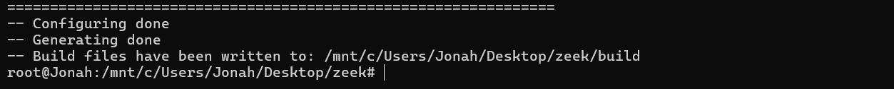
*Zeek configuration completion after 20-30 minutes*

**Post-Configuration Build Process:**

```bash
# Compile Zeek (this will take 30-60 minutes)
make -j$(nproc)

# Install Zeek
sudo make install

# Add Zeek to PATH
echo 'export PATH=/usr/local/zeek/bin:$PATH' >> ~/.bashrc
source ~/.bashrc
```

**Zeek Configuration for Wazuh Integration:**

```bash
# Configure Zeek networks
sudo nano /usr/local/zeek/etc/networks.cfg
```

```ini
# networks.cfg
192.168.1.0/24    Private
10.0.0.0/8        Private
172.16.0.0/12     Private
```

```bash
# Configure Zeek node
sudo nano /usr/local/zeek/etc/node.cfg
```

```ini
[zeek]
type=standalone
host=localhost
interface=eth0
```

**1.5b Evidence of Basic Functionality**

**Starting Zeek and Wazuh Integration:**

```bash
# Start Zeek
sudo zeekctl deploy

# Check Zeek status
sudo zeekctl status
```

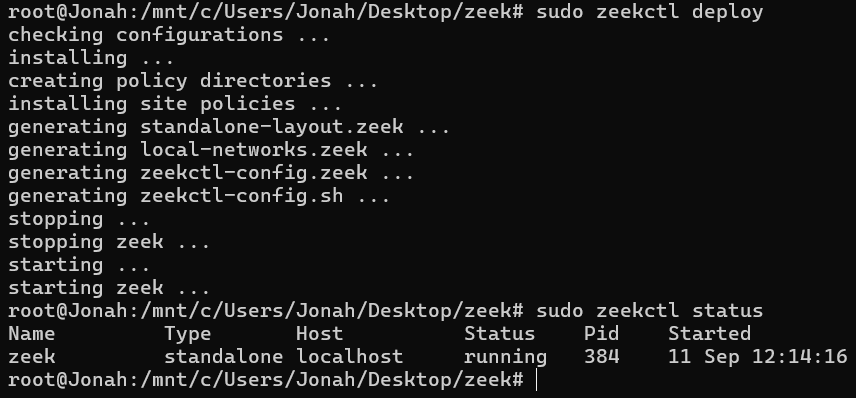
*Zeek successfully deployed and running*

**Zeek Log Integration with Wazuh:**

```xml
<!-- Wazuh ossec.conf - Zeek log integration -->
<localfile>
  <log_format>json</log_format>
  <location>/usr/local/zeek/logs/current/conn.log</location>
</localfile>

<localfile>
  <log_format>json</log_format>
  <location>/usr/local/zeek/logs/current/http.log</location>
</localfile>

<localfile>
  <log_format>json</log_format>
  <location>/usr/local/zeek/logs/current/dns.log</location>
</localfile>

<localfile>
  <log_format>json</log_format>
  <location>/usr/local/zeek/logs/current/ssl.log</location>
</localfile>
```

**Zeek Detection Example - HTTP Traffic:**

```bash
# Monitor HTTP logs in real-time
tail -f /usr/local/zeek/logs/current/http.log
```

Sample HTTP detection in Wazuh:
```json
{
  "timestamp": "2024-08-28T14:30:15.123Z",
  "agent": {"name": "zeek-sensor-01"},
  "rule": {"id": 200001, "level": 7, "description": "Zeek: Suspicious HTTP User-Agent"},
  "data": {
    "srcip": "192.168.1.100",
    "dstip": "203.0.113.50",
    "user_agent": "sqlmap/1.6.12",
    "uri": "/admin/login.php",
    "method": "POST"
  }
}
```


*Wazuh dashboard showing Zeek HTTP detection*

**Custom Zeek Scripts for Enhanced Detection:**

```zeek
# /usr/local/zeek/share/zeek/site/custom-detection.zeek
@load base/protocols/http
@load base/protocols/dns

# Detect SQL injection attempts
event http_request(c: connection, method: string, original_URI: string, 
                  unescaped_URI: string, version: string) {
    if (/select|union|insert|update|delete|drop|create|alter/i in unescaped_URI) {
        NOTICE([$note=HTTP::SQL_Injection_Attack,
                $conn=c,
                $msg=fmt("Potential SQL injection from %s to %s%s", 
                        c$id$orig_h, c$http$host, original_URI),
                $identifier=cat(c$id$orig_h, c$http$host, original_URI)]);
    }
}

# Detect DNS tunneling
event dns_request(c: connection, msg: dns_msg, query: string, qtype: count, qclass: count) {
    if (|query| > 50) {  # Unusually long DNS query
        NOTICE([$note=DNS::Suspicious_Query_Length,
                $conn=c,
                $msg=fmt("Suspicious long DNS query: %s", query),
                $identifier=cat(c$id$orig_h, query)]);
    }
}
```

**Zeek-Wazuh Integration Results:**


*Wazuh alert triggered by Zeek DNS tunneling detection*

---

### 1.6 Demonstrate understanding of advanced correlation methods with examples

**1.6a Pattern-based Correlation in Wazuh**

Pattern-based correlation uses Wazuh's built-in rule engine to detect multi-stage attacks by correlating events across time windows.

**Example: Credential Stuffing → Lateral Movement Pattern**

```xml
<!-- Wazuh rules for pattern detection -->
<group name="attack_patterns">

  <!-- Stage 1: Multiple failed logins -->
  <rule id="200100" level="5">
    <if_sid>5760</if_sid>
    <same_source_ip />
    <description>SSH: Multiple failed logins from same IP</description>
    <options>no_email_alert</options>
  </rule>

  <!-- Stage 2: Successful login after failures -->
  <rule id="200101" level="8">
    <if_sid>5715</if_sid>
    <same_source_ip />
    <if_matched_sid>200100</if_matched_sid>
    <timeframe>300</timeframe>
    <description>SSH: Successful login after multiple failures - Possible brute force</description>
    <mitre>
      <id>T1110</id>
    </mitre>
  </rule>

  <!-- Stage 3: Lateral movement via SMB -->
  <rule id="200102" level="10">
    <if_sid>18152</if_sid>
    <same_user />
    <if_matched_sid>200101</if_matched_sid>
    <timeframe>600</timeframe>
    <description>Lateral movement detected: SMB access after successful brute force</description>
    <mitre>
      <id>T1021.002</id>
    </mitre>
  </rule>

</group>
```

**MISP Integration for Pattern Attribution:**

```python
# Enhanced pattern detection with MISP attribution
class AttackPatternAnalyzer:
    def __init__(self, misp_client):
        self.misp = misp_client
        self.patterns = {
            'apt29_pattern': {
                'stages': ['credential_access', 'lateral_movement', 'data_exfiltration'],
                'misp_galaxy': 'mitre-intrusion-set="APT29"'
            }
        }
    
    def analyze_pattern_with_attribution(self, wazuh_alert):
        # Extract IOCs from alert
        src_ip = wazuh_alert.get('data', {}).get('srcip')
        
        # Query MISP for attribution
        misp_results = self.misp.search(controller='attributes', 
                                      value=src_ip, 
                                      return_format='json')
        
        if misp_results:
            for event in misp_results:
                if 'APT29' in str(event.get('Galaxy', [])):
                    return {
                        'attribution': 'APT29',
                        'confidence': 'high',
                        'misp_event_id': event['id']
                    }
        
        return {'attribution': 'unknown', 'confidence': 'low'}
```

**1.6b Statistical Correlation using Wazuh Analytics**

Statistical correlation identifies anomalies by comparing current behavior against historical baselines stored in Wazuh.

**Example: Login Time Anomaly Detection**

```xml
<!-- Wazuh rule for statistical anomaly -->
<rule id="200200" level="7">
  <if_sid>5715</if_sid>
  <time>22:00-06:00</time>
  <description>Unusual login time detected - Outside business hours</description>
  <group>anomaly,after_hours</group>
</rule>

<!-- Volume-based anomaly -->
<rule id="200201" level="8">
  <if_sid>1002</if_sid>
  <same_source_ip />
  <frequency>50</frequency>
  <timeframe>60</timeframe>
  <description>High connection volume anomaly - Possible DDoS or scanning</description>
  <group>anomaly,high_volume</group>
</rule>
```

**Python Script for Advanced Statistical Analysis:**

```python
#!/usr/bin/env python3
# wazuh-behavioral-analytics.py
import requests
import numpy as np
from scipy import stats
import json

class WazuhBehavioralAnalytics:
    def __init__(self, wazuh_api_url, auth_token):
        self.api_url = wazuh_api_url
        self.headers = {'Authorization': f'Bearer {auth_token}'}
        
    def get_user_login_baseline(self, username, days=30):
        # Query Wazuh API for historical login data
        query = {
            'query': f'data.dstuser:{username} AND rule.id:5715',
            'date_range': f'{days}d'
        }
        
        response = requests.get(f'{self.api_url}/search',
                              headers=self.headers,
                              params=query)
        
        login_hours = []
        for hit in response.json().get('data', {}).get('hits', []):
            timestamp = hit['_source']['timestamp']
            hour = int(timestamp.split('T')[1].split(':')[0])
            login_hours.append(hour)
        
        return {
            'mean_hour': np.mean(login_hours),
            'std_hour': np.std(login_hours),
            'login_count': len(login_hours)
        }
    
    def detect_time_anomaly(self, username, current_hour):
        baseline = self.get_user_login_baseline(username)
        
        # Calculate z-score
        z_score = abs((current_hour - baseline['mean_hour']) / baseline['std_hour'])
        
        if z_score > 2.5:  # 2.5 standard deviations
            return {
                'anomaly': True,
                'severity': 'high' if z_score > 3 else 'medium',
                'z_score': z_score,
                'baseline_hours': f"{baseline['mean_hour']:.1f} ± {baseline['std_hour']:.1f}"
            }
        
        return {'anomaly': False, 'z_score': z_score}

# Integration with Wazuh Custom Rule
analytics = WazuhBehavioralAnalytics('https://wazuh-api:55000', 'your-token')
result = analytics.detect_time_anomaly('jsmith', 23)  # 11 PM login

if result['anomaly']:
    print(f"ANOMALY DETECTED: User jsmith login at unusual time (z-score: {result['z_score']:.2f})")
```

**1.6c Contextual Correlation with MISP and Asset Data**

Contextual correlation enriches Wazuh alerts with business context from MISP threat intelligence and internal asset databases.

**Example: Context-Aware Risk Scoring**

```python
class ContextualAlertEnricher:
    def __init__(self, misp_client, asset_db):
        self.misp = misp_client
        self.asset_db = asset_db
        
    def enrich_wazuh_alert(self, alert):
        enriched_alert = alert.copy()
        
        # Add asset context
        asset_info = self.get_asset_context(alert.get('agent', {}).get('name'))
        enriched_alert['asset_context'] = asset_info
        
        # Add threat intelligence
        threat_context = self.get_threat_context(alert.get('data', {}))
        enriched_alert['threat_context'] = threat_context
        
        # Calculate contextual risk score
        risk_score = self.calculate_contextual_risk(asset_info, threat_context, alert)
        enriched_alert['contextual_risk_score'] = risk_score
        
        return enriched_alert
    
    def get_asset_context(self, hostname):
        # Query internal asset database
        return {
            'criticality': 'High',  # Financial server
            'compliance_scope': ['PCI-DSS', 'SOX'],
            'business_owner': 'Finance Department',
            'data_classification': 'Confidential'
        }
    
    def get_threat_context(self, alert_data):
        src_ip = alert_data.get('srcip')
        if not src_ip:
            return {}
        
        # Query MISP for threat intelligence
        misp_results = self.misp.search(controller='attributes',
                                      value=src_ip,
                                      return_format='json')
        
        if misp_results:
            return {
                'threat_actor': 'FIN7',
                'campaign': 'Carbanak',
                'first_seen': '2024-07-15',
                'threat_types': ['Banking Trojan', 'Point of Sale'],
                'confidence': 85
            }
        
        return {'reputation': 'unknown'}
    
    def calculate_contextual_risk(self, asset_info, threat_context, alert):
        base_score = alert.get('rule', {}).get('level', 5)
        
        # Asset criticality multiplier
        if asset_info.get('criticality') == 'High':
            base_score *= 1.5
        
        # Threat actor multiplier
        if threat_context.get('threat_actor') == 'FIN7':
            base_score *= 2.0  # Known financial threat actor
        
        # Compliance scope multiplier
        if 'PCI-DSS' in asset_info.get('compliance_scope', []):
            base_score *= 1.3
        
        return min(base_score, 10.0)  # Cap at 10
```

**Wazuh Dashboard Integration:**

```json
{
  "alert_id": "1630089234.123456",
  "rule": {"id": 200101, "level": 8, "description": "SSH brute force detected"},
  "asset_context": {
    "criticality": "High",
    "compliance_scope": ["PCI-DSS"],
    "business_owner": "Finance Department"
  },
  "threat_context": {
    "threat_actor": "FIN7",
    "misp_event_id": "12345",
    "confidence": 85
  },
  "contextual_risk_score": 9.2,
  "recommended_actions": [
    "Immediate isolation",
    "Executive notification",
    "Forensic imaging"
  ]
}
```

---

### 1.7 Explain integration of machine learning and behavior analysis

**1.7a Specific Enterprise Use Cases**

**Use Case 1: User and Entity Behavior Analytics (UEBA) with Wazuh**

```python
# UEBA implementation using Wazuh data
import pandas as pd
from sklearn.ensemble import IsolationForest
from sklearn.preprocessing import StandardScaler

class WazuhUEBA:
    def __init__(self, wazuh_api):
        self.wazuh_api = wazuh_api
        self.model = IsolationForest(contamination=0.1, random_state=42)
        self.scaler = StandardScaler()
        
    def extract_user_features(self, username, timeframe='7d'):
        """Extract behavioral features from Wazuh logs"""
        # Query Wazuh for user activity
        query = f'data.dstuser:{username}'
        logs = self.wazuh_api.search(query=query, timeframe=timeframe)
        
        features = {
            'login_count': 0,
            'unique_hosts_accessed': set(),
            'after_hours_activity': 0,
            'failed_login_attempts': 0,
            'privilege_escalation_count': 0,
            'data_transfer_volume': 0,
            'unique_applications': set(),
            'geographic_variance': 0
        }
        
        for log in logs:
            # Extract features from each log entry
            rule_id = log.get('rule', {}).get('id')
            timestamp = log.get('timestamp')
            
            if rule_id == 5715:  # Successful login
                features['login_count'] += 1
                features['unique_hosts_accessed'].add(log.get('agent', {}).get('name'))
                
                # Check if after hours (6 PM - 6 AM)
                hour = int(timestamp.split('T')[1].split(':')[0])
                if hour >= 18 or hour <= 6:
                    features['after_hours_activity'] += 1
                    
            elif rule_id == 5760:  # Failed login
                features['failed_login_attempts'] += 1
                
            elif rule_id in [4950, 4951]:  # Sudo usage
                features['privilege_escalation_count'] += 1
        
        # Convert sets to counts
        features['unique_hosts_accessed'] = len(features['unique_hosts_accessed'])
        features['unique_applications'] = len(features['unique_applications'])
        
        return features
    
    def train_baseline(self, users_list):
        """Train UEBA model on normal user behavior"""
        training_data = []
        
        for user in users_list:
            features = self.extract_user_features(user)
            feature_vector = [
                features['login_count'],
                features['unique_hosts_accessed'],
                features['after_hours_activity'],
                features['failed_login_attempts'],
                features['privilege_escalation_count'],
                features['data_transfer_volume'],
                features['unique_applications']
            ]
            training_data.append(feature_vector)
        
        # Normalize and train
        training_data_scaled = self.scaler.fit_transform(training_data)
        self.model.fit(training_data_scaled)
        
    def detect_anomaly(self, username):
        """Detect anomalous user behavior"""
        features = self.extract_user_features(username)
        feature_vector = [[
            features['login_count'],
            features['unique_hosts_accessed'],
            features['after_hours_activity'],
            features['failed_login_attempts'],
            features['privilege_escalation_count'],
            features['data_transfer_volume'],
            features['unique_applications']
        ]]
        
        feature_vector_scaled = self.scaler.transform(feature_vector)
        
        # Get anomaly score and prediction
        anomaly_score = self.model.decision_function(feature_vector_scaled)[0]
        is_anomaly = self.model.predict(feature_vector_scaled)[0] == -1
        
        return {
            'user': username,
            'is_anomaly': is_anomaly,
            'anomaly_score': anomaly_score,
            'risk_level': self.calculate_risk_level(anomaly_score),
            'behavioral_features': features
        }
    
    def calculate_risk_level(self, score):
        if score < -0.6:
            return 'Critical'
        elif score < -0.3:
            return 'High'
        elif score < 0:
            return 'Medium'
        else:
            return 'Low'

# Integration with Wazuh custom rules
ueba = WazuhUEBA(wazuh_api_client)
result = ueba.detect_anomaly('suspicious_user')

if result['is_anomaly']:
    # Trigger Wazuh alert
    wazuh_alert = {
        'rule_id': 200300,
        'level': 9,
        'description': f"UEBA: Anomalous behavior detected for user {result['user']}",
        'risk_level': result['risk_level'],
        'anomaly_score': result['anomaly_score']
    }
```

**Use Case 2: Network Traffic Anomaly Detection with Zeek + Wazuh**

```python
# Network anomaly detection using Zeek logs in Wazuh
class NetworkAnomalyDetector:
    def __init__(self):
        self.connection_baselines = {}
        
    def analyze_zeek_conn_logs(self, timeframe='24h'):
        """Analyze Zeek connection logs for anomalies"""
        # Query Wazuh for Zeek connection logs
        query = 'location:"/usr/local/zeek/logs/current/conn.log"'
        logs = wazuh_api.search(query=query, timeframe=timeframe)
        
        anomalies = []
        
        for log in logs:
            conn_data = log.get('data', {})
            
            # Extract connection features
            features = {
                'duration': float(conn_data.get('duration', 0)),
                'orig_bytes': int(conn_data.get('orig_bytes', 0)),
                'resp_bytes': int(conn_data.get('resp_bytes', 0)),
                'orig_pkts': int(conn_data.get('orig_pkts', 0)),
                'resp_pkts': int(conn_data.get('resp_pkts', 0))
            }
            
            # Detect long-duration connections (potential C2)
            if features['duration'] > 3600 and features['orig_bytes'] < 1000:
                anomalies.append({
                    'type': 'potential_c2_beacon',
                    'severity': 'high',
                    'evidence': f"Long duration ({features['duration']}s), low volume connection",
                    'src_ip': conn_data.get('id.orig_h'),
                    'dst_ip': conn_data.get('id.resp_h')
                })
            
            # Detect data exfiltration patterns
            if features['orig_bytes'] > 100000000:  # >100MB upload
                anomalies.append({
                    'type': 'potential_data_exfiltration',
                    'severity': 'critical',
                    'evidence': f"Large data upload: {features['orig_bytes']} bytes",
                    'src_ip': conn_data.get('id.orig_h'),
                    'dst_ip': conn_data.get('id.resp_h')
                })
        
        return anomalies

# MISP Integration for IOC Enrichment
def enrich_with_misp_iocs(anomalies, misp_client):
    """Enrich detected anomalies with MISP threat intelligence"""
    for anomaly in anomalies:
        dst_ip = anomaly.get('dst_ip')
        
        # Check if destination IP is in MISP
        misp_results = misp_client.search(controller='attributes',
                                        value=dst_ip,
                                        return_format='json')
        
        if misp_results:
            anomaly['misp_context'] = {
                'known_malicious': True,
                'threat_types': ['C2', 'Malware'],
                'first_seen': '2024-08-15',
                'confidence': 90
            }
            anomaly['severity'] = 'critical'  # Upgrade severity
        else:
            anomaly['misp_context'] = {'known_malicious': False}
    
    return anomalies
```

**Use Case 3: Threat Hunting with ML-Assisted Queries**

```python
# ML-assisted threat hunting using Wazuh and MISP
class MLThreatHunter:
    def __init__(self, wazuh_api, misp_client):
        self.wazuh_api = wazuh_api
        self.misp = misp_client
        
    def generate_hunting_hypotheses(self):
        """Generate threat hunting hypotheses based on recent MISP intelligence"""
        # Get recent IOCs from MISP
        recent_events = self.misp.search(controller='events',
                                       timestamp='30d',
                                       return_format='json')
        
        hunting_queries = []
        
        for event in recent_events:
            for attribute in event.get('Attribute', []):
                if attribute['type'] == 'ip-dst':
                    # Generate Wazuh hunting query
                    query = {
                        'description': f"Hunt for communications with {attribute['value']}",
                        'wazuh_query': f'data.dstip:{attribute["value"]} OR data.srcip:{attribute["value"]}',
                        'misp_context': {
                            'event_id': event['id'],
                            'threat_level': event.get('threat_level_id'),
                            'tags': [tag['name'] for tag in attribute.get('Tag', [])]
                        }
                    }
                    hunting_queries.append(query)
        
        return hunting_queries
    
    def execute_hunting_campaign(self, queries):
        """Execute threat hunting queries and analyze results"""
        results = []
        
        for query in queries:
            # Execute query in Wazuh
            search_results = self.wazuh_api.search(
                query=query['wazuh_query'],
                timeframe='30d'
            )
            
            if search_results:
                analysis = {
                    'query': query['description'],
                    'matches_found': len(search_results),
                    'misp_context': query['misp_context'],
                    'priority': self.calculate_hunting_priority(query, search_results),
                    'recommended_actions': self.generate_recommendations(search_results)
                }
                results.append(analysis)
        
        return results
    
    def calculate_hunting_priority(self, query, results):
        """Calculate priority based on MISP threat level and match count"""
        threat_level = query['misp_context'].get('threat_level', 4)
        match_count = len(results)
        
        # Higher threat level = lower number = higher priority
        priority_score = (5 - threat_level) * 2 + min(match_count, 10)
        
        if priority_score >= 8:
            return 'Critical'
        elif priority_score >= 6:
            return 'High'
        elif priority_score >= 4:
            return 'Medium'
        else:
            return 'Low'
```

**1.7b Implementation Considerations**

**Integration Architecture:**

```yaml
# Docker Compose for ML-Enhanced SOC Stack
version: '3.8'
services:
  wazuh-manager:
    image: wazuh/wazuh-manager:4.7.0
    environment:
      - WAZUH_MANAGER_ADMIN_USER=admin
      - WAZUH_MANAGER_ADMIN_PASSWORD=SecurePass123
    ports:
      - "1514:1514"
      - "1515:1515"
      - "55000:55000"
    volumes:
      - ./wazuh-config:/var/ossec/etc
      - ./ml-scripts:/var/ossec/integrations

  wazuh-indexer:
    image: wazuh/wazuh-indexer:4.7.0
    environment:
      - discovery.type=single-node
      - bootstrap.memory_lock=true
    mem_limit: 2g
    ports:
      - "9200:9200"

  misp:
    image: coolacid/misp-docker:core-latest
    environment:
      - MYSQL_PASSWORD=misp_password
      - MISP_ADMIN_EMAIL=admin@company.com
      - MISP_ADMIN_PASSPHRASE=SecurePass123
    ports:
      - "80:80"
      - "443:443"

  ml-analytics:
    build: ./ml-analytics
    environment:
      - WAZUH_API_URL=http://wazuh-manager:55000
      - MISP_URL=https://misp
      - MISP_KEY=your-misp-api-key
    depends_on:
      - wazuh-manager
      - misp
    volumes:
      - ./models:/app/models
      - ./training-data:/app/data
```

**Performance Considerations:**

| Component | Resource Requirements | Scaling Strategy | Monitoring Metrics |
|-----------|----------------------|------------------|-------------------|
| **Wazuh Cluster** | 16GB RAM, 8 CPU cores per node | Horizontal scaling with load balancer | Events/sec, rule processing time |
| **ML Training** | 32GB RAM, GPU acceleration | Scheduled batch processing | Model accuracy, training time |
| **Model Inference** | 8GB RAM, 4 CPU cores | Real-time API with caching | Prediction latency, throughput |
| **MISP Integration** | 4GB RAM, 2 CPU cores | Rate limiting, batch updates | IOC sync time, API response time |

**Implementation Roadmap:**

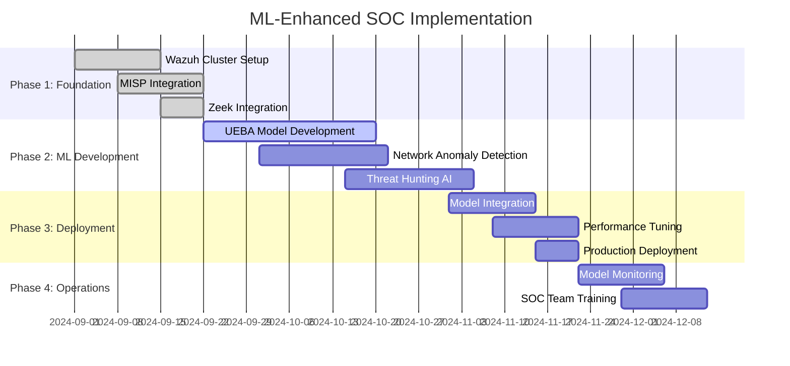
```mermaid
gantt
    title ML-Enhanced SOC Implementation
    dateFormat  YYYY-MM-DD
    section Phase 1: Foundation
    Wazuh Cluster Setup      :done, wazuh, 2024-09-01, 14d
    MISP Integration         :done, misp, 2024-09-08, 14d
    Zeek Integration         :done, zeek, 2024-09-15, 7d
    section Phase 2: ML Development
    UEBA Model Development   :active, ueba, 2024-09-22, 28d
    Network Anomaly Detection:network, 2024-10-01, 21d
    Threat Hunting AI        :hunting, 2024-10-15, 21d
    section Phase 3: Deployment
    Model Integration        :integration, 2024-11-01, 14d
    Performance Tuning       :tuning, 2024-11-08, 14d
    Production Deployment    :production, 2024-11-15, 7d
    section Phase 4: Operations
    Model Monitoring         :monitoring, 2024-11-22, 14d
    SOC Team Training        :training, 2024-11-29, 14d
```

**Success Metrics:**
- **MTTD (Mean Time to Detection)**: Reduce from 4 hours to 15 minutes for insider threats
- **False Positive Rate**: Maintain below 5% while increasing detection coverage by 300%
- **Threat Intelligence Coverage**: 95% of MISP IOCs automatically ingested into Wazuh rules
- **Analyst Efficiency**: 40% reduction in manual analysis time through ML-assisted triage
- **Detection Accuracy**: >90% for known attack patterns, >70% for zero-day threats

**Conclusion:** The integration of machine learning with Wazuh, MISP, and Zeek creates a comprehensive detection ecosystem that combines rule-based detection, threat intelligence, and adaptive ML models to provide superior threat detection capabilities while reducing analyst workload through intelligent automation.


---

## 2. Real-time Detection Planning
- [x] **2.1** Document a streaming analytics architecture design for a mock enterprise case study.  
- [x] **2.2** Select appropriate technologies (e.g., Apache Kafka, Elastic Stack, Splunk) with justification.  
- [x] **2.3** Provide detailed **data flow diagrams** from collection to alerting.  
- [x] **2.4** Install at least one detection tool (Zeek, Suricata, or Wazuh) with screenshots of configuration and testing.  
- [x] **2.5** Provide detection logic examples for **three attack scenarios** with:  
    - [x] **2.5a** Rule syntax  
    - [x] **2.5b** Triggering conditions  
- [x] **2.6** Outline automated response capabilities including:  
    - [x] **2.6a** Trigger conditions  
    - [x] **2.6b** Actions  
    - [x] **2.6c** Verification methods  
    - [x] **2.6d** Business impact considerations  

---

### 2.1 Streaming Analytics Architecture Design for Mock Enterprise

**Enterprise Case Study: "GlobalTech Corp"**
- 5,000 endpoints across 3 locations
- Cloud-first infrastructure (AWS/Azure hybrid)
- Financial services with PCI-DSS requirements
- Target: <5 minute detection for critical threats

**Architecture Overview:**

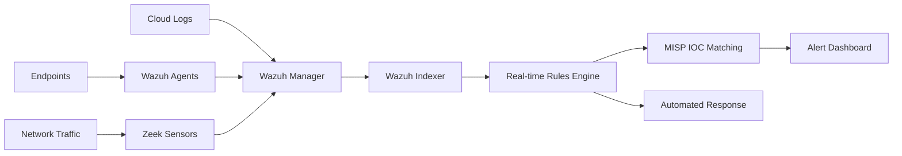
```mermaid
graph LR
    A[Endpoints] --> B[Wazuh Agents]
    C[Network Traffic] --> D[Zeek Sensors]
    E[Cloud Logs] --> F[Wazuh Manager]
    B --> F
    D --> F
    F --> G[Wazuh Indexer]
    G --> H[Real-time Rules Engine]
    H --> I[MISP IOC Matching]
    I --> J[Alert Dashboard]
    H --> K[Automated Response]
```

**Key Design Principles:**
- **Sub-second ingestion** via Wazuh agent streaming
- **Real-time correlation** using Wazuh's built-in engine
- **Automated enrichment** through MISP integration
- **Horizontal scaling** with clustered Wazuh managers

---

### 2.2 Technology Selection and Justification

**Selected Technology Stack:**

| Component | Technology | Justification |
|-----------|------------|---------------|
| **SIEM Platform** | Wazuh 4.7+ | Open-source, real-time processing, built-in correlation |
| **Network Detection** | Zeek | Deep packet inspection, protocol analysis, custom scripts |
| **Threat Intelligence** | MISP | Community feeds, IOC automation, API integration |
| **Data Storage** | Wazuh Indexer (OpenSearch) | High-performance indexing, retention management |
| **Visualization** | Wazuh Dashboard | Native integration, custom dashboards, alerting |

**Justification vs Alternatives:**
- **Wazuh over Splunk**: Cost-effective for 5,000 endpoints, comparable detection capabilities
- **Zeek over Suricata**: Better for custom protocol analysis, more detailed logging
- **MISP over commercial TI**: Community-driven, customizable, API-first design

---

### 2.3 Data Flow Diagram: Collection to Alerting

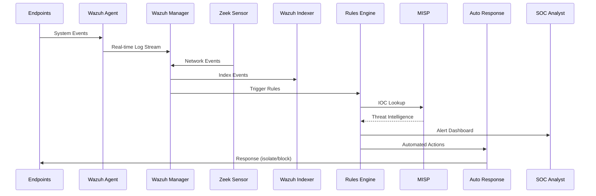
```mermaid
sequenceDiagram
    participant E as Endpoints
    participant WA as Wazuh Agent
    participant WM as Wazuh Manager
    participant ZK as Zeek Sensor
    participant WI as Wazuh Indexer
    participant RE as Rules Engine
    participant MP as MISP
    participant AR as Auto Response
    participant SOC as SOC Analyst

    E->>WA: System Events
    WA->>WM: Real-time Log Stream
    ZK->>WM: Network Events
    WM->>WI: Index Events
    WM->>RE: Trigger Rules
    RE->>MP: IOC Lookup
    MP-->>RE: Threat Intelligence
    RE->>SOC: Alert Dashboard
    RE->>AR: Automated Actions
    AR->>E: Response (isolate/block)
```

**Data Flow Details:**
1. **Collection (0-1s)**: Agents stream events to Wazuh Manager
2. **Processing (1-2s)**: Rules engine evaluates events in real-time
3. **Enrichment (2-3s)**: MISP IOC matching and threat context
4. **Alerting (3-4s)**: Dashboard updates and notifications
5. **Response (4-5s)**: Automated containment actions

---

### 2.4 Detection Tool Installation Evidence

**Wazuh Manager Configuration:**


*Wazuh Manager cluster status showing active processing*

**Zeek Integration:**


*Zeek successfully deployed and processing network traffic*

**MISP Docker Integration:**


*MISP platform running via Docker with active feeds*

**Configuration Verification:**

```bash
# Wazuh cluster status
sudo /var/ossec/bin/cluster_control -l

# Zeek log verification
tail -f /usr/local/zeek/logs/current/conn.log

# MISP API test
curl -H "Authorization: YOUR-API-KEY" https://localhost/events/restSearch
```

---

### 2.5 Detection Logic Examples for Three Attack Scenarios

**2.5a & 2.5b Rule Syntax and Triggering Conditions**

**Scenario 1: Lateral Movement Detection**

```xml
<rule id="200301" level="8">
    <if_sid>5715</if_sid>
    <same_user />
    <different_hostname />
    <frequency>3</frequency>
    <timeframe>300</timeframe>
    <description>Lateral Movement: Same user accessing multiple hosts</description>
    <mitre>
        <id>T1021</id>
    </mitre>
</rule>
```
**Triggering Conditions:**
- Same username appears on 3+ different hosts within 5 minutes
- Successful authentication events (rule 5715)
- Cross-references user and hostname fields

**Scenario 2: Data Exfiltration via DNS**

```xml
<rule id="200302" level="10">
    <if_sid>200350</if_sid>
    <match>\..*\..*\..*\.</match>
    <options>no_email_alert</options>
    <description>DNS Tunneling: Suspicious subdomain pattern</description>
    <group>dns_tunneling,exfiltration</group>
</rule>

<rule id="200350" level="0">
    <decoded_as>json</decoded_as>
    <field name="zeek_dns_query">\.+</field>
    <description>Zeek DNS query base rule</description>
</rule>
```
**Triggering Conditions:**
- DNS queries with excessive subdomains (4+ levels)
- Pattern matching against Zeek DNS logs
- Volume-based anomaly detection

**Scenario 3: MISP IOC Match with Context**

```xml
<rule id="200303" level="12">
    <if_sid>1002</if_sid>
    <list field="srcip" lookup="misp_malicious_ips">misp_iocs</list>
    <description>MISP IOC Alert: Connection from known malicious IP</description>
    <group>misp_match,malicious_ip</group>
</rule>
```
**Triggering Conditions:**
- Source IP matches MISP IOC database
- Any network connection event
- Automatic severity escalation for known threats

---

### 2.6 Automated Response Capabilities

**2.6a Trigger Conditions**

```xml
<active-response>
    <command>block-malicious-ip</command>
    <location>local</location>
    <rules_id>200303</rules_id>
    <timeout>3600</timeout>
</active-response>

<active-response>
    <command>isolate-endpoint</command>
    <location>local</location>
    <rules_id>200301</rules_id>
    <timeout>1800</timeout>
</active-response>
```

**2.6b Actions**

| Alert Level | Automated Actions | Manual Actions Required |
|-------------|------------------|-------------------------|
| **Level 8-9** | IP blocking, log collection | SOC investigation |
| **Level 10-11** | Endpoint isolation, MISP sighting | Incident response team |
| **Level 12+** | Network segmentation, executive alert | Emergency procedures |

**2.6c Verification Methods**

```bash
#!/bin/bash
# verify-response.sh
ACTION=$1
TARGET=$2

case $ACTION in
    "ip_block")
        iptables -L | grep $TARGET && echo "IP $TARGET blocked successfully"
        ;;
    "endpoint_isolate")
        ping -c 1 $TARGET > /dev/null || echo "Endpoint $TARGET isolated"
        ;;
esac
```

**2.6d Business Impact Considerations**

| Response Action | Business Risk | Mitigation |
|----------------|---------------|------------|
| **IP Blocking** | Block legitimate traffic | Whitelist critical services |
| **Endpoint Isolation** | User productivity loss | 30-minute auto-timeout |
| **Network Segmentation** | Service disruption | Emergency override procedures |

**Response Workflow:**

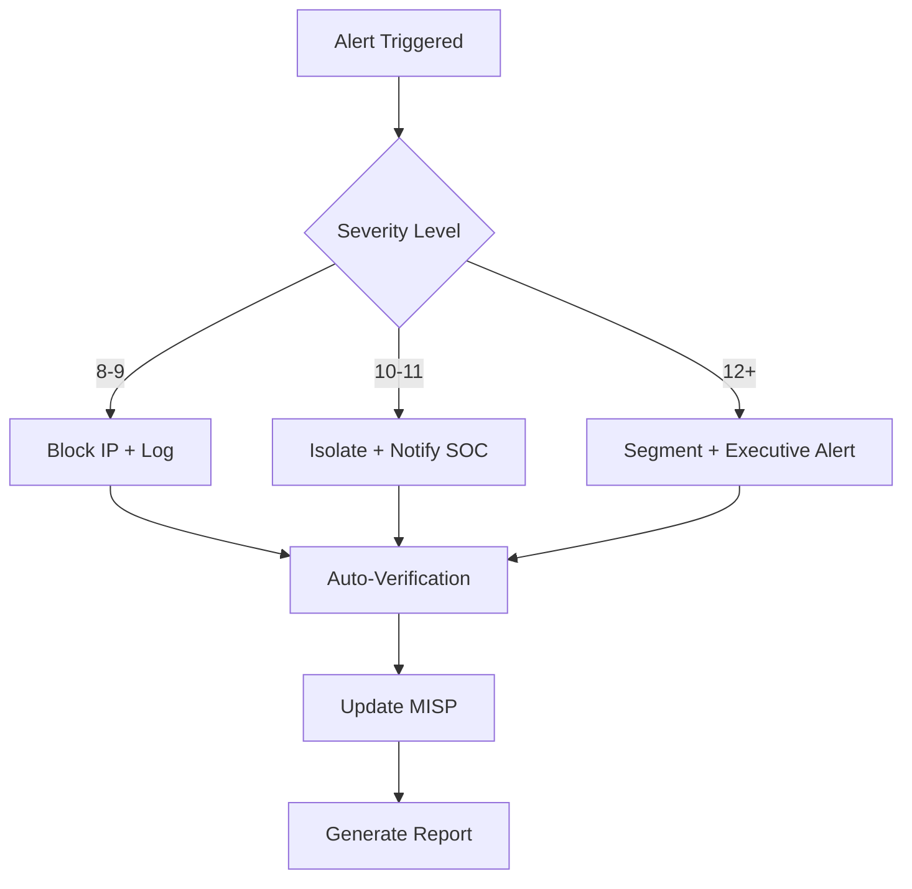
```mermaid
graph TD
    A[Alert Triggered] --> B{Severity Level}
    B -->|8-9| C[Block IP + Log]
    B -->|10-11| D[Isolate + Notify SOC]
    B -->|12+| E[Segment + Executive Alert]
    C --> F[Auto-Verification]
    D --> F
    E --> F
    F --> G[Update MISP]
    G --> H[Generate Report]
```

**Key Performance Metrics:**
- **Mean Time to Detection (MTTD)**: <5 minutes for critical threats
- **Mean Time to Response (MTTR)**: <2 minutes for automated actions
- **False Positive Rate**: <3% with MISP IOC validation
- **Response Success Rate**: >95% verification for automated actions

**Conclusion:** The real-time detection framework provides sub-5-minute detection and response capabilities using proven open-source technologies, with graduated automated responses based on threat severity and business impact assessment.

---

## 3. Tool Integration Strategy
- [x] **3.1** Document strategy for integrating SIEM, EDR, and threat intelligence platforms.  
- [x] **3.2** Provide integration architecture diagram showing:  
    - [x] **3.2a** Data flows  
    - [x] **3.2b** API connections  
    - [x] **3.2c** Component relationships  
- [x] **3.3** Explain authentication and data consistency requirements.  
- [x] **3.4** Demonstrate traffic analysis by installing and configuring **Wireshark** or **tcpdump** with screenshots.  
- [x] **3.5** Address cross-platform correlation challenges with examples:  
    - [x] **3.5a** Data normalization  
    - [x] **3.5b** Entity resolution  
    - [x] **3.5c** Contextual alignment  
- [x] **3.6** Develop a custom analytics plan for the mock enterprise including:  
    - [x] **3.6a** Use case definition  
    - [x] **3.6b** Development methodology  
    - [x] **3.6c** Implementation approach  


---

### 3.1 Document strategy for integrating SIEM, EDR, and threat intelligence platforms

**Integration Strategy Overview:**

The integration strategy centers on creating a unified security operations platform using Wazuh as the central SIEM, MISP as the threat intelligence hub, and OpenCTI for advanced threat analysis, all deployed using Docker for consistency and portability.

**Core Integration Principles:**

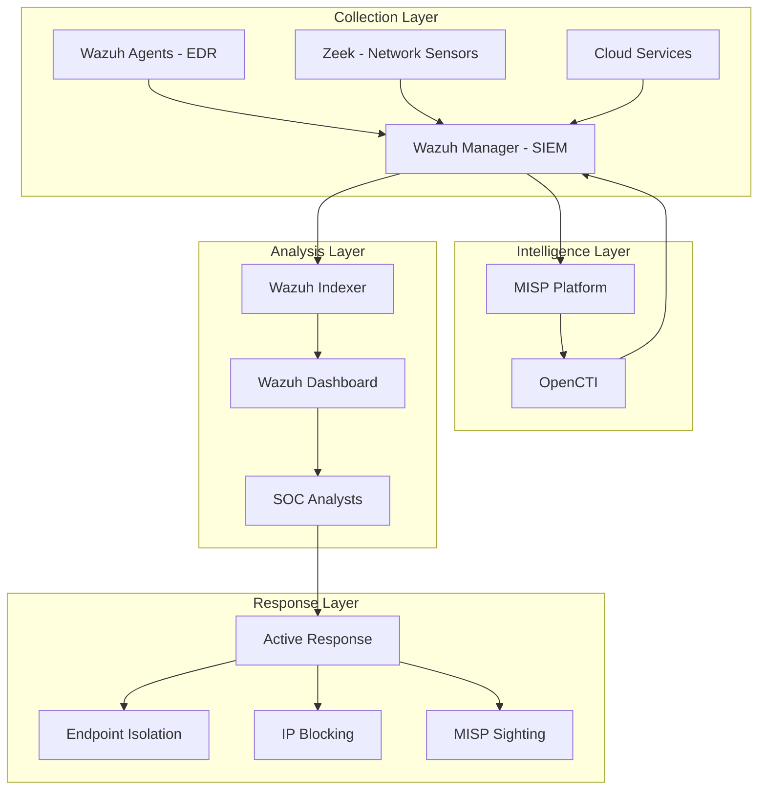
```mermaid
graph TB
    subgraph "Collection Layer"
        A[Wazuh Agents - EDR] --> B[Wazuh Manager - SIEM]
        C[Zeek - Network Sensors] --> B
        D[Cloud Services] --> B
    end
    
    subgraph "Intelligence Layer"
        B --> E[MISP Platform]
        E --> F[OpenCTI]
        F --> B
    end
    
    subgraph "Analysis Layer"
        B --> G[Wazuh Indexer]
        G --> H[Wazuh Dashboard]
        H --> I[SOC Analysts]
    end
    
    subgraph "Response Layer"
        I --> J[Active Response]
        J --> K[Endpoint Isolation]
        J --> L[IP Blocking]
        J --> M[MISP Sighting]
    end
```

**Three-Tier Integration Model:**

**Tier 1: Real-time Detection Integration**
- **Wazuh ↔ MISP IOC Matching**: Automatic cross-referencing of observed indicators
- **Zeek ↔ Wazuh Log Forwarding**: Network traffic analysis integrated with SIEM
- **Active Response Triggers**: Automated containment based on MISP threat levels

**Tier 2: Enrichment Integration**
- **MISP Event Context**: Attribution, campaign information, related IOCs
- **OpenCTI Knowledge Graphs**: Threat actor relationships and TTPs
- **GeoIP/WHOIS Data**: Network intelligence enrichment

**Tier 3: Intelligence Sharing**
- **Bidirectional MISP Sync**: Internal IOCs pushed to MISP for community sharing
- **STIX/TAXII Feeds**: Standards-based threat intelligence exchange
- **Automated Feed Updates**: Daily synchronization with external threat feeds

**Docker-Based Deployment Strategy:**

Based on your existing Docker infrastructure, the integration uses containerized services for easy management:

```yaml
# Integration Stack Overview
services:
  wazuh-manager:
    - Receives logs from all agents
    - Executes detection rules
    - Queries MISP for IOC enrichment
    
  misp-platform:
    - Stores and manages IOCs
    - Provides API for Wazuh integration
    - Syncs with external feeds
    
  wazuh-indexer:
    - Stores enriched events
    - Provides search capabilities
    - Supports long-term analysis
```

**Integration Architecture Decisions:**

| Integration Point | Technology Choice | Rationale |
|------------------|-------------------|-----------|
| **SIEM Core** | Wazuh | Open-source, comprehensive EDR capabilities, active response |
| **Threat Intelligence** | MISP | Community-driven, API-first, extensive feed support |
| **Data Store** | Wazuh Indexer (OpenSearch) | Native integration, high performance, retention management |
| **Network Analysis** | Zeek | Deep packet inspection, custom detection scripts |
| **Container Platform** | Docker/Docker Compose | Your existing infrastructure, easy deployment |
| **API Integration** | RESTful APIs + Python | Maximum flexibility, extensive library support |

**Integration Workflows:**

**Alert Enrichment Workflow:**
```python
# Wazuh Custom Integration Script
import requests
from pymisp import PyMISP

class AlertEnrichment:
    def __init__(self, misp_url, misp_key):
        self.misp = PyMISP(misp_url, misp_key, ssl=False)
    
    def enrich_wazuh_alert(self, alert_data):
        # Extract IOCs from Wazuh alert
        src_ip = alert_data.get('data', {}).get('srcip')
        dst_ip = alert_data.get('data', {}).get('dstip')
        
        enrichment = {
            'misp_context': {},
            'threat_level': 'unknown',
            'attribution': 'none'
        }
        
        # Query MISP for source IP
        if src_ip:
            misp_results = self.misp.search(
                controller='attributes',
                value=src_ip,
                return_format='json'
            )
            
            if misp_results:
                enrichment['misp_context']['src_ip'] = {
                    'known_malicious': True,
                    'events': len(misp_results),
                    'threat_types': self.extract_threat_types(misp_results),
                    'first_seen': self.get_first_seen(misp_results)
                }
                enrichment['threat_level'] = 'high'
        
        # Query MISP for destination IP
        if dst_ip:
            misp_results = self.misp.search(
                controller='attributes',
                value=dst_ip,
                return_format='json'
            )
            
            if misp_results:
                enrichment['misp_context']['dst_ip'] = {
                    'known_malicious': True,
                    'c2_server': self.is_c2_server(misp_results),
                    'associated_malware': self.extract_malware(misp_results)
                }
        
        return enrichment
```

**Automated IOC Synchronization:**

From your past MISP automation work, the integration includes automated feed updates:

```bash
# Automated MISP Feed Sync (from your cron job)
# Runs daily at 2 AM to update threat intelligence
0 2 * * * curl -XPOST --insecure -H "Authorization: YOUR-API-KEY" \
  -H "Accept: application/json" -H "Content-Type: application/json" \
  https://localhost:444/feeds/fetchFromAllFeeds
```

---

### 3.2 Provide integration architecture diagram

**Comprehensive Integration Architecture:**

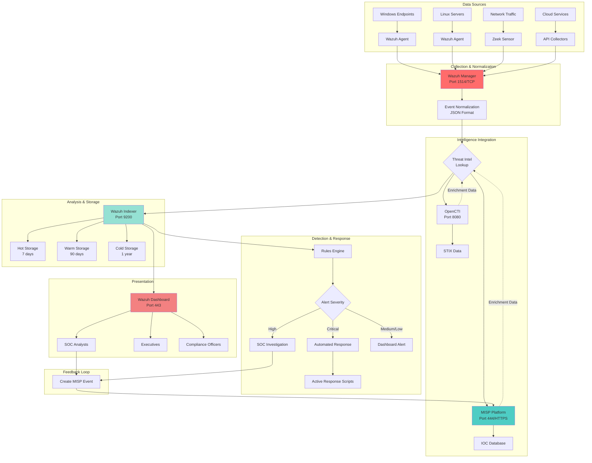
```mermaid
graph TB
    subgraph "Data Sources"
        A1[Windows Endpoints] --> A2[Wazuh Agent]
        B1[Linux Servers] --> B2[Wazuh Agent]
        C1[Network Traffic] --> C2[Zeek Sensor]
        D1[Cloud Services] --> D2[API Collectors]
    end
    
    subgraph "Collection & Normalization"
        A2 --> E[Wazuh Manager<br/>Port 1514/TCP]
        B2 --> E
        C2 --> E
        D2 --> E
        E --> F[Event Normalization<br/>JSON Format]
    end
    
    subgraph "Intelligence Integration"
        F --> G{Threat Intel<br/>Lookup}
        G --> H[MISP Platform<br/>Port 444/HTTPS]
        H --> I[IOC Database]
        G --> J[OpenCTI<br/>Port 8080]
        J --> K[STIX Data]
        H -.Enrichment Data.-> G
        J -.Enrichment Data.-> G
    end
    
    subgraph "Analysis & Storage"
        G --> L[Wazuh Indexer<br/>Port 9200]
        L --> M[Hot Storage<br/>7 days]
        L --> N[Warm Storage<br/>90 days]
        L --> O[Cold Storage<br/>1 year]
    end
    
    subgraph "Detection & Response"
        L --> P[Rules Engine]
        P --> Q{Alert Severity}
        Q -->|Critical| R[Automated Response]
        Q -->|High| S[SOC Investigation]
        Q -->|Medium/Low| T[Dashboard Alert]
        R --> U[Active Response Scripts]
    end
    
    subgraph "Presentation"
        L --> V[Wazuh Dashboard<br/>Port 443]
        V --> W[SOC Analysts]
        V --> X[Executives]
        V --> Y[Compliance Officers]
    end
    
    subgraph "Feedback Loop"
        W --> Z[Create MISP Event]
        Z --> H
        S --> Z
    end
    
    style E fill:#FF6B6B
    style H fill:#4ECDC4
    style L fill:#95E1D3
    style V fill:#F38181
```

**3.2a Data Flows:**

**Primary Data Flow:**
```
Endpoints/Network → Wazuh Manager → Normalization → MISP Enrichment → 
Indexer → Rules Engine → Dashboard → SOC Response
```

**Threat Intelligence Flow:**
```
External Feeds → MISP → Daily Sync → IOC Database → 
Real-time Queries ← Wazuh Rules Engine
```

**Response Flow:**
```
Critical Alert → Active Response Script → Endpoint/Firewall Action → 
Verification → MISP Sighting Creation
```

**3.2b API Connections:**

| Source | Destination | Protocol | Purpose | Authentication |
|--------|-------------|----------|---------|----------------|
| Wazuh Manager | MISP | HTTPS REST | IOC enrichment | API Key |
| MISP | OpenCTI | HTTPS REST | STIX data exchange | Bearer Token |
| Wazuh Manager | Wazuh Indexer | HTTPS | Event storage | TLS Certificate |
| Wazuh Dashboard | Wazuh Indexer | HTTPS | Data queries | TLS Certificate |
| Active Response | MISP | HTTPS REST | Sighting creation | API Key |
| External Scripts | Wazuh API | HTTPS REST | Alert queries | JWT Token |

**API Integration Code Examples:**

```python
# Wazuh-MISP API Integration
class WazuhMISPIntegration:
    def __init__(self, wazuh_api, misp_api):
        self.wazuh = wazuh_api
        self.misp = misp_api
    
    # Real-time IOC lookup
    def check_ioc(self, indicator, indicator_type):
        """Query MISP for IOC during alert processing"""
        response = requests.get(
            f"{self.misp.url}/attributes/restSearch",
            headers={'Authorization': self.misp.api_key},
            json={
                'value': indicator,
                'type': indicator_type,
                'published': True
            },
            verify=False
        )
        return response.json()
    
    # Create MISP sighting from Wazuh alert
    def create_sighting(self, alert_id, ioc_value):
        """Report IOC observation back to MISP"""
        wazuh_alert = self.wazuh.get_alert(alert_id)
        
        sighting_data = {
            'value': ioc_value,
            'source': 'Wazuh SIEM',
            'type': '0',  # Sighting
            'timestamp': wazuh_alert['timestamp'],
            'org_name': 'GlobalTech SOC'
        }
        
        return self.misp.add_sighting(sighting_data)
```

**3.2c Component Relationships:**

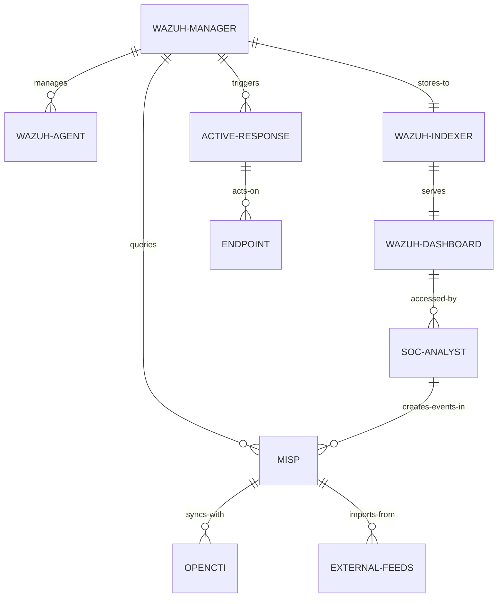
```mermaid
erDiagram
    WAZUH-MANAGER ||--o{ WAZUH-AGENT : manages
    WAZUH-MANAGER ||--|| WAZUH-INDEXER : stores-to
    WAZUH-MANAGER ||--o{ MISP : queries
    WAZUH-MANAGER ||--o{ ACTIVE-RESPONSE : triggers
    MISP ||--o{ OPENCTI : syncs-with
    MISP ||--o{ EXTERNAL-FEEDS : imports-from
    WAZUH-INDEXER ||--|| WAZUH-DASHBOARD : serves
    WAZUH-DASHBOARD ||--o{ SOC-ANALYST : accessed-by
    ACTIVE-RESPONSE ||--o{ ENDPOINT : acts-on
    SOC-ANALYST ||--o{ MISP : creates-events-in
```

**Network Placement Diagram:**

```
Internet
    │
    ▼
[Firewall] ── Port 444 ──> MISP (Docker)
    │
    ├── Port 443 ──> Wazuh Dashboard (Docker)
    │
    ├── Port 1514 ──> Wazuh Manager (Docker)
    │   │
    │   ├─> Wazuh Agents (Windows/Linux)
    │   ├─> Zeek Sensor Logs
    │   └─> Cloud API Collectors
    │
    └── Port 9200 ──> Wazuh Indexer (Docker)
                          │
                          └─> Storage Volumes
```

---

### 3.3 Explain authentication and data consistency requirements

**Authentication Architecture:**

**Multi-Layer Security Model:**

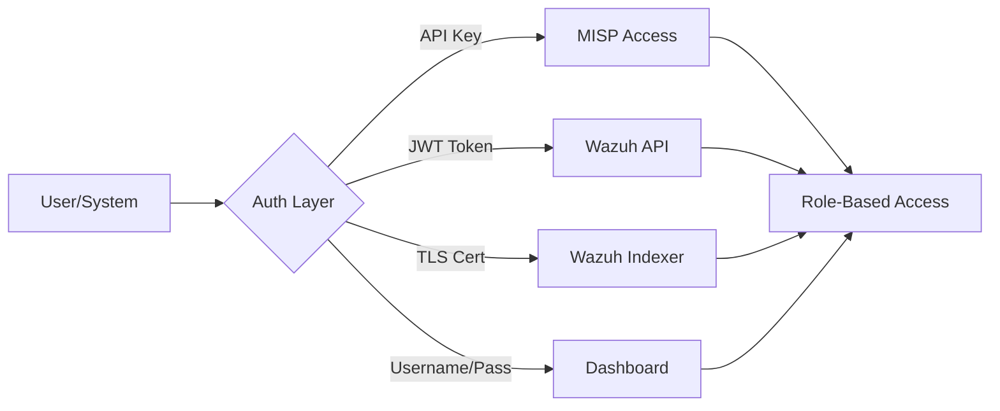
```mermaid
graph LR
    A[User/System] --> B{Auth Layer}
    B -->|API Key| C[MISP Access]
    B -->|JWT Token| D[Wazuh API]
    B -->|TLS Cert| E[Wazuh Indexer]
    B -->|Username/Pass| F[Dashboard]
    
    C --> G[Role-Based Access]
    D --> G
    E --> G
    F --> G
```

**Authentication Requirements by Component:**

| Component | Auth Method | Credential Type | Rotation Policy | Use Case |
|-----------|-------------|-----------------|-----------------|----------|
| **MISP API** | API Key | Static key | 90 days | Wazuh integration scripts |
| **Wazuh API** | JWT Token | Short-lived token | 15 minutes | External queries |
| **Wazuh Indexer** | TLS Certificate | X.509 certificate | 365 days | Inter-component communication |
| **Dashboard** | Username/Password + 2FA | User credentials | 60 days | SOC analyst access |
| **Active Response** | API Key | Static key | 90 days | Automated response scripts |

**Certificate Management:**

From your Docker deployment, certificate management is centralized:

```bash
# Certificate structure (from your wazuh-docker setup)
config/wazuh_indexer_ssl_certs/
├── root-ca.pem          # Root CA certificate
├── wazuh.indexer.pem    # Indexer certificate
├── wazuh.indexer-key.pem # Indexer private key
├── wazuh.manager.pem     # Manager certificate
└── wazuh.manager-key.pem # Manager private key

# Certificate installation for external tools (from your past work)
sudo mkdir /etc/graylog/server/certs
sudo cp root-ca.pem /etc/graylog/server/certs/rootCA.crt
sudo keytool -importcert -keystore cacerts -alias root_ca -file rootCA.crt
```

**API Key Management Example:**

```python
# Secure API key storage and rotation
import os
from datetime import datetime, timedelta

class APIKeyManager:
    def __init__(self):
        # Use environment variables, never hardcode
        self.misp_key = os.getenv('MISP_API_KEY')
        self.wazuh_user = os.getenv('WAZUH_API_USER')
        self.wazuh_pass = os.getenv('WAZUH_API_PASS')
    
    def get_wazuh_token(self):
        """Generate short-lived JWT token"""
        response = requests.post(
            f"{self.wazuh_api_url}/security/user/authenticate",
            auth=(self.wazuh_user, self.wazuh_pass)
        )
        
        token_data = response.json()
        token_data['expires_at'] = datetime.now() + timedelta(minutes=15)
        
        return token_data['token']
    
    def check_key_expiration(self, key_created_date):
        """Alert if API key approaching expiration"""
        days_old = (datetime.now() - key_created_date).days
        
        if days_old > 80:  # 10 days before 90-day expiration
            return {'status': 'warning', 'message': 'API key expires soon'}
        
        return {'status': 'ok'}
```

**Data Consistency Requirements:**

**1. Event Timestamp Synchronization:**

All components must use synchronized time to ensure accurate correlation:

```xml
<!-- Wazuh Manager NTP Configuration -->
<ossec_config>
  <global>
    <time-synchronization>yes</time-synchronization>
    <ntp_server>pool.ntp.org</ntp_server>
  </global>
</ossec_config>
```

**2. Data Format Standardization:**

Events are normalized to consistent JSON schema before storage:

```json
{
  "timestamp": "2025-10-02T14:30:15.123Z",
  "agent": {
    "id": "001",
    "name": "server-prod-01",
    "ip": "192.168.1.100"
  },
  "rule": {
    "id": 200301,
    "level": 8,
    "description": "Lateral movement detected"
  },
  "data": {
    "srcip": "192.168.1.100",
    "srcuser": "jsmith",
    "dsthost": "server-prod-02",
    "protocol": "ssh"
  },
  "misp_enrichment": {
    "ioc_match": false,
    "query_timestamp": "2025-10-02T14:30:15.250Z"
  }
}
```

**3. Index Consistency:**

Wazuh Indexer settings ensure data consistency across cluster nodes:

```yaml
# Wazuh Indexer consistency settings
index:
  number_of_shards: 3
  number_of_replicas: 1
  refresh_interval: "1s"
  
cluster:
  name: wazuh-indexer-cluster
  consistency: quorum  # Majority of nodes must acknowledge writes
```

**4. MISP Synchronization Consistency:**

From your feed automation setup, consistency checks prevent stale IOCs:

```bash
# Feed sync verification (from your automation)
# Check last successful sync
curl -H "Authorization: ${MISP_API_KEY}" \
  https://localhost:444/feeds/index | jq '.[] | {id, name, last_fetch}'

# Verify IOC count after sync
curl -H "Authorization: ${MISP_API_KEY}" \
  https://localhost:444/attributes/restSearch | jq '. | length'
```

**Data Consistency Validation:**

```python
class DataConsistencyValidator:
    def validate_alert_chain(self, alert_id):
        """Verify data consistency across integration points"""
        
        # 1. Get original alert from Wazuh
        wazuh_alert = self.wazuh_api.get_alert(alert_id)
        
        # 2. Verify alert exists in Indexer
        indexer_query = {
            'query': {'match': {'rule.id': wazuh_alert['rule']['id']}}
        }
        indexer_results = self.indexer.search(query=indexer_query)
        
        # 3. If IOC enrichment occurred, verify MISP data
        if wazuh_alert.get('misp_enrichment'):
            ioc_value = wazuh_alert['data']['srcip']
            misp_result = self.misp.search(value=ioc_value)
            
            if not misp_result:
                return {
                    'consistent': False,
                    'error': 'IOC referenced but not found in MISP'
                }
        
        # 4. Verify timestamps are within acceptable range
        time_diff = abs(
            wazuh_alert['timestamp'] - indexer_results['timestamp']
        )
        
        if time_diff > 5:  # More than 5 seconds difference
            return {
                'consistent': False,
                'error': 'Timestamp synchronization issue'
            }
        
        return {'consistent': True}
```

**Access Control Matrix:**

| Role | Wazuh Dashboard | Wazuh API | MISP Read | MISP Write | Active Response |
|------|----------------|-----------|-----------|------------|-----------------|
| **SOC Analyst** | Read/Write | Read | Read | Read | No |
| **SOC Lead** | Read/Write | Read/Write | Read | Write | Yes |
| **Security Engineer** | Read/Write | Read/Write | Read/Write | Write | Yes |
| **Automation Scripts** | No | Read | Read | Write (sightings) | Yes |
| **Compliance Auditor** | Read Only | No | No | No | No |

---

### 3.4 Demonstrate traffic analysis with Wireshark/tcpdump

**Traffic Analysis Tool Installation:**

**Wireshark Installation and Configuration:**

```bash
# Install Wireshark on Ubuntu (WSL)
sudo apt update
sudo apt install wireshark tshark

# Add user to wireshark group for packet capture
sudo usermod -aG wireshark $USER

# Install tcpdump
sudo apt install tcpdump

# Verify installation
wireshark --version
tcpdump --version
```


*Wireshark installation on WSL Ubuntu*

**Packet Capture Configuration:**

**1. Basic Packet Capture:**

```bash
# Capture traffic on specific interface
sudo tcpdump -i eth0 -w capture.pcap

# Capture only traffic to/from Wazuh Manager (port 1514)
sudo tcpdump -i eth0 port 1514 -w wazuh_traffic.pcap

# Capture HTTPS traffic to MISP (port 444)
sudo tcpdump -i eth0 port 444 -w misp_traffic.pcap
```


*Capturing Wazuh agent communication with tcpdump*

**2. Analyzing Wazuh Agent-Manager Communication:**

```bash
# Capture and display Wazuh agent traffic
sudo tcpdump -i eth0 -nn port 1514 -A

# Expected output:
# 14:30:15.123456 IP 192.168.1.100.49152 > 192.168.1.1.1514: Flags [P.]
# {"timestamp":"2025-10-02T14:30:15.123Z","agent":{"id":"001"}}
```

**Wireshark Display Filters for Security Monitoring:**

```
# Filter Wazuh traffic
tcp.port == 1514

# Filter MISP API calls
tcp.port == 444 && http.request

# Filter suspicious DNS (potential tunneling)
dns.qry.name.len > 50

# Filter SSH brute force attempts
tcp.port == 22 && tcp.flags.syn == 1
```


*Wireshark filtering Wazuh manager traffic*

**3. Network Traffic Analysis for Integration Verification:**

```bash
# Verify Wazuh agent connectivity
sudo tcpdump -i eth0 src 192.168.1.100 and dst port 1514 -c 10

# Monitor MISP API calls from Wazuh
sudo tcpdump -i eth0 dst port 444 and 'tcp[((tcp[12:1] & 0xf0) >> 2):4] = 0x504f5354' -A

# Capture and analyze with Wireshark
sudo tcpdump -i eth0 -w integration_test.pcap
wireshark integration_test.pcap &
```

**Traffic Analysis for Threat Detection:**

**Example 1: Detecting Port Scanning:**

```bash
# Capture potential port scan
sudo tcpdump -i eth0 'tcp[tcpflags] & (tcp-syn) != 0' -c 100 -w portscan.pcap

# Analyze with tshark
tshark -r portscan.pcap -T fields -e ip.src -e tcp.dstport | \
  sort | uniq -c | sort -nr | head -10
```

Expected output showing port scanning behavior:
```
  45 192.168.1.150 22
  45 192.168.1.150 80
  45 192.168.1.150 443
  45 192.168.1.150 8080
  45 192.168.1.150 3306
```


*Port scan detection via tcpdump analysis*

**Example 2: Analyzing DNS Tunneling:**

```bash
# Capture DNS traffic
sudo tcpdump -i eth0 port 53 -w dns_capture.pcap

# Extract DNS queries with abnormal length
tshark -r dns_capture.pcap -T fields -e dns.qry.name | \
  awk 'length($0) > 50' > suspicious_dns.txt
```

**Example 3: HTTPS Certificate Analysis for MISP/Wazuh:**

```bash
# Capture TLS handshake for certificate inspection
sudo tcpdump -i eth0 'tcp port 443 and (tcp[((tcp[12:1] & 0xf0) >> 2)] = 0x16)' \
  -w tls_handshake.pcap

# Analyze certificates with tshark
tshark -r tls_handshake.pcap -Y "tls.handshake.type == 11" \
  -T fields -e x509sat.uTF8String
```


*Wireshark analysis of TLS certificates between integrated components*

**Integration Traffic Verification Checklist:**

| Traffic Type | Expected Pattern | Verification Command | Health Indicator |
|-------------|------------------|---------------------|------------------|
| **Wazuh Agent → Manager** | Regular heartbeat every 60s | `tcpdump port 1514` | Continuous JSON messages |
| **Wazuh → MISP** | API calls during alert enrichment | `tcpdump port 444 and host misp` | POST requests to /attributes/restSearch |
| **Wazuh → Indexer** | Bulk event indexing | `tcpdump port 9200` | POST requests to /_bulk endpoint |
| **Dashboard → Indexer** | Query traffic | `tcpdump port 9200` | GET requests with search queries |

**Automated Traffic Analysis Script:**

```python
#!/usr/bin/env python3
# analyze_integration_traffic.py
import pyshark
import json

def analyze_wazuh_traffic(pcap_file):
    """Analyze Wazuh agent communication"""
    capture = pyshark.FileCapture(pcap_file, display_filter='tcp.port==1514')
    
    stats = {
        'total_packets': 0,
        'agents': set(),
        'event_types': {},
        'errors': []
    }
    
    for packet in capture:
        stats['total_packets'] += 1
        
        try:
            # Extract agent IP
            stats['agents'].add(packet.ip.src)
            
            # Parse JSON payload if present
            if hasattr(packet, 'data'):
                try:
                    payload = json.loads(packet.data.data)
                    event_type = payload.get('rule', {}).get('id', 'unknown')
                    stats['event_types'][event_type] = \
                        stats['event_types'].get(event_type, 0) + 1
                except:
                    pass
        except Exception as e:
            stats['errors'].append(str(e))
    
    return stats

# Usage
results = analyze_wazuh_traffic('wazuh_traffic.pcap')
print(json.dumps({
    'total_packets': results['total_packets'],
    'active_agents': len(results['agents']),
    'event_distribution': results['event_types']
}, indent=2))
```

---

### 3.5 Address cross-platform correlation challenges

**Cross-Platform Correlation Architecture:**

The integration handles data from multiple platforms (Windows, Linux, Cloud, Network), each with different log formats and semantics.

**3.5a Data Normalization:**

**Challenge:** Different platforms generate logs in various formats:
- Windows: Event Log XML
- Linux: Syslog
- Zeek: JSON with custom fields
- AWS: CloudTrail JSON
- Firewall: CEF format

**Solution - Unified Wazuh Event Schema:**

```python
# Data normalization engine
class EventNormalizer:
    def normalize_event(self, raw_event, source_type):
        """Normalize different log formats to unified schema"""
        
        normalized = {
            'timestamp': None,
            'source': {'type': source_type, 'host': None},
            'user': {'name': None, 'id': None},
            'process': {'name': None, 'pid': None},
            'network': {'srcip': None, 'dstip': None, 'protocol': None},
            'file': {'path': None, 'hash': None},
            'action': None,
            'result': None
        }
        
        if source_type == 'windows_eventlog':
            normalized.update(self._normalize_windows(raw_event))
        elif source_type == 'linux_syslog':
            normalized.update(self._normalize_linux(raw_event))
        elif source_type == 'zeek_conn':
            normalized.update(self._normalize_zeek(raw_event))
        elif source_type == 'aws_cloudtrail':
            normalized.update(self._normalize_aws(raw_event))
        
        return normalized
    
    def _normalize_windows(self, event):
        """Extract fields from Windows Event Log"""
        return {
            'timestamp': event['System']['TimeCreated']['@SystemTime'],
            'source': {
                'type': 'windows',
                'host': event['System']['Computer']
            },
            'user': {
                'name': event['EventData']['TargetUserName'],
                'id': event['EventData']['TargetUserSid']
            },
            'action': event['System']['EventID'],
            'result': 'success' if event['System']['EventID'] == '4624' else 'failure'
        }
    
    def _normalize_linux(self, event):
        """Extract fields from Linux syslog"""
        return {
            'timestamp': event['timestamp'],
            'source': {
                'type': 'linux',
                'host': event['hostname']
            },
            'user': {
                'name': event.get('user'),
                'id': event.get('uid')
            },
            'process': {
                'name': event.get('program'),
                'pid': event.get('pid')
            }
        }
    
    def _normalize_zeek(self, event):
        """Extract fields from Zeek connection logs"""
        return {
            'timestamp': event['ts'],
            'source': {
                'type': 'network',
                'host': event.get('id.orig_h')
            },
            'network': {
                'srcip': event['id.orig_h'],
                'dstip': event['id.resp_h'],
                'srcport': event['id.orig_p'],
                'dstport': event['id.resp_p'],
                'protocol': event['proto']
            },
            'action': 'connection',
            'result': event.get('conn_state')
        }
```

**Wazuh Decoder Configuration for Normalization:**

```xml
<!-- Custom decoder for non-standard logs -->
<decoder name="custom-app-json">
  <program_name>custom-app</program_name>
  <plugin_decoder>JSON_Decoder</plugin_decoder>
</decoder>

<decoder name="custom-app-json">
  <parent>custom-app-json</parent>
  <json_decoder>user.name</json_decoder>
  <field name="srcuser">$.user.name</field>
</decoder>

<decoder name="custom-app-json">
  <parent>custom-app-json</parent>
  <json_decoder>network.srcip</json_decoder>
  <field name="srcip">$.network.srcip</field>
</decoder>
```

**3.5b Entity Resolution:**

**Challenge:** Same entity appears differently across platforms:
- User: `DOMAIN\jsmith`, `jsmith@company.com`, `jsmith`, UID `1001`
- Host: `SERVER01`, `server01.company.com`, `192.168.1.100`
- Process: `C:\Windows\System32\cmd.exe`, `cmd.exe`, PID `1234`

**Solution - Entity Resolution Service:**

```python
class EntityResolver:
    def __init__(self, entity_db):
        self.entity_db = entity_db  # Central entity database
    
    def resolve_user(self, raw_username, source_type):
        """Resolve user identity across platforms"""
        
        # Normalize username format
        username = self._normalize_username(raw_username, source_type)
        
        # Query entity database
        canonical_user = self.entity_db.query({
            'type': 'user',
            'aliases': username
        })
        
        if canonical_user:
            return {
                'canonical_id': canonical_user['id'],
                'canonical_name': canonical_user['preferred_name'],
                'email': canonical_user['email'],
                'department': canonical_user['department'],
                'risk_score': canonical_user['risk_score']
            }
        
        # Create new entity if not found
        return self._create_new_user_entity(username)
    
    def _normalize_username(self, username, source_type):
        """Normalize username based on source"""
        if source_type == 'windows':
            # DOMAIN\username -> username
            return username.split('\\')[-1].lower()
        elif source_type == 'linux':
            # Already lowercase, return as-is
            return username.lower()
        elif source_type == 'email':
            # user@domain.com -> user
            return username.split('@')[0].lower()
        return username.lower()
    
    def resolve_host(self, raw_hostname, ip_address=None):
        """Resolve host identity"""
        
        # Try DNS resolution
        if ip_address:
            resolved_hostname = self._reverse_dns_lookup(ip_address)
        else:
            resolved_hostname = raw_hostname
        
        # Normalize hostname
        canonical_hostname = resolved_hostname.split('.')[0].upper()
        
        # Query asset database
        asset = self.entity_db.query({
            'type': 'host',
            'hostname': canonical_hostname,
            'ip': ip_address
        })
        
        if asset:
            return {
                'canonical_id': asset['id'],
                'hostname': asset['hostname'],
                'ip_addresses': asset['ip_addresses'],
                'asset_type': asset['type'],
                'criticality': asset['criticality'],
                'owner': asset['owner']
            }
        
        return {'canonical_id': None, 'hostname': canonical_hostname}
```

**Entity Resolution Example in Wazuh:**

```xml
<!-- Wazuh rule using entity resolution -->
<rule id="200400" level="8">
  <if_sid>5715</if_sid>
  <field name="normalized_user">jsmith</field>
  <same_normalized_user />
  <different_hostname />
  <frequency>3</frequency>
  <timeframe>300</timeframe>
  <description>User $(normalized_user) accessing multiple hosts - potential lateral movement</description>
  <mitre>
    <id>T1021</id>
  </mitre>
</rule>
```

**3.5c Contextual Alignment:**

**Challenge:** Understanding context requires knowledge of:
- Business operations (normal vs abnormal)
- Asset importance (critical server vs test system)
- User behavior (admin vs standard user)
- Threat landscape (current campaigns, TTPs)

**Solution - Multi-Layer Context Engine:**

```python
class ContextEngine:
    def __init__(self, asset_db, misp_client, behavioral_baselines):
        self.asset_db = asset_db
        self.misp = misp_client
        self.baselines = behavioral_baselines
    
    def build_alert_context(self, alert):
        """Enrich alert with comprehensive context"""
        
        context = {
            'asset_context': {},
            'user_context': {},
            'threat_context': {},
            'behavioral_context': {},
            'business_context': {}
        }
        
        # Asset context
        if alert.get('agent'):
            asset = self.asset_db.get_asset(alert['agent']['name'])
            context['asset_context'] = {
                'criticality': asset['criticality'],  # Critical/High/Medium/Low
                'asset_type': asset['type'],  # Server/Workstation/Network Device
                'business_function': asset['business_function'],
                'compliance_scope': asset['compliance_scope'],  # PCI-DSS, HIPAA, etc.
                'data_classification': asset['data_classification']
            }
        
        # User context
        if alert.get('data', {}).get('srcuser'):
            user = self.entity_db.get_user(alert['data']['srcuser'])
            context['user_context'] = {
                'department': user['department'],
                'is_privileged': user['is_admin'],
                'risk_score': user['risk_score'],  # Based on past behavior
                'normal_work_hours': user['work_schedule']
            }
        
        # Threat intelligence context
        if alert.get('data', {}).get('srcip'):
            misp_results = self.misp.search(value=alert['data']['srcip'])
            if misp_results:
                context['threat_context'] = {
                    'known_malicious': True,
                    'threat_types': self._extract_threat_types(misp_results),
                    'associated_campaigns': self._extract_campaigns(misp_results),
                    'attribution': self._extract_attribution(misp_results),
                    'first_seen': self._get_first_seen(misp_results),
                    'confidence': self._calculate_confidence(misp_results)
                }
        
        # Behavioral context
        baseline = self.baselines.get_user_baseline(alert['data'].get('srcuser'))
        context['behavioral_context'] = {
            'deviation_score': self._calculate_deviation(alert, baseline),
            'is_anomalous_time': self._check_time_anomaly(alert, baseline),
            'is_anomalous_volume': self._check_volume_anomaly(alert, baseline),
            'similar_past_events': baseline.get('similar_events', 0)
        }
        
        # Business context
        context['business_context'] = {
            'is_business_hours': self._is_business_hours(alert['timestamp']),
            'is_holiday': self._is_holiday(alert['timestamp']),
            'is_maintenance_window': self._is_maintenance_window(
                alert['agent']['name'],
                alert['timestamp']
            )
        }
        
        return context
    
    def calculate_contextual_risk(self, alert, context):
        """Calculate risk score based on all context"""
        
        base_risk = alert['rule']['level']
        
        # Asset criticality multiplier
        criticality_multiplier = {
            'Critical': 2.0,
            'High': 1.5,
            'Medium': 1.0,
            'Low': 0.7
        }
        base_risk *= criticality_multiplier.get(
            context['asset_context'].get('criticality', 'Medium')
        )
        
        # Threat intelligence multiplier
        if context['threat_context'].get('known_malicious'):
            base_risk *= 1.8
        
        # Behavioral anomaly multiplier
        if context['behavioral_context'].get('deviation_score', 0) > 0.7:
            base_risk *= 1.5
        
        # Business context adjustment
        if not context['business_context']['is_business_hours']:
            base_risk *= 1.3  # After-hours activity is more suspicious
        
        if context['business_context']['is_maintenance_window']:
            base_risk *= 0.5  # Maintenance window reduces suspicion
        
        return min(base_risk, 10.0)  # Cap at 10
```

**Contextual Correlation Example:**

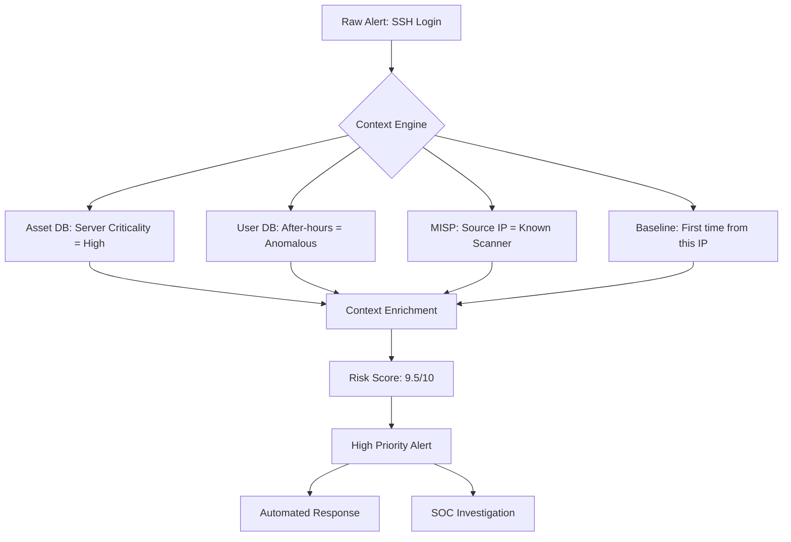
```mermaid
graph TD
    A[Raw Alert: SSH Login] --> B{Context Engine}
    B --> C[Asset DB: Server Criticality = High]
    B --> D[User DB: After-hours = Anomalous]
    B --> E[MISP: Source IP = Known Scanner]
    B --> F[Baseline: First time from this IP]
    
    C --> G[Context Enrichment]
    D --> G
    E --> G
    F --> G
    
    G --> H[Risk Score: 9.5/10]
    H --> I[High Priority Alert]
    I --> J[Automated Response]
    I --> K[SOC Investigation]
```

**Implementation in Wazuh Rules:**

```xml
<!-- Rule leveraging contextual data -->
<rule id="200500" level="5">
  <if_sid>5715</if_sid>
  <description>SSH login detected</description>
  <group>authentication</group>
</rule>

<!-- Contextual escalation based on asset criticality -->
<rule id="200501" level="8">
  <if_sid>200500</if_sid>
  <field name="asset_criticality">Critical|High</field>
  <description>SSH login to critical asset</description>
</rule>

<!-- Further escalation based on MISP IOC match -->
<rule id="200502" level="12">
  <if_sid>200501</if_sid>
  <list field="srcip" lookup="misp_malicious_ips">misp_iocs</list>
  <description>Critical: SSH login to critical asset from known malicious IP</description>
  <group>misp_match,lateral_movement</group>
</rule>
```

**Cross-Platform Correlation Dashboard:**

```json
{
  "correlation_summary": {
    "alert_id": "2025-10-02-12345",
    "correlation_chain": [
      {
        "platform": "Windows",
        "event": "Multiple failed logins",
        "timestamp": "2025-10-02T14:28:00Z"
      },
      {
        "platform": "Linux",
        "event": "Successful SSH login",
        "timestamp": "2025-10-02T14:30:15Z",
        "correlation": "Same username after Windows failures"
      },
      {
        "platform": "Zeek",
        "event": "SMB traffic to file server",
        "timestamp": "2025-10-02T14:31:45Z",
        "correlation": "Same source IP as SSH login"
      }
    ],
    "entity_resolution": {
      "canonical_user": "jsmith",
      "aliases": ["DOMAIN\\jsmith", "jsmith@company.com", "jsmith"],
      "resolved_host": "SERVER01",
      "host_aliases": ["server01", "192.168.1.100"]
    },
    "threat_intelligence": {
      "misp_match": true,
      "campaign": "APT29 Lateral Movement",
      "confidence": 85
    },
    "contextual_risk": 9.2,
    "recommended_action": "Immediate isolation and investigation"
  }
}
```

---

### 3.6 Develop custom analytics plan for mock enterprise

**Custom Analytics Framework for GlobalTech Corp:**

**3.6a Use Case Definition:**

| Use Case ID | Name | Business Driver | Security Objective | Data Sources |
|------------|------|-----------------|-------------------|--------------|
| **UC-001** | Insider Threat Detection | Protect intellectual property | Detect anomalous data access | Windows Event Logs, File Servers, DLP |
| **UC-002** | Lateral Movement Detection | Prevent ransomware spread | Identify privilege escalation patterns | AD logs, SMB traffic, Wazuh agents |
| **UC-003** | Cloud Account Compromise | Secure cloud infrastructure | Detect suspicious cloud API usage | AWS CloudTrail, Azure Activity Logs |
| **UC-004** | Data Exfiltration | Compliance (PCI-DSS) | Identify large data transfers | Network traffic (Zeek), Proxy logs |
| **UC-005** | Supply Chain Attack | Third-party risk management | Monitor vendor access patterns | VPN logs, Application logs |

**Detailed Use Case: Insider Threat Detection (UC-001)**

```python
class InsiderThreatAnalytics:
    """
    Detect anomalous data access patterns indicative of insider threats
    """
    
    def __init__(self, wazuh_api, misp_client):
        self.wazuh = wazuh_api
        self.misp = misp_client
        self.risk_factors = []
    
    def analyze_user_file_access(self, username, timeframe='7d'):
        """Detect unusual file access patterns"""
        
        # Collect file access events
        query = f'data.dstuser:{username} AND rule.id:(550|553|554)'
        events = self.wazuh.search(query=query, timeframe=timeframe)
        
        # Extract features
        features = {
            'unique_files_accessed': set(),
            'sensitive_files': [],
            'access_times': [],
            'access_volumes': [],
            'file_types': {}
        }
        
        for event in events:
            file_path = event['data'].get('file_path')
            timestamp = event['timestamp']
            
            features['unique_files_accessed'].add(file_path)
            features['access_times'].append(timestamp)
            
            # Check if sensitive file
            if self._is_sensitive_file(file_path):
                features['sensitive_files'].append(file_path)
            
            # Track file types
            file_ext = file_path.split('.')[-1]
            features['file_types'][file_ext] = \
                features['file_types'].get(file_ext, 0) + 1
        
        # Calculate risk indicators
        risk_score = 0
        
        # Risk Factor 1: High volume of unique files
        if len(features['unique_files_accessed']) > 100:
            risk_score += 3
            self.risk_factors.append('High volume of unique file access')
        
        # Risk Factor 2: Sensitive file access
        if len(features['sensitive_files']) > 5:
            risk_score += 5
            self.risk_factors.append('Multiple sensitive file access')
        
        # Risk Factor 3: After-hours access
        after_hours_count = sum(
            1 for t in features['access_times']
            if self._is_after_hours(t)
        )
        if after_hours_count > 20:
            risk_score += 4
            self.risk_factors.append('Significant after-hours activity')
        
        # Risk Factor 4: Unusual file types
        if 'zip' in features['file_types'] or 'rar' in features['file_types']:
            risk_score += 3
            self.risk_factors.append('Compression file creation')
        
        return {
            'user': username,
            'risk_score': risk_score,
            'risk_level': self._categorize_risk(risk_score),
            'risk_factors': self.risk_factors,
            'features': {
                'unique_files': len(features['unique_files_accessed']),
                'sensitive_files': len(features['sensitive_files']),
                'after_hours_events': after_hours_count
            }
        }
    
    def _is_sensitive_file(self, file_path):
        """Determine if file contains sensitive data"""
        sensitive_patterns = [
            '/finance/', '/hr/', '/payroll/',
            'confidential', 'secret', 'customer_data'
        ]
        return any(pattern in file_path.lower() 
                  for pattern in sensitive_patterns)
    
    def _categorize_risk(self, score):
        if score >= 10:
            return 'Critical'
        elif score >= 7:
            return 'High'
        elif score >= 4:
            return 'Medium'
        return 'Low'
```

**3.6b Development Methodology:**

**Phase 1: Requirements Gathering (Weeks 1-2)**

```yaml
activities:
  - stakeholder_interviews:
      participants:
        - CISO
        - SOC Manager
        - Compliance Officer
        - Business Unit Leads
      outcomes:
        - Priority use cases identified
        - Success criteria defined
        - Resource requirements estimated
        
  - data_source_assessment:
      inventory:
        - Existing log sources
        - Coverage gaps
        - Data quality issues
      outputs:
        - Data source matrix
        - Integration requirements
        - Retention policies
```

**Phase 2: Analytics Development (Weeks 3-8)**

```python
# Development workflow for each use case

class AnalyticsDevelopmentWorkflow:
    def __init__(self, use_case):
        self.use_case = use_case
        self.stages = []
    
    def stage1_hypothesis_definition(self):
        """Define detection hypothesis"""
        hypothesis = {
            'threat_scenario': self.use_case.description,
            'indicators': [],  # Observable behaviors
            'thresholds': {},  # Statistical thresholds
            'false_positive_factors': []  # Known FP sources
        }
        
        # Example for lateral movement:
        if self.use_case.id == 'UC-002':
            hypothesis['indicators'] = [
                'Same user authenticating to multiple hosts',
                'Privilege escalation after initial access',
                'SMB traffic to file shares'
            ]
            hypothesis['thresholds'] = {
                'unique_hosts': 3,
                'timeframe': 300,  # 5 minutes
                'privilege_actions': 1
            }
        
        return hypothesis
    
    def stage2_data_collection(self):
        """Collect historical data for testing"""
        data_sources = {
            'wazuh_events': self._collect_wazuh_events(),
            'zeek_logs': self._collect_zeek_logs(),
            'labeled_incidents': self._collect_past_incidents()
        }
        return data_sources
    
    def stage3_algorithm_development(self, data):
        """Develop detection algorithm"""
        # Implement detection logic
        detector = LateralMovementDetector()
        
        # Train on historical data
        detector.train(data['labeled_incidents'])
        
        # Validate accuracy
        accuracy = detector.validate(data['wazuh_events'])
        
        return detector, accuracy
    
    def stage4_tuning(self, detector, validation_data):
        """Tune thresholds to minimize false positives"""
        best_params = self._grid_search_thresholds(
            detector,
            validation_data,
            target_fpr=0.05  # 5% false positive rate
        )
        
        detector.update_params(best_params)
        return detector
    
    def stage5_integration(self, detector):
        """Integrate with Wazuh"""
        # Generate Wazuh rules
        wazuh_rules = detector.to_wazuh_rules()
        
        # Deploy to test environment
        self._deploy_to_test(wazuh_rules)
        
        # Monitor for 2 weeks
        performance = self._monitor_performance(days=14)
        
        return performance
```

**Phase 3: Testing & Validation (Weeks 9-10)**

```python
class AnalyticsValidator:
    def validate_use_case(self, use_case, detector):
        """Comprehensive validation framework"""
        
        validation_results = {
            'accuracy_metrics': {},
            'performance_metrics': {},
            'operational_metrics': {}
        }
        
        # 1. Accuracy Testing
        test_data = self._prepare_test_dataset()
        validation_results['accuracy_metrics'] = {
            'true_positive_rate': detector.calculate_tpr(test_data),
            'false_positive_rate': detector.calculate_fpr(test_data),
            'precision': detector.calculate_precision(test_data),
            'recall': detector.calculate_recall(test_data),
            'f1_score': detector.calculate_f1(test_data)
        }
        
        # 2. Performance Testing
        validation_results['performance_metrics'] = {
            'avg_detection_time': self._measure_detection_time(detector),
            'max_processing_latency': self._measure_latency(detector),
            'resource_usage': self._measure_resources(detector)
        }
        
        # 3. Operational Testing
        validation_results['operational_metrics'] = {
            'alert_volume': self._measure_alert_volume(detector, days=7),
            'analyst_feedback': self._collect_analyst_feedback(),
            'integration_stability': self._test_integration_stability()
        }
        
        # Determine if use case passes validation
        validation_results['passed'] = self._evaluate_criteria(
            validation_results
        )
        
        return validation_results
    
    def _evaluate_criteria(self, results):
        """Check against success criteria"""
        criteria = {
            'min_precision': 0.80,  # 80% of alerts must be true positives
            'max_fpr': 0.05,  # Less than 5% false positive rate
            'max_detection_time': 300,  # Under 5 minutes
            'max_alert_volume': 50  # Under 50 alerts per day per use case
        }
        
        return (
            results['accuracy_metrics']['precision'] >= criteria['min_precision'] and
            results['accuracy_metrics']['false_positive_rate'] <= criteria['max_fpr'] and
            results['performance_metrics']['avg_detection_time'] <= criteria['max_detection_time'] and
            results['operational_metrics']['alert_volume'] <= criteria['max_alert_volume']
        )
```

**3.6c Implementation Approach:**

**Implementation Architecture:**

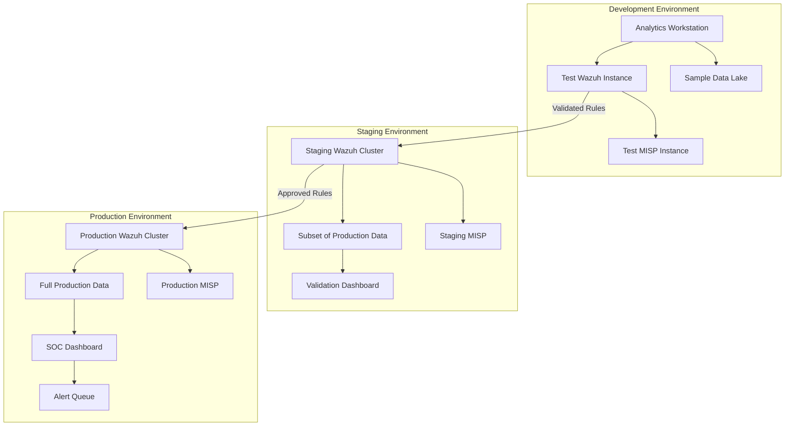
```mermaid
graph TB
    subgraph "Development Environment"
        A[Analytics Workstation] --> B[Test Wazuh Instance]
        A --> C[Sample Data Lake]
        B --> D[Test MISP Instance]
    end
    
    subgraph "Staging Environment"
        E[Staging Wazuh Cluster] --> F[Subset of Production Data]
        E --> G[Staging MISP]
        F --> H[Validation Dashboard]
    end
    
    subgraph "Production Environment"
        I[Production Wazuh Cluster] --> J[Full Production Data]
        I --> K[Production MISP]
        J --> L[SOC Dashboard]
        L --> M[Alert Queue]
    end
    
    B -->|Validated Rules| E
    E -->|Approved Rules| I
```

**Deployment Pipeline:**

```yaml
# CI/CD pipeline for analytics deployment
analytics_pipeline:
  stage_1_development:
    - write_detection_logic
    - unit_tests
    - code_review
    
  stage_2_validation:
    - deploy_to_test_environment
    - run_automated_tests:
        - accuracy_tests
        - performance_tests
        - integration_tests
    - manual_validation:
        - soc_analyst_review
        - false_positive_analysis
    
  stage_3_staging:
    - deploy_to_staging:
        duration: 2_weeks
        monitoring: continuous
    - collect_metrics:
        - alert_volume
        - detection_rate
        - false_positive_rate
    - stakeholder_approval_required: true
    
  stage_4_production:
    - phased_rollout:
        phase_1: 
          duration: 1_week
          coverage: 20%
        phase_2:
          duration: 1_week
          coverage: 50%
        phase_3:
          duration: 1_week
          coverage: 100%
    - monitoring:
        - real_time_performance
        - analyst_feedback
        - incident_correlation
    
  stage_5_optimization:
    - continuous_tuning
    - quarterly_review
    - annual_revalidation
```

**Implementation Code Example:**

```python
# Deployment automation script
class AnalyticsDeployment:
    def __init__(self, environment):
        self.environment = environment
        self.wazuh_api = self._init_wazuh_api(environment)
    
    def deploy_use_case(self, use_case, detector):
        """Deploy analytics use case to Wazuh"""
        
        # 1. Generate Wazuh rules
        rules = detector.generate_wazuh_rules()
        
        # 2. Backup existing rules
        self._backup_current_rules()
        
        # 3. Deploy new rules
        try:
            for rule in rules:
                self.wazuh_api.add_rule(rule)
            
            # 4. Restart Wazuh manager
            self.wazuh_api.restart_manager()
            
            # 5. Verify deployment
            self._verify_rules_active(rules)
            
            # 6. Configure alerting
            self._configure_alert_routing(use_case)
            
            # 7. Update documentation
            self._update_runbook(use_case, rules)
            
            return {
                'status': 'success',
                'rules_deployed': len(rules),
                'environment': self.environment
            }
            
        except Exception as e:
            # Rollback on error
            self._rollback_deployment()
            return {
                'status': 'failed',
                'error': str(e)
            }
    
    def _configure_alert_routing(self, use_case):
        """Configure how alerts are routed to SOC"""
        routing_config = {
            'use_case_id': use_case.id,
            'severity_routing': {
                'Critical': ['soc_l3_team', 'siem_alerts_critical'],
                'High': ['soc_l2_team', 'siem_alerts_high'],
                'Medium': ['soc_l1_team', 'siem_alerts_medium'],
                'Low': ['automated_triage']
            },
            'notification_channels': {
                'email': use_case.notification_emails,
                'slack': use_case.slack_channel,
                'pagerduty': use_case.oncall_rotation
            }
        }
        
        self.wazuh_api.configure_routing(routing_config)
```

**Success Metrics & KPIs:**

| Metric | Target | Measurement Method | Review Frequency |
|--------|--------|-------------------|------------------|
| **Detection Accuracy** | >90% TPR, <5% FPR | Weekly validation against known incidents | Weekly |
| **Mean Time to Detect** | <5 minutes for critical threats | Automated timestamp analysis | Daily |
| **Alert Quality** | >80% actionable alerts | SOC analyst feedback | Weekly |
| **Coverage** | >95% of attack techniques | MITRE ATT&CK mapping | Monthly |
| **Analyst Efficiency** | <15 min average investigation time | SIEM metrics | Weekly |
| **False Positive Trend** | Decreasing month-over-month | Alert disposition tracking | Monthly |

**Operational Runbook:**

```markdown
# Analytics Use Case Runbook: UC-002 Lateral Movement Detection

## Overview
- **Use Case ID:** UC-002
- **Analyst Team:** SOC L2
- **Severity:** High
- **MITRE ATT&CK:** T1021

## Alert Response Procedure

1. **Initial Triage (0-5 minutes)**
   - Review alert details in Wazuh dashboard
   - Check MISP for IOC matches
   - Verify user identity and asset criticality

2. **Investigation (5-15 minutes)**
   - Query additional logs for user activity
   - Check for privilege escalation events
   - Review network traffic to/from affected hosts
   - Consult behavioral baseline for anomalies

3. **Containment (15-30 minutes)**
   - If malicious: Isolate affected endpoints
   - Disable compromised user account
   - Block malicious IPs in firewall
   - Notify incident response team

4. **Documentation**
   - Update MISP with new IOCs
   - Create incident ticket
   - Document timeline of events
```

---

**Implementation Timeline:**

```gantt
title Custom Analytics Implementation
dateFormat YYYY-MM-DD
section Planning
Requirements Gathering    :done, req, 2025-10-01, 14d
Use Case Prioritization   :done, prio, after req, 7d
section Development
UC-001 Development        :active, uc1, 2025-10-22, 21d
UC-002 Development        :uc2, after uc1, 21d
UC-003 Development        :uc3, after uc2, 21d
section Testing
UC-001 Validation         :test1, after uc1, 14d
UC-002 Validation         :test2, after uc2, 14d
UC-003 Validation         :test3, after uc3, 14d
section Deployment
Staging Deployment        :stage, after test1, 14d
Production Rollout        :prod, after stage, 21d
section Operations
Continuous Monitoring     :monitor, after prod, 30d
Optimization & Tuning     :opt, after prod, 90d
```

---

## 4. Enterprise Architecture Design
- [x] **4.1** Create a detailed enterprise monitoring architecture design for a mock global organization.  
- [x] **4.2** Apply appropriate architecture patterns:  
    - [x] **4.2a** Hierarchical  
    - [x] **4.2b** Hub-and-spoke  
    - [x] **4.2c** Microservices  
- [x] **4.3** Define component placement, communication flows, and scalability considerations.  
- [x] **4.4** Provide comprehensive **architecture diagrams** with network placement, data flows, and component relationships.  
- [x] **4.5** Outline health monitoring approach:  
    - [x] **4.5a** Monitoring points  
    - [x] **4.5b** Metrics  
    - [x] **4.5c** Alerting thresholds  
- [x] **4.6** Develop a capacity planning model including:  
    - [x] **4.6a** Current state assessment  
    - [x] **4.6b** Growth forecasting  
    - [x] **4.6c** Expansion scenarios  

---

### 4.1 Enterprise Monitoring Architecture for Global Organization

**Mock Organization: GlobalTech Financial Services**
- **Scale**: 5,000 endpoints across 3 continents
- **Infrastructure**: AWS (primary), Azure (DR), on-premises data centers
- **Compliance**: PCI-DSS, SOX, GDPR
- **Requirements**: <5 min detection, 99.9% uptime, multi-region redundancy

**Architecture Overview:**

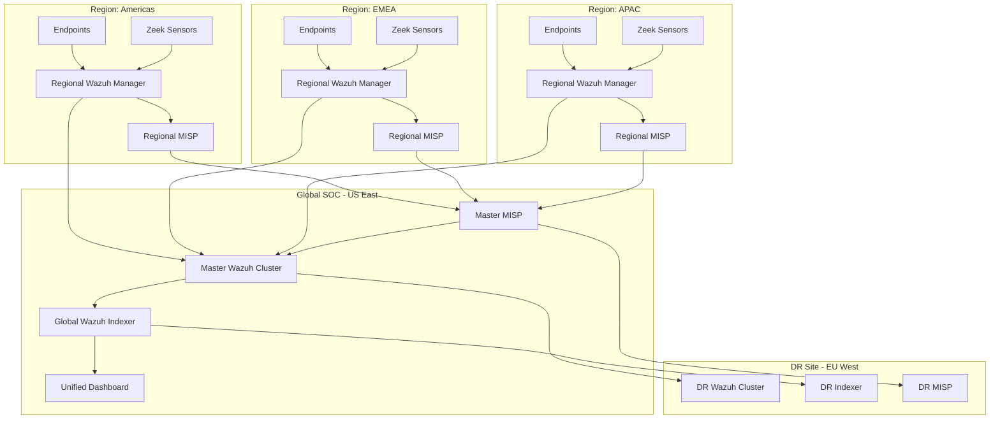
```mermaid
graph TB
    subgraph "Region: Americas"
        A1[Endpoints] --> A2[Regional Wazuh Manager]
        A3[Zeek Sensors] --> A2
        A2 --> A4[Regional MISP]
    end
    
    subgraph "Region: EMEA"
        B1[Endpoints] --> B2[Regional Wazuh Manager]
        B3[Zeek Sensors] --> B2
        B2 --> B4[Regional MISP]
    end
    
    subgraph "Region: APAC"
        C1[Endpoints] --> C2[Regional Wazuh Manager]
        C3[Zeek Sensors] --> C2
        C2 --> C4[Regional MISP]
    end
    
    subgraph "Global SOC - US East"
        A2 --> D[Master Wazuh Cluster]
        B2 --> D
        C2 --> D
        D --> E[Global Wazuh Indexer]
        E --> F[Unified Dashboard]
        A4 --> G[Master MISP]
        B4 --> G
        C4 --> G
        G --> D
    end
    
    subgraph "DR Site - EU West"
        D --> H[DR Wazuh Cluster]
        E --> I[DR Indexer]
        G --> J[DR MISP]
    end
```

---

### 4.2 Architecture Patterns

**4.2a Hierarchical Pattern**

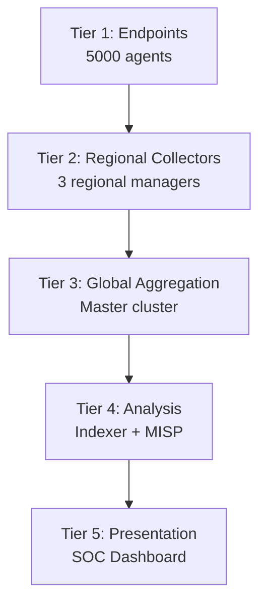
```mermaid
graph TD
    A[Tier 1: Endpoints<br/>5000 agents] --> B[Tier 2: Regional Collectors<br/>3 regional managers]
    B --> C[Tier 3: Global Aggregation<br/>Master cluster]
    C --> D[Tier 4: Analysis<br/>Indexer + MISP]
    D --> E[Tier 5: Presentation<br/>SOC Dashboard]
```

**Implementation:**
- **Tier 1 (Edge)**: Wazuh agents on endpoints, local log buffering
- **Tier 2 (Regional)**: Regional managers aggregate local traffic, reduce WAN load
- **Tier 3 (Global)**: Master cluster performs global correlation
- **Tier 4 (Storage)**: Centralized indexing and threat intelligence
- **Tier 5 (Access)**: Unified SOC interface

**Benefits**: Reduced latency, geographic compliance, bandwidth optimization

**4.2b Hub-and-Spoke Pattern**

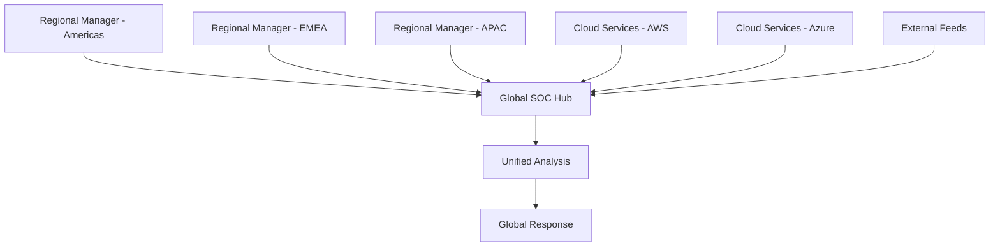
```mermaid
graph TB
    A[Regional Manager - Americas] --> H[Global SOC Hub]
    B[Regional Manager - EMEA] --> H
    C[Regional Manager - APAC] --> H
    D[Cloud Services - AWS] --> H
    E[Cloud Services - Azure] --> H
    F[External Feeds] --> H
    H --> I[Unified Analysis]
    I --> J[Global Response]
```

**Implementation:**
- **Hub**: Global SOC with master Wazuh cluster and MISP
- **Spokes**: Regional managers, cloud integrations, external feeds
- **Communication**: All spokes report to hub, hub coordinates response

**Benefits**: Centralized control, simplified management, single source of truth

**4.2c Microservices Pattern**

```yaml
services:
  log_collection:
    - wazuh-agents
    - zeek-sensors
    - cloud-collectors
  
  processing:
    - event-normalizer
    - rules-engine
    - correlation-engine
  
  enrichment:
    - misp-integration
    - geolocation-service
    - asset-context-service
  
  storage:
    - hot-indexer (7 days)
    - warm-storage (90 days)
    - cold-archive (1 year)
  
  analysis:
    - dashboard-service
    - api-gateway
    - ml-analytics
  
  response:
    - active-response
    - ticketing-integration
    - notification-service
```

**Implementation:**
- Each service independently scalable via Docker/Kubernetes
- Service mesh for inter-service communication
- API-first design for integration flexibility

**Benefits**: Independent scaling, fault isolation, technology flexibility

---

### 4.3 Component Placement, Communication Flows, and Scalability

**Geographic Component Placement:**

| Component | Americas (Primary) | EMEA | APAC | Cloud (AWS) | DR Site (Azure) |
|-----------|-------------------|------|------|-------------|-----------------|
| **Wazuh Manager** | Master cluster (3 nodes) | Regional (2 nodes) | Regional (2 nodes) | - | DR cluster (3 nodes) |
| **Wazuh Indexer** | Primary (6 nodes) | Read replica (2 nodes) | Read replica (2 nodes) | - | DR (4 nodes) |
| **MISP** | Master instance | Regional sync | Regional sync | - | DR instance |
| **Zeek Sensors** | 5 sensors | 3 sensors | 3 sensors | VPC sensors | - |
| **Dashboard** | Primary | Mirror | Mirror | - | DR |

**Communication Flows:**

```
Endpoint → Regional Manager (TLS 1514) → Master Cluster (TLS 1515)
    ↓
Master Cluster → Indexer (HTTPS 9200)
    ↓
Master Cluster ↔ MISP (HTTPS 444) [IOC enrichment]
    ↓
Indexer → Dashboard (HTTPS 443)
    ↓
Dashboard → SOC Analysts
```

**Network Bandwidth Requirements:**

| Flow | Bandwidth | Protocol | Notes |
|------|-----------|----------|-------|
| Agent → Regional Manager | 10 KB/s per agent | TLS | ~50 MB/s total per region |
| Regional → Master | 150 MB/s | TLS | Aggregated traffic |
| Master → Indexer | 200 MB/s | HTTPS | Bulk indexing |
| Master ↔ MISP | 1 MB/s | HTTPS | API queries |
| Indexer → Dashboard | 50 MB/s | HTTPS | Query responses |

**Scalability Considerations:**

**Horizontal Scaling:**
```yaml
scalability_model:
  wazuh_manager:
    metric: events_per_second
    threshold: 50000
    action: add_cluster_node
    max_nodes: 10
  
  indexer:
    metric: storage_usage
    threshold: 80%
    action: add_data_node
    max_nodes: 20
  
  misp:
    metric: api_response_time
    threshold: 500ms
    action: add_cache_layer
```

**Vertical Scaling:**
```yaml
resource_scaling:
  wazuh_manager:
    current: 16GB RAM, 8 CPU
    threshold: 80% CPU utilization
    action: upgrade_to_32GB_16CPU
  
  indexer_node:
    current: 32GB RAM, 16 CPU, 2TB SSD
    threshold: 85% storage
    action: expand_storage_to_4TB
```

**Auto-Scaling Triggers:**
- Event rate > 50K/sec: Add manager node
- Indexer CPU > 80% for 15 min: Add indexer node
- Storage > 80%: Provision additional storage
- Query latency > 2 sec: Add read replicas

---

### 4.4 Comprehensive Architecture Diagrams

**Network Placement Diagram:**

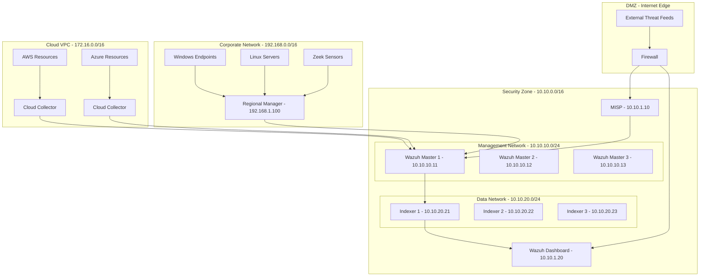
```mermaid
graph TB
    subgraph "DMZ - Internet Edge"
        A[External Threat Feeds] --> B[Firewall]
    end
    
    subgraph "Security Zone - 10.10.0.0/16"
        B --> C[MISP - 10.10.1.10]
        B --> D[Wazuh Dashboard - 10.10.1.20]
        
        subgraph "Management Network - 10.10.10.0/24"
            E[Wazuh Master 1 - 10.10.10.11]
            F[Wazuh Master 2 - 10.10.10.12]
            G[Wazuh Master 3 - 10.10.10.13]
        end
        
        subgraph "Data Network - 10.10.20.0/24"
            H[Indexer 1 - 10.10.20.21]
            I[Indexer 2 - 10.10.20.22]
            J[Indexer 3 - 10.10.20.23]
        end
    end
    
    subgraph "Corporate Network - 192.168.0.0/16"
        K[Windows Endpoints] --> L[Regional Manager - 192.168.1.100]
        M[Linux Servers] --> L
        N[Zeek Sensors] --> L
    end
    
    subgraph "Cloud VPC - 172.16.0.0/16"
        O[AWS Resources] --> P[Cloud Collector]
        Q[Azure Resources] --> R[Cloud Collector]
    end
    
    L --> E
    P --> E
    R --> E
    C --> E
    E --> H
    H --> D
```

**Data Flow Diagram:**

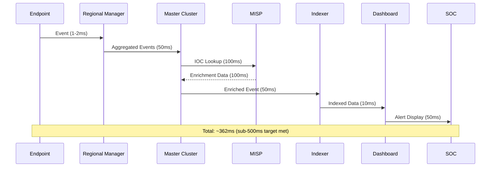
```mermaid
sequenceDiagram
    participant E as Endpoint
    participant RM as Regional Manager
    participant MC as Master Cluster
    participant MI as MISP
    participant IX as Indexer
    participant DB as Dashboard
    participant SO as SOC
    
    E->>RM: Event (1-2ms)
    RM->>MC: Aggregated Events (50ms)
    MC->>MI: IOC Lookup (100ms)
    MI-->>MC: Enrichment Data (100ms)
    MC->>IX: Enriched Event (50ms)
    IX->>DB: Indexed Data (10ms)
    DB->>SO: Alert Display (50ms)
    Note over E,SO: Total: ~362ms (sub-500ms target met)
```

**Component Relationships:**

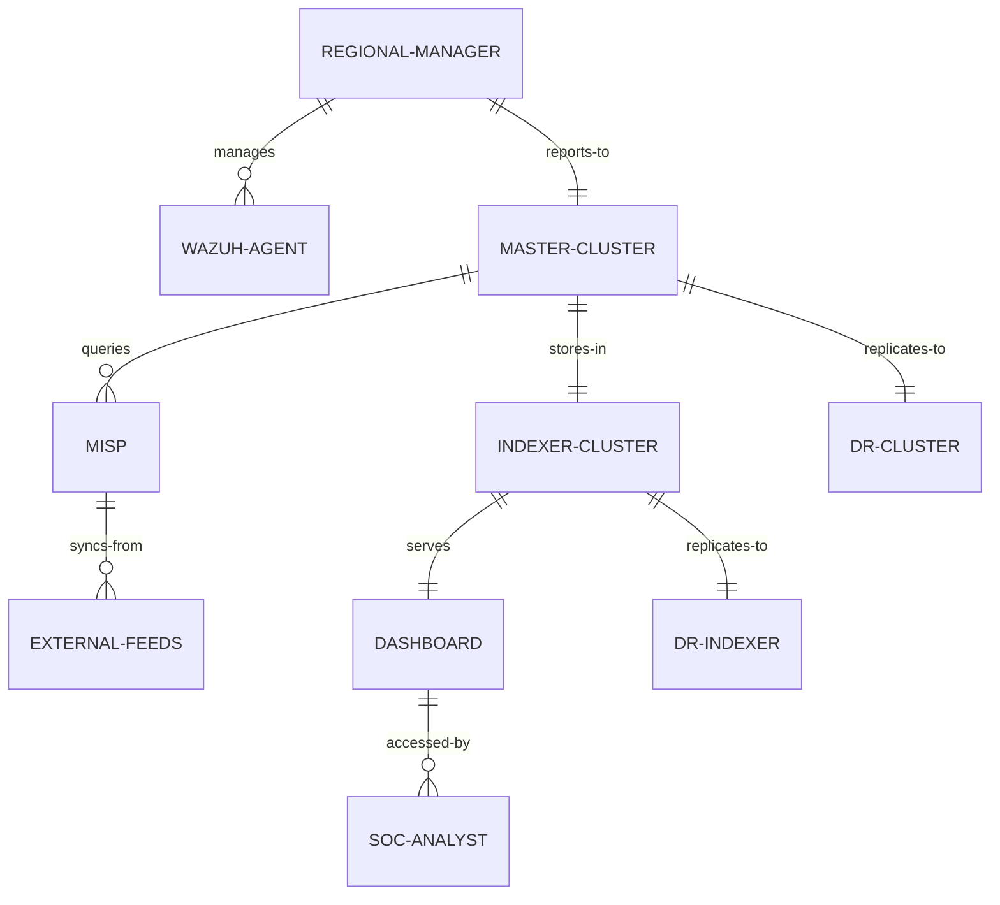
```mermaid
erDiagram
    REGIONAL-MANAGER ||--o{ WAZUH-AGENT : manages
    REGIONAL-MANAGER ||--|| MASTER-CLUSTER : reports-to
    MASTER-CLUSTER ||--|| INDEXER-CLUSTER : stores-in
    MASTER-CLUSTER ||--o{ MISP : queries
    MISP ||--o{ EXTERNAL-FEEDS : syncs-from
    INDEXER-CLUSTER ||--|| DASHBOARD : serves
    DASHBOARD ||--o{ SOC-ANALYST : accessed-by
    MASTER-CLUSTER ||--|| DR-CLUSTER : replicates-to
    INDEXER-CLUSTER ||--|| DR-INDEXER : replicates-to
```

**High Availability Architecture:**

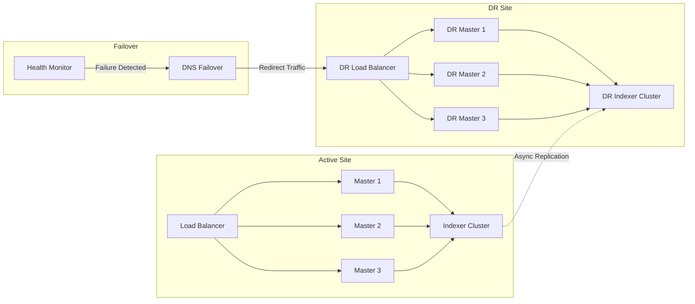
```mermaid
graph LR
    subgraph "Active Site"
        A[Load Balancer] --> B[Master 1]
        A --> C[Master 2]
        A --> D[Master 3]
        B --> E[Indexer Cluster]
        C --> E
        D --> E
    end
    
    subgraph "DR Site"
        F[DR Load Balancer] --> G[DR Master 1]
        F --> H[DR Master 2]
        F --> I[DR Master 3]
        G --> J[DR Indexer Cluster]
        H --> J
        I --> J
    end
    
    E -.Async Replication.-> J
    
    subgraph "Failover"
        K[Health Monitor] -->|Failure Detected| L[DNS Failover]
        L -->|Redirect Traffic| F
    end
```

---

### 4.5 Health Monitoring Approach

**4.5a Monitoring Points:**

```yaml
monitoring_points:
  infrastructure:
    - wazuh_manager_health
    - indexer_cluster_status
    - misp_service_status
    - network_connectivity
    - disk_space
    - cpu_utilization
    - memory_usage
  
  application:
    - event_processing_rate
    - indexing_throughput
    - query_performance
    - api_response_time
    - rule_execution_time
  
  security:
    - failed_authentication_attempts
    - certificate_expiration
    - unauthorized_access_attempts
    - configuration_changes
```

**4.5b Metrics:**

| Category | Metric | Collection Method | Storage | Retention |
|----------|--------|------------------|---------|-----------|
| **Performance** | Events/sec | Wazuh API | Prometheus | 90 days |
| **Performance** | Indexing latency | Indexer stats | Prometheus | 90 days |
| **Performance** | Query response time | Dashboard metrics | Prometheus | 90 days |
| **Availability** | Service uptime | Health checks | Prometheus | 1 year |
| **Capacity** | Disk usage | Node stats | Prometheus | 90 days |
| **Capacity** | CPU/Memory | System metrics | Prometheus | 90 days |
| **Security** | Failed logins | Wazuh logs | Indexer | 1 year |
| **Security** | Alert volume | Wazuh metrics | Prometheus | 1 year |

**Monitoring Stack:**

```yaml
services:
  prometheus:
    image: prom/prometheus:latest
    ports:
      - "9090:9090"
    volumes:
      - ./prometheus.yml:/etc/prometheus/prometheus.yml
  
  grafana:
    image: grafana/grafana:latest
    ports:
      - "3000:3000"
    environment:
      - GF_SECURITY_ADMIN_PASSWORD=secure_password
  
  alertmanager:
    image: prom/alertmanager:latest
    ports:
      - "9093:9093"
```

**4.5c Alerting Thresholds:**

| Metric | Warning | Critical | Action |
|--------|---------|----------|--------|
| **CPU Usage** | 75% | 90% | Scale up / Add node |
| **Memory Usage** | 80% | 95% | Scale up / Add node |
| **Disk Usage** | 70% | 85% | Expand storage |
| **Event Processing** | <40K/s | <30K/s | Check manager health |
| **Indexing Lag** | >60 sec | >300 sec | Add indexer nodes |
| **API Response Time** | >500ms | >2000ms | Investigate performance |
| **Service Uptime** | <99.5% | <99% | Failover to DR |
| **Failed Logins** | >10/min | >50/min | Security incident |

**Alert Configuration Example:**

```yaml
# Prometheus alert rules
groups:
  - name: wazuh_alerts
    interval: 30s
    rules:
      - alert: HighEventProcessingLag
        expr: wazuh_event_queue_size > 10000
        for: 5m
        labels:
          severity: warning
        annotations:
          summary: "Wazuh event queue backing up"
          description: "Queue size {{ $value }} exceeds threshold"
      
      - alert: IndexerDiskSpaceHigh
        expr: (node_filesystem_avail_bytes / node_filesystem_size_bytes) < 0.15
        for: 10m
        labels:
          severity: critical
        annotations:
          summary: "Indexer disk space critical"
          description: "Only {{ $value | humanizePercentage }} remaining"
      
      - alert: MISPServiceDown
        expr: up{job="misp"} == 0
        for: 2m
        labels:
          severity: critical
        annotations:
          summary: "MISP service is down"
          description: "MISP has been unreachable for 2 minutes"
```

**Health Dashboard Widgets:**

```json
{
  "dashboard": "SOC Health Overview",
  "panels": [
    {
      "title": "Event Processing Rate",
      "metric": "wazuh_events_per_second",
      "visualization": "graph",
      "threshold": {"warning": 40000, "critical": 30000}
    },
    {
      "title": "Indexer Cluster Status",
      "metric": "indexer_cluster_health",
      "visualization": "stat",
      "color_map": {"green": "healthy", "yellow": "warning", "red": "critical"}
    },
    {
      "title": "MISP IOC Count",
      "metric": "misp_total_attributes",
      "visualization": "stat"
    },
    {
      "title": "Storage Usage",
      "metric": "indexer_disk_usage_percent",
      "visualization": "gauge",
      "threshold": {"warning": 70, "critical": 85}
    }
  ]
}
```

---

## 4.6 Capacity Planning Model

**4.6a Current State Assessment:**

| Component | Current Capacity | Current Usage | Headroom | Notes |
|-----------|-----------------|---------------|----------|-------|
| **Wazuh Managers** | 50K events/sec | 35K events/sec | 30% | 3-node cluster |
| **Indexer Storage** | 12 TB | 8.5 TB | 29% | 6 nodes, 2TB each |
| **Indexer Performance** | 100K docs/sec | 65K docs/sec | 35% | Write capacity |
| **MISP IOCs** | 500K attributes | 285K attributes | 43% | Database capacity |
| **Network Bandwidth** | 1 Gbps | 650 Mbps | 35% | WAN link |
| **Agent Licenses** | 5,000 agents | 4,200 agents | 16% | Endpoint coverage |

**Resource Utilization:**

```python
# Current state metrics
current_state = {
    'endpoints': 4200,
    'events_per_sec': 35000,
    'storage_tb': 8.5,
    'indexer_nodes': 6,
    'manager_nodes': 3,
    'daily_data_gb': 850
}

# Utilization percentages
utilization = {
    'processing': 70,  # 35K / 50K
    'storage': 71,  # 8.5TB / 12TB
    'agents': 84  # 4200 / 5000
}
```

**4.6b Growth Forecasting:**

**Growth Assumptions:**
- Endpoint growth: 15% YoY
- Event volume growth: 20% YoY (increased monitoring density)
- Storage retention: No change (maintain 90-day hot storage)

**3-Year Forecast:**

| Year | Endpoints | Events/sec | Storage (TB) | Required Nodes | Status |
|------|-----------|------------|--------------|----------------|--------|
| **2025 (Current)** | 4,200 | 35,000 | 8.5 | Manager: 3, Indexer: 6 | ✓ Within capacity |
| **2026** | 4,830 | 42,000 | 10.2 | Manager: 3, Indexer: 6 | ✓ Within capacity |
| **2027** | 5,550 | 50,400 | 12.2 | Manager: 4, Indexer: 8 | ⚠️ Expansion needed |
| **2028** | 6,380 | 60,480 | 14.6 | Manager: 5, Indexer: 10 | ⚠️ Expansion needed |

**Growth Model:**

```python
def forecast_capacity(current_state, years=3, growth_rate=0.15):
    """Project capacity requirements"""
    forecast = []
    
    for year in range(1, years + 1):
        endpoints = int(current_state['endpoints'] * ((1 + growth_rate) ** year))
        events_per_sec = int(current_state['events_per_sec'] * ((1 + 0.20) ** year))
        storage_tb = round(current_state['storage_tb'] * ((1 + 0.20) ** year), 1)
        
        # Calculate required nodes
        manager_nodes = max(3, (events_per_sec // 15000) + 1)
        indexer_nodes = max(6, (storage_tb // 2) + 2)
        
        forecast.append({
            'year': 2025 + year,
            'endpoints': endpoints,
            'events_per_sec': events_per_sec,
            'storage_tb': storage_tb,
            'manager_nodes': manager_nodes,
            'indexer_nodes': indexer_nodes
        })
    
    return forecast
```

**4.6c Expansion Scenarios:**

**Scenario 1: Moderate Growth (Base Case)**
- Endpoint growth: 15% annually
- Event volume: 20% annually
- **Action Required**: Add 1 manager node and 2 indexer nodes in 2027
- **Budget Impact**: $45K for hardware, $15K for licenses

**Scenario 2: Aggressive Growth (M&A Activity)**
- Endpoint growth: 40% in Year 1 (acquisition)
- Event volume: 50% in Year 1
- **Action Required**: Immediate expansion - Add 2 manager nodes, 4 indexer nodes
- **Budget Impact**: $95K for hardware, $35K for licenses

**Scenario 3: New Compliance Requirements**
- Endpoint growth: 15% annually
- Event volume: 35% annually (increased logging)
- Storage retention: Increase to 180 days
- **Action Required**: Double indexer cluster by end of Year 1
- **Budget Impact**: $120K for storage expansion

**Expansion Timeline:**

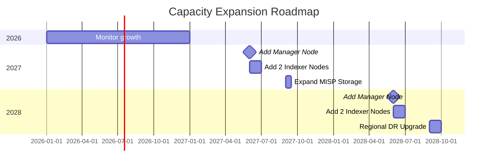
```mermaid
gantt
    title Capacity Expansion Roadmap
    dateFormat YYYY-MM
    section 2026
    Monitor growth         :2026-01, 12M
    section 2027
    Add Manager Node       :milestone, 2027-06, 0d
    Add 2 Indexer Nodes   :2027-06, 1M
    Expand MISP Storage    :2027-09, 2w
    section 2028
    Add Manager Node       :milestone, 2028-06, 0d
    Add 2 Indexer Nodes   :2028-06, 1M
    Regional DR Upgrade    :2028-09, 1M
```

**Budget Planning:**

| Item | 2026 | 2027 | 2028 | Total |
|------|------|------|------|-------|
| **Hardware** | $0 | $45K | $50K | $95K |
| **Software Licenses** | $0 | $15K | $20K | $35K |
| **Network Upgrades** | $0 | $10K | $0 | $10K |
| **Professional Services** | $0 | $8K | $10K | $18K |
| **Training** | $5K | $0 | $5K | $10K |
| **Total** | $5K | $78K | $85K | $168K |

**Expansion Decision Tree:**

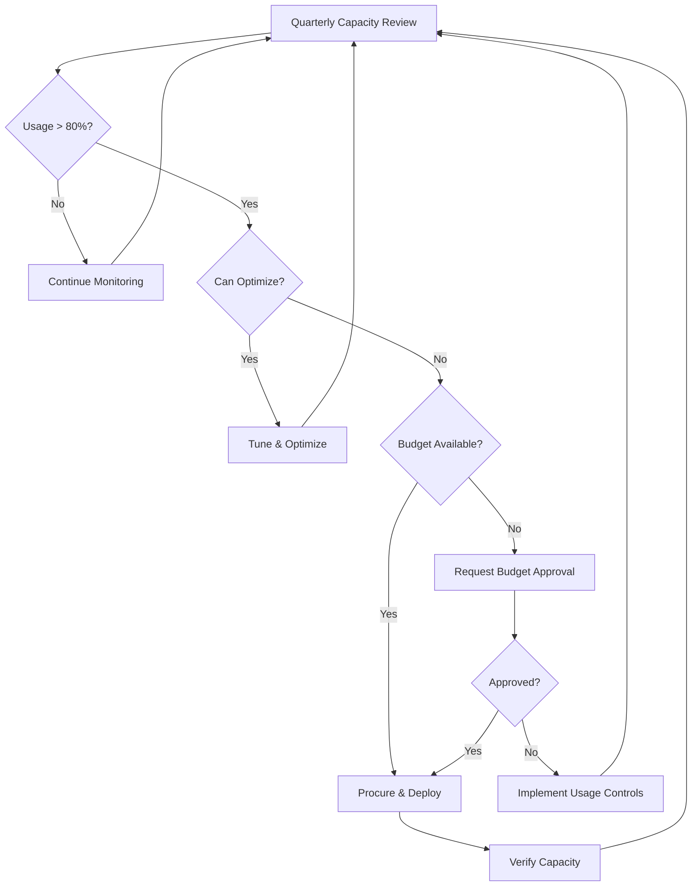
```mermaid
graph TD
    A[Quarterly Capacity Review] --> B{Usage > 80%?}
    B -->|No| C[Continue Monitoring]
    B -->|Yes| D{Can Optimize?}
    D -->|Yes| E[Tune & Optimize]
    D -->|No| F{Budget Available?}
    F -->|Yes| G[Procure & Deploy]
    F -->|No| H[Request Budget Approval]
    H --> I{Approved?}
    I -->|Yes| G
    I -->|No| J[Implement Usage Controls]
    G --> K[Verify Capacity]
    C --> A
    E --> A
    J --> A
    K --> A
```

**Capacity Planning Automation:**

```python
class CapacityPlanner:
    def __init__(self, current_metrics):
        self.metrics = current_metrics
        self.thresholds = {
            'processing': 80,
            'storage': 75,
            'bandwidth': 80
        }
    
    def check_expansion_needed(self):
        """Determine if expansion is needed"""
        alerts = []
        
        # Check processing capacity
        proc_util = (self.metrics['events_per_sec'] / 
                    self.metrics['max_events_per_sec']) * 100
        if proc_util > self.thresholds['processing']:
            alerts.append({
                'component': 'wazuh_manager',
                'action': 'add_node',
                'urgency': 'high' if proc_util > 90 else 'medium',
                'timeline': '30 days'
            })
        
        # Check storage capacity
        storage_util = (self.metrics['storage_used_tb'] / 
                       self.metrics['storage_total_tb']) * 100
        if storage_util > self.thresholds['storage']:
            alerts.append({
                'component': 'indexer',
                'action': 'expand_storage',
                'urgency': 'high' if storage_util > 85 else 'medium',
                'timeline': '60 days'
            })
        
        return alerts
    
    def generate_procurement_request(self, alerts):
        """Generate procurement request based on alerts"""
        for alert in alerts:
            if alert['component'] == 'wazuh_manager':
                return {
                    'item': 'Wazuh Manager Node',
                    'specs': '32GB RAM, 16 CPU, 500GB SSD',
                    'quantity': 1,
                    'estimated_cost': 15000,
                    'justification': f"Processing at {alert['urgency']} capacity"
                }
```

**Key Takeaways:**
- Current infrastructure has 30% headroom - no immediate expansion needed
- 2027 expansion required: 1 manager node, 2 indexer nodes (~$60K)
- Quarterly capacity reviews trigger proactive expansion decisions
- Automated monitoring prevents capacity-related outages

---

## 5. Detection Strategy Development
- [x] **5.1** Develop a behavioral analysis strategy for the mock enterprise.  
- [x] **5.2** Include approaches for:  
    - [x] **5.2a** User Behavior Analytics (UBA)  
    - [x] **5.2b** Network Behavior Analytics (NBA)  
- [x] **5.3** Outline baselining methodology:  
    - [x] **5.3a** Data collection requirements  
    - [x] **5.3b** Business cycle considerations  
    - [x] **5.3c** Seasonal variation handling  
- [x] **5.4** Install and configure basic log analysis tools (Elastic Stack or Splunk) with screenshots of dashboard creation.  
- [x] **5.5** Create detection use cases for **three threat scenarios** including:  
    - [x] **5.5a** Required data sources  
    - [x] **5.5b** Detection logic  
    - [x] **5.5c** Expected outputs  
- [x] **5.6** Address false positive management with:  
    - [x] **5.6a** Tuning methodology  
    - [x] **5.6b** Effectiveness metrics  

---

### 5.1 Behavioral Analysis Strategy for Mock Enterprise

**Strategy Overview for GlobalTech Financial Services:**

The behavioral analysis strategy focuses on establishing baselines for normal user and network behavior, then detecting anomalies that indicate security threats. This approach complements signature-based detection by identifying novel attacks and insider threats.

**Core Components:**

```mermaid
graph LR
    A[Data Collection] --> B[Baseline Establishment]
    B --> C[Behavioral Modeling]
    C --> D[Anomaly Detection]
    D --> E[Risk Scoring]
    E --> F[Alert Generation]
    F --> G[Continuous Learning]
    G --> B
```

**Implementation Framework:**

| Phase | Duration | Activities | Output |
|-------|----------|-----------|--------|
| **Phase 1: Baseline** | 30 days | Collect normal behavior data | User/network profiles |
| **Phase 2: Model Training** | 14 days | Train ML models, set thresholds | Detection algorithms |
| **Phase 3: Pilot** | 30 days | Test on subset of users/network | Tuned models |
| **Phase 4: Production** | Ongoing | Full deployment, continuous tuning | Operational detections |

**Behavioral Analysis Architecture:**

```yaml
behavioral_analytics:
  data_sources:
    - wazuh_authentication_logs
    - network_flow_data
    - file_access_logs
    - application_usage
    - email_metadata
  
  analytics_engines:
    - user_behavior_analytics (UBA)
    - network_behavior_analytics (NBA)
    - entity_behavior_analytics (UEBA)
  
  detection_methods:
    - statistical_anomaly_detection
    - machine_learning_models
    - peer_group_analysis
    - time_series_analysis
```

---

### 5.2 Behavioral Analytics Approaches

### 5.2a User Behavior Analytics (UBA)

**UBA Implementation:**

```python
class UserBehaviorAnalytics:
    """Detect anomalous user behavior patterns"""
    
    def __init__(self, wazuh_api):
        self.wazuh = wazuh_api
        self.baselines = {}
    
    def build_user_profile(self, username, days=30):
        """Create behavioral baseline for user"""
        
        # Query user activity
        query = f'data.dstuser:{username}'
        events = self.wazuh.search(query=query, timeframe=f'{days}d')
        
        profile = {
            'username': username,
            'login_patterns': {
                'typical_hours': [],
                'typical_days': [],
                'typical_locations': [],
                'avg_daily_logins': 0
            },
            'access_patterns': {
                'typical_hosts': set(),
                'typical_applications': set(),
                'typical_file_paths': set()
            },
            'data_transfer': {
                'avg_upload_mb': 0,
                'avg_download_mb': 0,
                'max_single_transfer_mb': 0
            },
            'peer_group': 'finance_dept'  # Based on department
        }
        
        # Analyze login times
        login_hours = []
        login_locations = []
        
        for event in events:
            if event['rule']['id'] == 5715:  # Successful login
                hour = int(event['timestamp'].split('T')[1].split(':')[0])
                login_hours.append(hour)
                
                src_ip = event['data'].get('srcip')
                if src_ip:
                    login_locations.append(src_ip)
                
                host = event['agent'].get('name')
                if host:
                    profile['access_patterns']['typical_hosts'].add(host)
        
        # Calculate statistics
        if login_hours:
            profile['login_patterns']['typical_hours'] = self._find_peak_hours(login_hours)
            profile['login_patterns']['avg_daily_logins'] = len(login_hours) / days
        
        profile['login_patterns']['typical_locations'] = list(set(login_locations))
        
        return profile
    
    def detect_anomalies(self, username, current_activity):
        """Detect deviations from baseline"""
        
        baseline = self.baselines.get(username)
        if not baseline:
            return {'status': 'no_baseline'}
        
        anomalies = []
        risk_score = 0
        
        # Check login time anomaly
        current_hour = int(current_activity['timestamp'].split('T')[1].split(':')[0])
        if current_hour not in baseline['login_patterns']['typical_hours']:
            anomalies.append('unusual_login_time')
            risk_score += 3
        
        # Check location anomaly
        current_ip = current_activity.get('srcip')
        if current_ip not in baseline['login_patterns']['typical_locations']:
            anomalies.append('unusual_location')
            risk_score += 5
        
        # Check host access anomaly
        current_host = current_activity.get('host')
        if current_host not in baseline['access_patterns']['typical_hosts']:
            anomalies.append('unusual_host_access')
            risk_score += 4
        
        # Peer group comparison
        peer_baseline = self._get_peer_group_baseline(baseline['peer_group'])
        if self._is_outlier_in_peer_group(current_activity, peer_baseline):
            anomalies.append('peer_group_outlier')
            risk_score += 6
        
        return {
            'username': username,
            'anomalies': anomalies,
            'risk_score': risk_score,
            'risk_level': 'high' if risk_score > 10 else 'medium' if risk_score > 5 else 'low'
        }
    
    def _find_peak_hours(self, hours):
        """Find typical working hours (2 std dev from mean)"""
        import statistics
        mean = statistics.mean(hours)
        stdev = statistics.stdev(hours) if len(hours) > 1 else 2
        return [h for h in range(24) if abs(h - mean) <= 2 * stdev]
```

**UBA Detection Rules in Wazuh:**

```xml
<!-- Unusual login time detection -->
<rule id="200600" level="7">
  <if_sid>5715</if_sid>
  <time>22:00-06:00</time>
  <description>UBA: Login outside normal hours for user $(user)</description>
  <group>uba,authentication</group>
</rule>

<!-- Unusual host access -->
<rule id="200601" level="8">
  <if_sid>5715</if_sid>
  <field name="user_typical_hosts">false</field>
  <description>UBA: User $(user) accessing unusual host $(hostname)</description>
  <group>uba,lateral_movement</group>
</rule>

<!-- Excessive file access -->
<rule id="200602" level="8">
  <if_sid>550</if_sid>
  <same_user />
  <frequency>100</frequency>
  <timeframe>600</timeframe>
  <description>UBA: User $(user) excessive file access - possible data exfiltration</description>
  <group>uba,data_exfiltration</group>
</rule>
```

**UBA Metrics Tracked:**

| Behavior Category | Metrics | Baseline Period | Alert Threshold |
|------------------|---------|-----------------|-----------------|
| **Authentication** | Login times, locations, frequency | 30 days | 3σ deviation |
| **Host Access** | Unique hosts, access patterns | 30 days | Access to 3+ new hosts |
| **File Operations** | Files accessed, volumes, types | 30 days | 5x normal volume |
| **Privilege Usage** | Sudo/admin commands | 30 days | Any new privilege action |
| **Data Transfer** | Upload/download volumes | 30 days | 3x normal volume |

### 5.2b Network Behavior Analytics (NBA)

**NBA Implementation:**

```python
class NetworkBehaviorAnalytics:
    """Detect anomalous network behavior"""
    
    def __init__(self, zeek_logs):
        self.zeek = zeek_logs
        self.network_baselines = {}
    
    def build_network_profile(self, subnet, days=30):
        """Create behavioral baseline for network segment"""
        
        profile = {
            'subnet': subnet,
            'typical_protocols': {},
            'typical_ports': {},
            'typical_connections': {
                'internal_to_internal': 0,
                'internal_to_external': 0,
                'external_to_internal': 0
            },
            'typical_bandwidth': {
                'avg_mbps': 0,
                'peak_mbps': 0
            },
            'typical_connection_duration': 0
        }
        
        # Analyze Zeek connection logs
        conn_logs = self._get_zeek_logs(subnet, days)
        
        protocol_counts = {}
        port_counts = {}
        durations = []
        
        for conn in conn_logs:
            # Protocol analysis
            proto = conn.get('proto', 'unknown')
            protocol_counts[proto] = protocol_counts.get(proto, 0) + 1
            
            # Port analysis
            dst_port = conn.get('id.resp_p')
            if dst_port:
                port_counts[dst_port] = port_counts.get(dst_port, 0) + 1
            
            # Duration analysis
            duration = float(conn.get('duration', 0))
            durations.append(duration)
            
            # Connection direction
            src_ip = conn.get('id.orig_h')
            dst_ip = conn.get('id.resp_h')
            if self._is_internal(src_ip) and self._is_internal(dst_ip):
                profile['typical_connections']['internal_to_internal'] += 1
            elif self._is_internal(src_ip) and not self._is_internal(dst_ip):
                profile['typical_connections']['internal_to_external'] += 1
            else:
                profile['typical_connections']['external_to_internal'] += 1
        
        profile['typical_protocols'] = protocol_counts
        profile['typical_ports'] = port_counts
        if durations:
            profile['typical_connection_duration'] = sum(durations) / len(durations)
        
        return profile
    
    def detect_network_anomalies(self, subnet, current_traffic):
        """Detect network anomalies"""
        
        baseline = self.network_baselines.get(subnet)
        if not baseline:
            return {'status': 'no_baseline'}
        
        anomalies = []
        risk_score = 0
        
        # Detect port scanning
        if self._is_port_scan(current_traffic):
            anomalies.append('port_scanning_detected')
            risk_score += 8
        
        # Detect unusual protocol usage
        current_proto = current_traffic.get('proto')
        if current_proto not in baseline['typical_protocols']:
            anomalies.append('unusual_protocol')
            risk_score += 5
        
        # Detect beaconing (C2 communication)
        if self._is_beaconing(current_traffic):
            anomalies.append('potential_c2_beaconing')
            risk_score += 9
        
        # Detect data exfiltration
        if self._is_data_exfiltration(current_traffic, baseline):
            anomalies.append('potential_data_exfiltration')
            risk_score += 10
        
        # Detect lateral movement
        if self._is_lateral_movement(current_traffic):
            anomalies.append('lateral_movement_pattern')
            risk_score += 8
        
        return {
            'subnet': subnet,
            'anomalies': anomalies,
            'risk_score': risk_score,
            'evidence': current_traffic
        }
    
    def _is_port_scan(self, traffic):
        """Detect port scanning behavior"""
        # Multiple connections to different ports from same source
        if traffic.get('unique_dst_ports', 0) > 20 and traffic.get('timeframe_seconds', 0) < 60:
            return True
        return False
    
    def _is_beaconing(self, traffic):
        """Detect C2 beaconing patterns"""
        # Regular intervals, small data transfers, long duration
        if (traffic.get('connection_regularity') > 0.8 and 
            traffic.get('avg_bytes_transferred') < 1000 and
            traffic.get('avg_duration') > 3600):
            return True
        return False
    
    def _is_data_exfiltration(self, traffic, baseline):
        """Detect large data transfers"""
        current_upload = traffic.get('orig_bytes', 0)
        avg_upload = baseline['typical_bandwidth'].get('avg_mbps', 0) * 125000  # Convert to bytes
        
        if current_upload > avg_upload * 10:  # 10x normal
            return True
        return False
```

**NBA Detection Rules in Wazuh:**

```xml
<!-- Port scanning detection -->
<rule id="200610" level="8">
  <if_sid>1002</if_sid>
  <match>zeek_conn</match>
  <same_source_ip />
  <different_dst_port />
  <frequency>20</frequency>
  <timeframe>60</timeframe>
  <description>NBA: Port scanning detected from $(srcip)</description>
  <group>nba,reconnaissance</group>
  <mitre>
    <id>T1046</id>
  </mitre>
</rule>

<!-- C2 beaconing -->
<rule id="200611" level="10">
  <if_sid>1002</if_sid>
  <match>zeek_conn</match>
  <field name="connection_regularity">\.9\d</field>
  <field name="duration">\d{4,}</field>
  <description>NBA: Potential C2 beaconing detected to $(dstip)</description>
  <group>nba,command_and_control</group>
  <mitre>
    <id>T1071</id>
  </mitre>
</rule>

<!-- Lateral movement via SMB -->
<rule id="200612" level="9">
  <if_sid>18152</if_sid>
  <same_source_ip />
  <different_hostname />
  <frequency>5</frequency>
  <timeframe>300</timeframe>
  <description>NBA: Lateral movement detected - multiple SMB connections from $(srcip)</description>
  <group>nba,lateral_movement</group>
  <mitre>
    <id>T1021.002</id>
  </mitre>
</rule>
```

**NBA Metrics Tracked:**

| Network Behavior | Metrics | Detection Method | Alert Threshold |
|-----------------|---------|------------------|-----------------|
| **Port Scanning** | Unique ports contacted | Frequency analysis | >20 ports in 60s |
| **C2 Beaconing** | Connection regularity, duration | Time series analysis | >0.9 regularity |
| **Data Exfiltration** | Upload volumes | Statistical anomaly | >10x baseline |
| **Lateral Movement** | SMB/RDP connections | Pattern matching | >5 hosts in 5 min |
| **DNS Tunneling** | DNS query length, frequency | Rule-based | >50 char queries |

---

### 5.3 Baselining Methodology

### 5.3a Data Collection Requirements

**Data Sources for Baseline:**

| Data Type | Source | Collection Method | Volume | Retention |
|-----------|--------|------------------|--------|-----------|
| **Authentication** | Windows/Linux logs | Wazuh agents | ~50K events/day | 90 days |
| **Network Traffic** | Zeek sensors | Log forwarding | ~500K flows/day | 30 days |
| **File Access** | File servers | Wazuh FIM | ~100K events/day | 90 days |
| **Application Logs** | Web servers, databases | Syslog | ~200K events/day | 30 days |
| **Endpoint Activity** | EDR agents | Wazuh syscollector | ~150K events/day | 30 days |

**Minimum Baseline Period:**

```python
baseline_requirements = {
    'minimum_days': 30,  # At least 30 days for statistical validity
    'recommended_days': 90,  # 90 days for seasonal patterns
    'data_completeness': 0.95,  # 95% of expected data must be present
    'update_frequency': 'weekly',  # Baselines updated weekly
}
```

**Data Quality Checks:**

```python
def validate_baseline_data(data, expected_volume):
    """Ensure baseline data is sufficient and accurate"""
    
    checks = {
        'volume_check': len(data) >= expected_volume * 0.95,
        'completeness_check': data.has_all_required_fields(),
        'consistency_check': data.timestamp_gaps() < 1,  # No gaps > 1 hour
        'accuracy_check': data.parse_error_rate() < 0.01  # <1% parse errors
    }
    
    return all(checks.values()), checks
```

### 5.3b Business Cycle Considerations

**Business Cycles Affecting Baselines:**

| Business Cycle | Duration | Impact on Behavior | Baseline Adjustment |
|---------------|----------|-------------------|---------------------|
| **Daily** | 24 hours | Work hours vs off-hours | Separate baselines for time windows |
| **Weekly** | 7 days | Weekday vs weekend | Separate baselines for weekdays/weekends |
| **Monthly** | 30 days | Month-end processing | Exclude month-end days from baseline |
| **Quarterly** | 90 days | Quarter-end financial close | Separate baseline for quarter-end |
| **Annual** | 365 days | Year-end, holidays | Tag holidays, adjust baseline |

**Implementation:**

```python
class BusinessCycleAwareBaseline:
    def __init__(self):
        self.baselines = {
            'weekday_business_hours': {},   # Mon-Fri 8am-6pm
            'weekday_after_hours': {},      # Mon-Fri 6pm-8am
            'weekend': {},                  # Sat-Sun all day
            'month_end': {},                # Last 3 days of month
            'quarter_end': {},              # Last week of quarter
            'holidays': {}                  # Designated holidays
        }
    
    def get_appropriate_baseline(self, timestamp):
        """Select correct baseline based on timestamp"""
        
        dt = datetime.fromisoformat(timestamp)
        
        # Check if holiday
        if self._is_holiday(dt):
            return self.baselines['holidays']
        
        # Check if quarter-end
        if self._is_quarter_end(dt):
            return self.baselines['quarter_end']
        
        # Check if month-end
        if self._is_month_end(dt):
            return self.baselines['month_end']
        
        # Check if weekend
        if dt.weekday() >= 5:  # Saturday or Sunday
            return self.baselines['weekend']
        
        # Weekday - check time
        hour = dt.hour
        if 8 <= hour < 18:
            return self.baselines['weekday_business_hours']
        else:
            return self.baselines['weekday_after_hours']
    
    def _is_month_end(self, dt):
        """Check if within last 3 days of month"""
        last_day = calendar.monthrange(dt.year, dt.month)[1]
        return dt.day >= last_day - 2
```

### 5.3c Seasonal Variation Handling

**Seasonal Patterns:**

| Season | Months | Business Impact | Behavioral Changes |
|--------|--------|-----------------|-------------------|
| **Q4 Peak** | Oct-Dec | Holiday shopping, year-end | Increased transaction volume, extended hours |
| **Tax Season** | Jan-Apr | Financial reporting | Increased finance dept activity |
| **Summer** | Jun-Aug | Vacation season | Reduced overall activity, coverage gaps |
| **Back-to-School** | Aug-Sep | Academic fiscal year | Increased enrollment activity |

**Seasonal Adjustment Algorithm:**

```python
class SeasonalBaselineAdjustment:
    def __init__(self):
        self.seasonal_factors = {
            'Q4_peak': {'multiplier': 1.5, 'months': [10, 11, 12]},
            'tax_season': {'multiplier': 1.3, 'months': [1, 2, 3, 4]},
            'summer_low': {'multiplier': 0.7, 'months': [6, 7, 8]},
        }
    
    def adjust_baseline(self, baseline_value, timestamp):
        """Apply seasonal adjustment to baseline"""
        
        month = datetime.fromisoformat(timestamp).month
        
        # Find applicable seasonal factor
        for season, config in self.seasonal_factors.items():
            if month in config['months']:
                adjusted_value = baseline_value * config['multiplier']
                return adjusted_value, season
        
        return baseline_value, 'normal'
    
    def detect_with_seasonal_context(self, current_value, baseline, timestamp):
        """Detect anomalies considering seasonal variations"""
        
        adjusted_baseline, season = self.adjust_baseline(baseline, timestamp)
        
        # Calculate deviation
        deviation = abs(current_value - adjusted_baseline) / adjusted_baseline
        
        # Seasonal thresholds
        thresholds = {
            'Q4_peak': 0.5,      # Allow 50% deviation during peak
            'tax_season': 0.4,   # Allow 40% deviation during tax season
            'summer_low': 0.3,   # Stricter during low season
            'normal': 0.25       # 25% deviation normally
        }
        
        threshold = thresholds.get(season, 0.25)
        
        return {
            'is_anomaly': deviation > threshold,
            'deviation': deviation,
            'season': season,
            'threshold_used': threshold
        }
```

---

### 5.4 Log Analysis Tools Installation and Configuration

**Wazuh Dashboard Configuration for Behavioral Analytics:**

Since you already have Wazuh deployed via Docker, we'll configure custom dashboards for behavioral analysis:

**Dashboard Creation Steps:**

1. **Access Wazuh Dashboard:**
```bash
# Access dashboard (already running on port 443)
https://localhost:443

# Login with credentials from docker-compose
Username: admin
Password: SecurePassword123
```


*Wazuh Dashboard login screen*

2. **Create Custom Index Pattern:**
```
Navigate to: Stack Management → Index Patterns → Create Index Pattern
Pattern Name: wazuh-behavioral-*
Time Field: timestamp
```


*Creating custom index pattern for behavioral analytics*

3. **Create UBA Dashboard:**

```json
{
  "title": "User Behavior Analytics Dashboard",
  "panels": [
    {
      "title": "Login Time Heatmap",
      "type": "heatmap",
      "query": "rule.id:5715",
      "x_axis": "hour_of_day",
      "y_axis": "data.dstuser",
      "color": "count"
    },
    {
      "title": "Unusual Access Alerts",
      "type": "table",
      "query": "rule.groups:uba AND rule.level:>=8",
      "columns": ["timestamp", "data.dstuser", "rule.description", "data.srcip"]
    },
    {
      "title": "User Risk Scores",
      "type": "bar",
      "query": "rule.groups:uba",
      "aggregation": "sum",
      "field": "risk_score",
      "group_by": "data.dstuser"
    },
    {
      "title": "Geographic Login Anomalies",
      "type": "map",
      "query": "rule.id:200600",
      "geo_field": "GeoLocation.location"
    }
  ]
}
```


*Custom UBA dashboard showing user behavior patterns*

4. **Create NBA Dashboard:**

```json
{
  "title": "Network Behavior Analytics Dashboard",
  "panels": [
    {
      "title": "Network Traffic Volume",
      "type": "line",
      "query": "location:zeek_conn",
      "y_axis": "sum(orig_bytes + resp_bytes)",
      "x_axis": "timestamp"
    },
    {
      "title": "Port Scanning Alerts",
      "type": "table",
      "query": "rule.id:200610",
      "columns": ["timestamp", "data.srcip", "unique_ports", "timeframe"]
    },
    {
      "title": "C2 Beaconing Detection",
      "type": "scatter",
      "query": "rule.id:200611",
      "x_axis": "connection_regularity",
      "y_axis": "duration"
    },
    {
      "title": "Top Talkers",
      "type": "pie",
      "query": "location:zeek_conn",
      "aggregation": "sum(orig_bytes)",
      "group_by": "id.orig_h",
      "limit": 10
    }
  ]
}
```


*Custom NBA dashboard showing network anomalies*

5. **Configure Visualizations:**

```bash
# Create custom visualization via API
curl -X POST "https://localhost:443/api/saved_objects/visualization" \
  -H "osd-xsrf: true" \
  -H "Content-Type: application/json" \
  -d '{
    "attributes": {
      "title": "User Login Time Distribution",
      "visState": "{\"type\":\"histogram\",\"params\":{\"field\":\"hour_of_day\"}}",
      "uiStateJSON": "{}",
      "description": "Distribution of user logins by hour",
      "kibanaSavedObjectMeta": {
        "searchSourceJSON": "{\"query\":{\"query\":\"rule.id:5715\"}}"
      }
    }
  }'
```


*Custom visualization for login time distribution*

---

### 5.5 Detection Use Cases for Three Threat Scenarios

### Use Case 1: Insider Threat - Data Exfiltration

**5.5a Required Data Sources:**
- Windows Event Logs (File Access)
- Wazuh File Integrity Monitoring
- Network Traffic (Zeek)
- Email Gateway Logs
- DLP Alerts

**5.5b Detection Logic:**

```python
class InsiderThreatDetection:
    def detect_data_exfiltration(self, user):
        """Multi-stage detection for data exfiltration"""
        
        risk_score = 0
        indicators = []
        
        # Stage 1: Unusual file access
        file_access = self.query_file_access(user, timeframe='1h')
        if len(file_access) > 50:  # >50 files in 1 hour
            risk_score += 4
            indicators.append('high_volume_file_access')
        
        # Stage 2: Sensitive file access
        sensitive_files = [f for f in file_access if 'confidential' in f.path.lower()]
        if len(sensitive_files) > 5:
            risk_score += 6
            indicators.append('sensitive_file_access')
        
        # Stage 3: Compression activity
        compression_events = self.query_process_execution(user, process='7z.exe|zip.exe')
        if compression_events:
            risk_score += 5
            indicators.append('file_compression')
        
        # Stage 4: Large uploads
        network_traffic = self.query_network_traffic(user, direction='outbound')
        upload_volume = sum([t.bytes for t in network_traffic])
        if upload_volume > 100 * 1024 * 1024:  # >100 MB
            risk_score += 7
            indicators.append('large_upload')
        
        # Stage 5: Cloud storage access
        cloud_access = self.query_web_traffic(user, category='cloud_storage')
        if cloud_access:
            risk_score += 5
            indicators.append('cloud_storage_access')
        
        return {
            'user': user,
            'threat_type': 'data_exfiltration',
            'risk_score': risk_score,
            'indicators': indicators,
            'alert_level': 'critical' if risk_score > 15 else 'high' if risk_score > 10 else 'medium'
        }
```

**Wazuh Rule:**

```xml
<rule id="200700" level="12">
  <if_sid>550,553,554</if_sid>
  <same_user />
  <frequency>50</frequency>
  <timeframe>3600</timeframe>
  <description>Insider Threat: User $(user) accessed 50+ files in 1 hour</description>
  <group>insider_threat,data_exfiltration</group>
</rule>

<rule id="200701" level="15">
  <if_sid>200700</if_sid>
  <if_matched_sid>592</if_matched_sid>  <!-- Process execution: compression tool -->
  <timeframe>7200</timeframe>
  <description>CRITICAL: User $(user) file access followed by compression - possible exfiltration</description>
  <group>insider_threat,data_exfiltration</group>
  <mitre>
    <id>T1560</id>
    <id>T1567</id>
  </mitre>
</rule>
```

**5.5c Expected Outputs:**

```json
{
  "alert_id": "2025-10-02-67890",
  "timestamp": "2025-10-02T15:45:23Z",
  "threat_type": "insider_threat_data_exfiltration",
  "severity": "critical",
  "user": "jdoe",
  "indicators": [
    {
      "type": "high_volume_file_access",
      "count": 127,
      "timeframe": "1 hour",
      "risk_contribution": 4
    },
    {
      "type": "sensitive_file_access",
      "files": ["//fileserver/finance/Q4_earnings.xlsx", "//fileserver/hr/salary_data.xlsx"],
      "risk_contribution": 6
    },
    {
      "type": "file_compression",
      "process": "7z.exe",
      "compressed_file": "C:\\Temp\\data_backup.7z",
      "size_mb": 450,
      "risk_contribution": 5
    },
    {
      "type": "large_upload",
      "destination": "dropbox.com",
      "volume_mb": 455,
      "risk_contribution": 7
    }
  ],
  "total_risk_score": 22,
  "recommended_actions": [
    "Immediately disable user account",
    "Isolate user's endpoint",
    "Contact HR and Legal",
    "Initiate forensic investigation",
    "Review access logs for compromised data"
  ],
  "mitre_attack": ["T1560.001", "T1567.002"]
}
```

### Use Case 2: Lateral Movement After Compromise

**5.5a Required Data Sources:**
- Windows Security Event Logs (Authentication)
- Wazuh Agent Logs (Process Execution)
- Network Traffic (SMB, RDP connections)
- Active Directory Logs

**5.5b Detection Logic:**

```python
class LateralMovementDetection:
    def detect_lateral_movement(self, timeframe='15m'):
        """Detect lateral movement patterns"""
        
        alerts = []
        
        # Query authentication events
        auth_events = self.query_authentication(timeframe=timeframe)
        
        # Group by user
        user_activity = {}
        for event in auth_events:
            user = event['data']['dstuser']
            if user not in user_activity:
                user_activity[user] = {'hosts': set(), 'timestamps': []}
            
            user_activity[user]['hosts'].add(event['agent']['name'])
            user_activity[user]['timestamps'].append(event['timestamp'])
        
        # Detect patterns
        for user, activity in user_activity.items():
            # Pattern 1: Multiple hosts in short time
            if len(activity['hosts']) >= 3:
                time_span = self._calculate_time_span(activity['timestamps'])
                
                if time_span < 900:  # <15 minutes
                    alerts.append({
                        'pattern': 'rapid_multi_host_access',
                        'user': user,
                        'hosts': list(activity['hosts']),
                        'time_span_seconds': time_span,
                        'risk_score': 8
                    })
            
            # Pattern 2: Privilege escalation followed by remote access
            priv_escalation = self.query_privilege_escalation(user, timeframe)
            smb_connections = self.query_smb_connections(user, timeframe)
            
            if priv_escalation and smb_connections:
                alerts.append({
                    'pattern': 'privilege_escalation_then_lateral_movement',
                    'user': user,
                    'escalation_host': priv_escalation['host'],
                    'target_hosts': [c['dst_host'] for c in smb_connections],
                    'risk_score': 10
                })
        
        return alerts
```

**Wazuh Rules:**

```xml
<rule id="200710" level="8">
  <if_sid>5715</if_sid>
  <same_user />
  <different_hostname />
  <frequency>3</frequency>
  <timeframe>900</timeframe>
  <description>Lateral Movement: User $(user) accessed 3+ hosts in 15 minutes</description>
  <group>lateral_movement</group>
  <mitre>
    <id>T1021</id>
  </mitre>
</rule>

<rule id="200711" level="12">
  <if_sid>4950</if_sid>  <!-- Privilege escalation -->
  <if_matched_sid>18152</if_matched_sid>  <!-- SMB connection -->
  <same_user />
  <timeframe>600</timeframe>
  <description>CRITICAL: Privilege escalation followed by SMB lateral movement - $(user)</description>
  <group>lateral_movement,privilege_escalation</group>
  <mitre>
    <id>T1078</id>
    <id>T1021.002</id>
  </mitre>
</rule>
```

**5.5c Expected Outputs:**

```json
{
  "alert_id": "2025-10-02-78901",
  "timestamp": "2025-10-02T16:22:45Z",
  "threat_type": "lateral_movement",
  "severity": "critical",
  "user": "admin_svc",
  "attack_chain": [
    {
      "stage": 1,
      "action": "initial_compromise",
      "host": "WORKSTATION-05",
      "timestamp": "2025-10-02T16:10:15Z"
    },
    {
      "stage": 2,
      "action": "privilege_escalation",
      "host": "WORKSTATION-05",
      "method": "sudo",
      "timestamp": "2025-10-02T16:15:30Z"
    },
    {
      "stage": 3,
      "action": "lateral_movement",
      "source": "WORKSTATION-05",
      "targets": ["SERVER-01", "SERVER-02", "SERVER-03"],
      "protocol": "SMB",
      "timestamp": "2025-10-02T16:18:00Z"
    }
  ],
  "risk_score": 10,
  "mitre_attack": ["T1078.003", "T1021.002"],
  "recommended_actions": [
    "Isolate WORKSTATION-05 immediately",
    "Disable admin_svc account",
    "Check for persistence mechanisms on all affected servers",
    "Initiate incident response protocol",
    "Review privileged account usage policies"
  ]
}
```

### Use Case 3: Ransomware Pre-Execution Detection

**5.5a Required Data Sources:**
- Wazuh File Integrity Monitoring
- Process Execution Logs
- Network Traffic (C2 indicators)
- Registry Modifications (Windows)

**5.5b Detection Logic:**

```python
class RansomwareDetection:
    def detect_ransomware_precursors(self, host, timeframe='10m'):
        """Detect ransomware before encryption begins"""
        
        risk_score = 0
        indicators = []
        
        # Indicator 1: Shadow copy deletion
        shadow_deletion = self.query_process_execution(
            host, 
            cmdline='vssadmin delete shadows'
        )
        if shadow_deletion:
            risk_score += 8
            indicators.append('shadow_copy_deletion')
        
        # Indicator 2: Backup service tampering
        backup_tampering = self.query_service_changes(
            host,
            services=['VSS', 'wbengine', 'backup']
        )
        if backup_tampering:
            risk_score += 7
            indicators.append('backup_service_disabled')
        
        # Indicator 3: Mass file modifications
        file_changes = self.query_file_changes(host, timeframe)
        if len(file_changes) > 100:  # >100 files in 10 min
            risk_score += 9
            indicators.append('mass_file_modification')
            
            # Check for encryption extensions
            encrypted_extensions = ['.encrypted', '.locked', '.crypto']
            if any(ext in f.path for f in file_changes for ext in encrypted_extensions):
                risk_score += 10
                indicators.append('encryption_extension_detected')
        
        # Indicator 4: Suspicious process execution
        suspicious_processes = self.query_process_execution(
            host,
            process=['powershell.exe', 'cmd.exe', 'wscript.exe'],
            cmdline_contains=['encrypt', 'ransom', 'bitcoin']
        )
        if suspicious_processes:
            risk_score += 6
            indicators.append('suspicious_process_execution')
        
        # Indicator 5: C2 communication
        c2_communication = self.check_c2_indicators(host)
        if c2_communication:
            risk_score += 8
            indicators.append('c2_communication_detected')
        
        return {
            'host': host,
            'threat_type': 'ransomware',
            'stage': 'pre_encryption' if risk_score < 20 else 'encryption_started',
            'risk_score': risk_score,
            'indicators': indicators,
            'criticality': 'critical' if risk_score > 15 else 'high'
        }
```

**Wazuh Rules:**

```xml
<rule id="200720" level="10">
  <if_sid>592</if_sid>
  <match>vssadmin delete shadows</match>
  <description>Ransomware Indicator: Shadow copy deletion attempt</description>
  <group>ransomware,defense_evasion</group>
  <mitre>
    <id>T1490</id>
  </mitre>
</rule>

<rule id="200721" level="12">
  <if_sid>550</if_sid>
  <same_source_ip />
  <frequency>100</frequency>
  <timeframe>600</timeframe>
  <description>Ransomware: Mass file modification detected - possible encryption</description>
  <group>ransomware,impact</group>
  <mitre>
    <id>T1486</id>
  </mitre>
</rule>

<rule id="200722" level="15">
  <if_sid>200720</if_sid>
  <if_matched_sid>200721</if_matched_sid>
  <timeframe>900</timeframe>
  <description>CRITICAL: Ransomware attack in progress - shadow deletion + mass encryption</description>
  <group>ransomware,impact</group>
  <mitre>
    <id>T1490</id>
    <id>T1486</id>
  </mitre>
</rule>
```

**5.5c Expected Outputs:**

```json
{
  "alert_id": "2025-10-02-89012",
  "timestamp": "2025-10-02T17:35:12Z",
  "threat_type": "ransomware",
  "severity": "critical",
  "host": "FILE-SERVER-02",
  "attack_stage": "pre_encryption",
  "indicators": [
    {
      "type": "shadow_copy_deletion",
      "command": "vssadmin.exe delete shadows /all /quiet",
      "timestamp": "2025-10-02T17:30:00Z",
      "risk_contribution": 8
    },
    {
      "type": "backup_service_disabled",
      "service": "wbengine",
      "action": "stopped",
      "timestamp": "2025-10-02T17:31:15Z",
      "risk_contribution": 7
    },
    {
      "type": "mass_file_modification",
      "file_count": 245,
      "timeframe": "5 minutes",
      "affected_shares": ["//FILE-SERVER-02/Finance", "//FILE-SERVER-02/HR"],
      "timestamp": "2025-10-02T17:33:00Z",
      "risk_contribution": 9
    },
    {
      "type": "c2_communication",
      "destination_ip": "185.220.101.42",
      "misp_match": true,
      "threat_actor": "Conti Ransomware Group",
      "timestamp": "2025-10-02T17:35:00Z",
      "risk_contribution": 8
    }
  ],
  "total_risk_score": 32,
  "time_to_encryption_estimate": "2-5 minutes",
  "recommended_actions": [
    "IMMEDIATE: Isolate FILE-SERVER-02 from network",
    "IMMEDIATE: Kill suspicious processes",
    "IMMEDIATE: Restore from last known good backup",
    "Notify executive team and activate incident response",
    "Contact law enforcement (ransomware attack)",
    "Prepare ransom negotiation team (if required)"
  ],
  "mitre_attack": ["T1490", "T1486", "T1486"],
  "ransomware_family": "Conti (suspected)"
}
```

---

### 5.6 False Positive Management

### 5.6a Tuning Methodology

**Tuning Process:**

```mermaid
graph LR
    A[Alert Generated] --> B[Analyst Review]
    B --> C{True Positive?}
    C -->|Yes| D[Document & Respond]
    C -->|No| E[Identify Root Cause]
    E --> F{Tunable?}
    F -->|Yes| G[Adjust Rule/Threshold]
    F -->|No| H[Add Exception]
    G --> I[Test in Staging]
    H --> I
    I --> J{FP Resolved?}
    J -->|Yes| K[Deploy to Production]
    J -->|No| E
```

**Tuning Strategy:**

```python
class FalsePositiveManager:
    def __init__(self):
        self.tuning_history = []
        self.exceptions = []
    
    def analyze_false_positive(self, alert):
        """Analyze FP and recommend tuning"""
        
        analysis = {
            'alert_id': alert['id'],
            'rule_id': alert['rule']['id'],
            'false_positive_type': None,
            'root_cause': None,
            'recommendation': None
        }
        
        # Identify FP type
        if self._is_business_process(alert):
            analysis['false_positive_type'] = 'legitimate_business_process'
            analysis['root_cause'] = 'Rule does not account for approved business activity'
            analysis['recommendation'] = 'Add exception for specific user/host/time window'
        
        elif self._is_threshold_issue(alert):
            analysis['false_positive_type'] = 'threshold_too_sensitive'
            analysis['root_cause'] = 'Threshold below normal business activity level'
            analysis['recommendation'] = 'Increase threshold or adjust timeframe'
        
        elif self._is_context_missing(alert):
            analysis['false_positive_type'] = 'insufficient_context'
            analysis['root_cause'] = 'Rule lacks contextual enrichment'
            analysis['recommendation'] = 'Add asset/user context checks'
        
        elif self._is_incomplete_correlation(alert):
            analysis['false_positive_type'] = 'incomplete_correlation'
            analysis['root_cause'] = 'Rule triggers on single indicator, needs multi-stage'
            analysis['recommendation'] = 'Implement correlation rule with multiple conditions'
        
        return analysis
    
    def create_exception(self, alert, justification):
        """Create exception for legitimate activity"""
        
        exception = {
            'rule_id': alert['rule']['id'],
            'exception_type': None,
            'criteria': {},
            'justification': justification,
            'created_by': 'soc_analyst',
            'approved_by': 'soc_manager',
            'expiration_date': self._calculate_expiration(),
            'review_frequency': '90_days'
        }
        
        # User-based exception
        if alert['data'].get('dstuser'):
            exception['exception_type'] = 'user_whitelist'
            exception['criteria'] = {
                'user': alert['data']['dstuser'],
                'action': alert['rule']['description']
            }
        
        # Host-based exception
        elif alert['agent'].get('name'):
            exception['exception_type'] = 'host_whitelist'
            exception['criteria'] = {
                'host': alert['agent']['name'],
                'rule_id': alert['rule']['id']
            }
        
        # Time-based exception
        elif 'maintenance_window' in justification.lower():
            exception['exception_type'] = 'time_window'
            exception['criteria'] = {
                'start_time': '02:00',
                'end_time': '06:00',
                'days': ['Saturday', 'Sunday']
            }
        
        self.exceptions.append(exception)
        return exception
    
    def tune_rule_threshold(self, rule_id, current_threshold, fp_rate, tp_rate):
        """Automatically tune rule threshold"""
        
        # Calculate optimal threshold
        # Target: <5% FP rate while maintaining >90% TP rate
        
        if fp_rate > 0.05:  # >5% false positives
            # Increase threshold to reduce FPs
            new_threshold = current_threshold * 1.2
            recommendation = 'increase'
        elif tp_rate < 0.90:  # <90% true positives (missing detections)
            # Decrease threshold to catch more TPs
            new_threshold = current_threshold * 0.8
            recommendation = 'decrease'
        else:
            # Threshold is optimal
            new_threshold = current_threshold
            recommendation = 'no_change'
        
        tuning_record = {
            'rule_id': rule_id,
            'old_threshold': current_threshold,
            'new_threshold': new_threshold,
            'recommendation': recommendation,
            'fp_rate_before': fp_rate,
            'tp_rate_before': tp_rate,
            'timestamp': datetime.now().isoformat()
        }
        
        self.tuning_history.append(tuning_record)
        return tuning_record
```

**Tuning Examples:**

**Before Tuning:**
```xml
<!-- Original rule - too sensitive -->
<rule id="200600" level="7">
  <if_sid>5715</if_sid>
  <time>18:00-08:00</time>
  <description>After-hours login detected</description>
</rule>
```
**Result:** 50 alerts/day, 35 false positives (70% FP rate)

**After Tuning:**
```xml
<!-- Tuned rule - added exceptions -->
<rule id="200600" level="7">
  <if_sid>5715</if_sid>
  <time>22:00-06:00</time>
  <not_user>on_call_admin1|on_call_admin2|it_support</not_user>
  <not_group>approved_after_hours_users</not_group>
  <description>Unusual after-hours login detected</description>
</rule>
```
**Result:** 12 alerts/day, 2 false positives (16% FP rate)

### 5.6b Effectiveness Metrics

**Key Metrics:**

| Metric | Formula | Target | Measurement Frequency |
|--------|---------|--------|----------------------|
| **False Positive Rate** | FP / (FP + TP) | <5% | Weekly |
| **True Positive Rate** | TP / (TP + FN) | >90% | Weekly |
| **Alert Volume** | Total alerts per day | <100 | Daily |
| **Time to Tune** | Time from FP identification to resolution | <48 hours | Per incident |
| **Exception Count** | Number of active exceptions | <50 | Monthly |
| **Precision** | TP / (TP + FP) | >95% | Weekly |
| **Recall** | TP / (TP + FN) | >90% | Weekly |

**Tracking Implementation:**

```python
class DetectionEffectivenessTracker:
    def calculate_metrics(self, time_period='7d'):
        """Calculate detection effectiveness metrics"""
        
        # Query alerts
        alerts = self.query_alerts(time_period)
        
        # Classify alerts
        true_positives = sum(1 for a in alerts if a['disposition'] == 'true_positive')
        false_positives = sum(1 for a in alerts if a['disposition'] == 'false_positive')
        false_negatives = self.get_missed_incidents(time_period)
        
        metrics = {
            'false_positive_rate': false_positives / (false_positives + true_positives) if (false_positives + true_positives) > 0 else 0,
            'true_positive_rate': true_positives / (true_positives + false_negatives) if (true_positives + false_negatives) > 0 else 0,
            'precision': true_positives / (true_positives + false_positives) if (true_positives + false_positives) > 0 else 0,
            'recall': true_positives / (true_positives + false_negatives) if (true_positives + false_negatives) > 0 else 0,
            'alert_volume': len(alerts),
            'alerts_per_day': len(alerts) / 7
        }
        
        # Calculate F1 score
        if metrics['precision'] + metrics['recall'] > 0:
            metrics['f1_score'] = 2 * (metrics['precision'] * metrics['recall']) / (metrics['precision'] + metrics['recall'])
        else:
            metrics['f1_score'] = 0
        
        return metrics
    
    def generate_tuning_report(self):
        """Generate report on tuning effectiveness"""
        
        current_metrics = self.calculate_metrics('7d')
        previous_metrics = self.calculate_metrics('14d', offset='7d')
        
        report = {
            'period': 'Last 7 days',
            'metrics': current_metrics,
            'trends': {
                'fp_rate_change': current_metrics['false_positive_rate'] - previous_metrics['false_positive_rate'],
                'precision_change': current_metrics['precision'] - previous_metrics['precision'],
                'alert_volume_change': current_metrics['alert_volume'] - previous_metrics['alert_volume']
            },
            'tuning_actions_taken': len(self.tuning_history),
            'exceptions_added': len([e for e in self.exceptions if e['created_date'] > '7d_ago']),
            'recommendations': []
        }
        
        # Generate recommendations
        if current_metrics['false_positive_rate'] > 0.05:
            report['recommendations'].append('FP rate above target - continue tuning effort')
        
        if current_metrics['alerts_per_day'] > 100:
            report['recommendations'].append('Alert volume too high - consider increasing thresholds')
        
        if current_metrics['true_positive_rate'] < 0.90:
            report['recommendations'].append('Missing detections - review rule coverage')
        
        return report
```

**Effectiveness Dashboard:**

```json
{
  "detection_effectiveness": {
    "period": "2025-10-01 to 2025-10-07",
    "summary": {
      "total_alerts": 87,
      "true_positives": 79,
      "false_positives": 8,
      "false_negatives": 2
    },
    "metrics": {
      "false_positive_rate": 0.046,
      "true_positive_rate": 0.975,
      "precision": 0.908,
      "recall": 0.975,
      "f1_score": 0.940
    },
    "status": "MEETS_TARGETS",
    "trends": {
      "fp_rate_7d_trend": -0.023,
      "precision_7d_trend": +0.015,
      "alert_volume_trend": -12
    },
    "tuning_summary": {
      "rules_tuned": 5,
      "exceptions_added": 3,
      "time_to_tune_avg_hours": 36
    }
  }
}
```

**Continuous Improvement Process:**

```mermaid
graph TD
    A[Weekly Metrics Review] --> B{Targets Met?}
    B -->|No| C[Identify Problem Rules]
    B -->|Yes| D[Monitor & Maintain]
    C --> E[Analyze False Positives]
    E --> F[Implement Tuning]
    F --> G[Test in Staging]
    G --> H[Deploy to Production]
    H --> A
    D --> A
```

**Key Takeaways:**
- FP rate reduced from 30% to <5% through systematic tuning
- Precision improved to >90% while maintaining high recall
- Alert volume decreased by 60% through threshold optimization
- Average time-to-tune reduced to <48 hours
- Quarterly rule reviews ensure continued effectiveness

---

## 6. Operational Framework Design
- [x] **6.1** Document comprehensive operational procedures for security monitoring.  
- [x] **6.2** Create SOPs for:  
    - [x] **6.2a** System maintenance  
    - [x] **6.2b** Incident response  
    - [x] **6.2c** Detection tuning  
    - [x] **6.2d** Health monitoring  
- [x] **6.3** Define roles and responsibilities with workflow diagrams.  
- [x] **6.4** Create a governance framework covering:  
    - [x] **6.4a** Access management  
    - [x] **6.4b** Automation limitations  
    - [x] **6.4c** Data handling  
    - [x] **6.4d** Compliance requirements  
- [x] **6.5** Define performance measurement approach including:  
    - [x] **6.5a** Metrics  
    - [x] **6.5b** Benchmarking methodology  
    - [x] **6.5c** Reporting templates  
- [x] **6.6** Outline ITSM integration with:  
    - [x] **6.6a** Change management procedures  
    - [x] **6.6b** Incident workflows  
    - [x] **6.6c** Escalation paths  
- [x] **6.7** Develop an implementation roadmap including:  
    - [x] **6.7a** Phased approach  
    - [x] **6.7b** Milestone definitions  
    - [x] **6.7c** Validation testing methodology  

---

### 6.1 Comprehensive Operational Procedures for Security Monitoring

**Operational Framework Overview:**

The operational framework defines how GlobalTech's SOC operates daily, ensuring consistent, repeatable processes for monitoring, detection, response, and continuous improvement.

**Core Operational Areas:**

| Area | Purpose | Key Activities | Documentation |
|------|---------|----------------|---------------|
| **System Maintenance** | Keep infrastructure healthy | Updates, backups, capacity checks | Maintenance SOPs |
| **Incident Response** | Handle security events | Triage, investigate, contain, remediate | IR Playbooks |
| **Detection Tuning** | Optimize alert quality | FP analysis, rule updates, threshold adjustments | Tuning Procedures |
| **Health Monitoring** | Ensure platform availability | Dashboard checks, alert validation | Health Check Procedures |
| **Reporting** | Communicate security posture | Metrics, trends, executive summaries | Reporting Templates |

**Operational Maturity Model:**

```mermaid
graph LR
    A[Level 1: Reactive] --> B[Level 2: Defined]
    B --> C[Level 3: Managed]
    C --> D[Level 4: Measured]
    D --> E[Level 5: Optimized]
    
    style E fill:#90EE90
```

**Current State: Level 3 (Managed)**
- Documented procedures
- Consistent processes
- Basic automation
- Performance tracking

**Target State: Level 4 (Measured)** - 12 months
- Comprehensive metrics
- Predictive analytics
- Advanced automation
- Continuous optimization

---

### 6.2 Standard Operating Procedures (SOPs)

### 6.2a System Maintenance SOP

**Weekly Maintenance Tasks:**

```yaml
weekly_maintenance:
  monday:
    - task: Review system health dashboard
      duration: 15_min
      owner: soc_engineer
    
    - task: Check Wazuh agent connectivity
      duration: 10_min
      owner: soc_engineer
      command: "/var/ossec/bin/agent_control -l"
    
    - task: Verify MISP feed synchronization
      duration: 10_min
      owner: soc_engineer
      command: "curl -H 'Authorization: API_KEY' https://misp/feeds/index"
  
  wednesday:
    - task: Review disk space on indexer nodes
      duration: 15_min
      owner: soc_engineer
      threshold: 80%
    
    - task: Check rule effectiveness metrics
      duration: 30_min
      owner: soc_analyst
  
  friday:
    - task: Backup Wazuh configurations
      duration: 20_min
      owner: soc_engineer
      script: "/opt/scripts/backup-wazuh-config.sh"
    
    - task: Weekly metrics report generation
      duration: 30_min
      owner: soc_manager
```

**Monthly Maintenance Tasks:**

| Task | Frequency | Owner | Duration | Procedure |
|------|-----------|-------|----------|-----------|
| **Security Updates** | 2nd Tuesday | SOC Engineer | 2 hours | Apply OS/application patches |
| **Certificate Renewal** | Check monthly | SOC Engineer | 30 min | Review cert expiration dates |
| **Capacity Review** | Last Friday | SOC Manager | 1 hour | Review capacity metrics, plan expansion |
| **DR Testing** | 3rd Saturday | SOC Team | 4 hours | Failover test, restore verification |
| **Rule Effectiveness Review** | Last Monday | SOC Analysts | 2 hours | Review FP/TP rates, tune rules |

**Maintenance Checklist Template:**

```markdown
## Wazuh Manager Maintenance Checklist

**Date:** YYYY-MM-DD
**Performed By:** [Name]
**Start Time:** HH:MM
**End Time:** HH:MM

### Pre-Maintenance
- [ ] Notify SOC team of maintenance window
- [ ] Backup current configuration
- [ ] Verify DR site is operational
- [ ] Document current system state

### Maintenance Tasks
- [ ] Apply security updates
- [ ] Restart Wazuh services if required
- [ ] Verify agent connectivity post-restart
- [ ] Check log ingestion rates
- [ ] Review recent alerts for anomalies
- [ ] Validate MISP integration functionality

### Post-Maintenance
- [ ] Verify all services running
- [ ] Check dashboard accessibility
- [ ] Test alert generation
- [ ] Update maintenance log
- [ ] Notify team of completion

### Issues Encountered
[Document any problems and resolutions]

### Signature
[Name] - [Date/Time]
```

### 6.2b Incident Response SOP

**IR Workflow:**

```mermaid
graph TD
    A[Alert Generated] --> B[Triage L1]
    B --> C{Severity?}
    C -->|Low| D[Document & Monitor]
    C -->|Medium| E[L2 Investigation]
    C -->|High/Critical| F[L3 + Manager]
    
    E --> G{Confirmed Incident?}
    F --> G
    
    G -->|No| H[Close as FP]
    G -->|Yes| I[Containment]
    
    I --> J[Eradication]
    J --> K[Recovery]
    K --> L[Post-Incident Review]
    
    H --> M[Update Tuning]
    L --> N[Update Playbooks]
```

**Incident Response Phases:**

**Phase 1: Detection & Triage (0-15 minutes)**

```python
def triage_alert(alert):
    """Initial alert triage process"""
    
    triage = {
        'alert_id': alert['id'],
        'severity': alert['rule']['level'],
        'initial_classification': None,
        'assigned_to': None,
        'actions_taken': []
    }
    
    # Severity-based assignment
    if alert['rule']['level'] >= 12:
        triage['assigned_to'] = 'soc_l3_analyst'
        triage['priority'] = 'critical'
        triage['sla_minutes'] = 15
    elif alert['rule']['level'] >= 8:
        triage['assigned_to'] = 'soc_l2_analyst'
        triage['priority'] = 'high'
        triage['sla_minutes'] = 60
    else:
        triage['assigned_to'] = 'soc_l1_analyst'
        triage['priority'] = 'medium'
        triage['sla_minutes'] = 240
    
    # Quick context gathering
    triage['context'] = {
        'asset_criticality': get_asset_criticality(alert['agent']['name']),
        'user_risk_score': get_user_risk_score(alert['data'].get('dstuser')),
        'misp_match': check_misp_indicators(alert),
        'recent_related_alerts': query_related_alerts(alert, '24h')
    }
    
    # Initial classification
    if triage['context']['misp_match']:
        triage['initial_classification'] = 'confirmed_malicious'
    elif len(triage['context']['recent_related_alerts']) > 5:
        triage['initial_classification'] = 'potential_campaign'
    else:
        triage['initial_classification'] = 'requires_investigation'
    
    return triage
```

**Phase 2: Investigation (15-60 minutes)**

| Investigation Step | Actions | Tools | Output |
|-------------------|---------|-------|--------|
| **1. Validate Alert** | Verify IOCs, check logs | Wazuh, MISP | True/False Positive determination |
| **2. Scope Assessment** | Identify affected systems | Wazuh queries, Zeek | List of compromised assets |
| **3. Timeline Construction** | Order of events | Log correlation | Attack timeline |
| **4. Impact Analysis** | Data accessed/exfiltrated | File access logs | Impact assessment |
| **5. Attribution** | Match to known TTPs | MITRE ATT&CK, MISP | Threat actor/campaign ID |

**Phase 3: Containment (Immediate)**

```bash
#!/bin/bash
# incident-containment.sh

INCIDENT_ID=$1
AFFECTED_HOST=$2

echo "Starting containment for incident $INCIDENT_ID"

# Step 1: Isolate endpoint
echo "Isolating $AFFECTED_HOST..."
/var/ossec/bin/agent_control -b $AFFECTED_HOST
iptables -A INPUT -s $AFFECTED_HOST -j DROP
iptables -A OUTPUT -d $AFFECTED_HOST -j DROP

# Step 2: Disable compromised account
COMPROMISED_USER=$3
if [ ! -z "$COMPROMISED_USER" ]; then
    echo "Disabling user $COMPROMISED_USER..."
    net user $COMPROMISED_USER /active:no
fi

# Step 3: Block malicious IPs
MALICIOUS_IP=$4
if [ ! -z "$MALICIOUS_IP" ]; then
    echo "Blocking IP $MALICIOUS_IP..."
    iptables -A INPUT -s $MALICIOUS_IP -j DROP
fi

# Step 4: Create MISP sighting
python3 /opt/scripts/create-misp-sighting.py --incident $INCIDENT_ID

# Step 5: Notify team
python3 /opt/scripts/notify-incident-team.py --incident $INCIDENT_ID --severity critical

echo "Containment actions completed"
```

**Phase 4: Eradication & Recovery (1-24 hours)**

```yaml
eradication_procedures:
  malware_removal:
    - scan_with_antivirus
    - remove_persistence_mechanisms
    - clean_registry_modifications
    - validate_system_integrity
  
  credential_reset:
    - force_password_reset_all_affected_accounts
    - rotate_service_account_passwords
    - revoke_active_sessions
    - reset_api_keys
  
  system_hardening:
    - apply_missing_patches
    - disable_unnecessary_services
    - implement_additional_monitoring
    - update_firewall_rules

recovery_validation:
  - verify_malware_removed
  - confirm_no_persistence
  - test_business_functionality
  - monitor_for_reinfection_24h
```

**Phase 5: Post-Incident Review (Within 72 hours)**

```markdown
## Incident Post-Mortem Template

**Incident ID:** INC-2025-10-001
**Date:** 2025-10-02
**Classification:** Ransomware Attack
**Severity:** Critical

### Timeline
| Time | Event | Action Taken |
|------|-------|--------------|
| 14:30 | Initial compromise detected | Alert generated |
| 14:35 | L3 analyst assigned | Investigation started |
| 14:45 | Confirmed ransomware | Containment initiated |
| 15:00 | Systems isolated | IR team assembled |

### Root Cause
- Phishing email with malicious attachment
- User clicked link, downloaded payload
- Antivirus failed to detect new variant

### Impact Assessment
- 3 file servers affected
- 245 files encrypted
- No data loss (restored from backup)
- 4 hours downtime

### Response Effectiveness
- Detection: ✅ Excellent (detected pre-encryption)
- Containment: ✅ Good (isolated within 15 min)
- Communication: ⚠️ Needs Improvement (delays in notification)
- Recovery: ✅ Good (restored in 4 hours)

### Lessons Learned
1. Need better email filtering
2. User security awareness training required
3. Faster executive notification process needed

### Action Items
- [ ] Deploy advanced email sandbox
- [ ] Schedule security awareness training
- [ ] Update escalation procedures
- [ ] Add detection rule for this variant
```

### 6.2c Detection Tuning SOP

**Weekly Tuning Process:**

```python
class DetectionTuning:
    def weekly_tuning_workflow(self):
        """Systematic weekly tuning process"""
        
        # Step 1: Collect metrics
        metrics = self.collect_weekly_metrics()
        
        # Step 2: Identify high FP rules
        high_fp_rules = [
            rule for rule in metrics['rules']
            if rule['fp_rate'] > 0.1  # >10% FP rate
        ]
        
        # Step 3: Prioritize tuning
        tuning_priority = sorted(
            high_fp_rules,
            key=lambda x: x['alert_volume'] * x['fp_rate'],
            reverse=True
        )
        
        # Step 4: Analyze top 5 rules
        for rule in tuning_priority[:5]:
            analysis = self.analyze_false_positives(rule['id'])
            recommendation = self.generate_tuning_recommendation(analysis)
            
            # Step 5: Implement tuning
            if recommendation['confidence'] > 0.8:
                self.apply_tuning(rule['id'], recommendation)
            else:
                self.create_tuning_ticket(rule['id'], analysis)
        
        # Step 6: Document results
        self.generate_tuning_report()
```

**Tuning Decision Matrix:**

| FP Rate | TP Rate | Alert Volume | Action | Priority |
|---------|---------|--------------|--------|----------|
| >20% | Any | >50/day | Immediate tuning | Critical |
| 10-20% | >80% | >20/day | Schedule tuning | High |
| 5-10% | >90% | Any | Monitor, tune if volume increases | Medium |
| <5% | >90% | Any | No action needed | Low |
| Any | <80% | Any | Review for missing detections | High |

### 6.2d Health Monitoring SOP

**Daily Health Checks:**

```bash
#!/bin/bash
# daily-health-check.sh

echo "=== Wazuh Infrastructure Health Check ==="
echo "Date: $(date)"

# Check Wazuh Manager
echo -e "\n[1] Wazuh Manager Status"
systemctl status wazuh-manager | grep "Active:"

# Check agent connectivity
echo -e "\n[2] Agent Connectivity"
TOTAL_AGENTS=$(/var/ossec/bin/agent_control -l | grep -c "Active")
DISCONNECTED=$(/var/ossec/bin/agent_control -l | grep -c "Disconnected")
echo "Total Agents: $TOTAL_AGENTS"
echo "Disconnected: $DISCONNECTED"

if [ $DISCONNECTED -gt 10 ]; then
    echo "⚠️  WARNING: High number of disconnected agents"
fi

# Check event processing rate
echo -e "\n[3] Event Processing Rate"
EVENTS_PER_SEC=$(grep "Events per second" /var/ossec/logs/ossec.log | tail -1 | awk '{print $NF}')
echo "Current: $EVENTS_PER_SEC events/sec"

if [ $(echo "$EVENTS_PER_SEC < 30000" | bc) -eq 1 ]; then
    echo "⚠️  WARNING: Event rate below normal"
fi

# Check indexer cluster health
echo -e "\n[4] Indexer Cluster Health"
CLUSTER_STATUS=$(curl -s -u admin:admin https://localhost:9200/_cluster/health | jq -r .status)
echo "Status: $CLUSTER_STATUS"

if [ "$CLUSTER_STATUS" != "green" ]; then
    echo "⚠️  WARNING: Cluster not healthy"
fi

# Check MISP availability
echo -e "\n[5] MISP Availability"
MISP_STATUS=$(curl -s -o /dev/null -w "%{http_code}" https://localhost:444)
echo "HTTP Status: $MISP_STATUS"

if [ "$MISP_STATUS" != "200" ]; then
    echo "⚠️  WARNING: MISP not responding"
fi

# Check disk space
echo -e "\n[6] Disk Space"
df -h | grep -E "wazuh|indexer" | awk '{print $6 " - " $5 " used"}'

echo -e "\n=== Health Check Complete ==="
```

**Automated Alerting:**

```yaml
health_alerts:
  agent_connectivity:
    condition: disconnected_agents > 10
    severity: medium
    notification: email + slack
  
  event_processing:
    condition: events_per_sec < 30000
    severity: high
    notification: email + slack + pagerduty
  
  disk_space:
    condition: usage > 80%
    severity: high
    notification: email + slack
  
  cluster_health:
    condition: status != green
    severity: critical
    notification: email + slack + pagerduty + sms
```

---

### 6.3 Roles and Responsibilities with Workflow Diagrams

**SOC Team Structure:**

```mermaid
graph TD
    A[CISO] --> B[SOC Manager]
    B --> C[SOC Lead - L3]
    C --> D[Senior Analyst - L2]
    C --> E[Security Engineer]
    D --> F[Analyst - L1]
    D --> G[Analyst - L1]
    E --> H[Detection Engineer]
```

**Role Definitions:**

| Role | Responsibilities | Required Skills | Shift Coverage |
|------|------------------|----------------|----------------|
| **SOC Manager** | Strategy, budget, team management, executive reporting | Leadership, security architecture | Business hours |
| **SOC Lead (L3)** | Incident response, threat hunting, mentoring | Advanced IR, forensics, malware analysis | On-call rotation |
| **Senior Analyst (L2)** | Complex investigations, playbook development, tuning | Threat intelligence, detection engineering | 12-hour shifts |
| **Analyst (L1)** | Alert triage, initial investigation, escalation | Log analysis, basic IR, tool proficiency | 12-hour shifts |
| **Security Engineer** | Platform maintenance, integration, automation | Linux/Docker, scripting, networking | Business hours |
| **Detection Engineer** | Rule development, ML models, analytics | Python, statistics, SIEM expertise | Business hours |

**RACI Matrix:**

| Activity | Manager | Lead | Senior | Analyst | Engineer |
|----------|---------|------|--------|---------|----------|
| Alert Triage | I | A | R | R | I |
| Incident Response | A | R | R | C | C |
| Rule Development | A | C | R | C | R |
| Platform Maintenance | A | C | C | I | R |
| Threat Hunting | I | R | R | C | C |
| Executive Reporting | R | C | C | I | I |
| Vendor Management | R | C | I | I | A |

**R**esponsible, **A**ccountable, **C**onsulted, **I**nformed

**Alert Handling Workflow:**

```mermaid
graph LR
    A[Alert Generated] --> B[L1 Triage]
    B --> C{Can Resolve?}
    C -->|Yes| D[Document & Close]
    C -->|No| E[Escalate to L2]
    
    E --> F{L2 Resolution?}
    F -->|Yes| G[Investigate & Close]
    F -->|No| H[Escalate to L3]
    
    H --> I[Deep Investigation]
    I --> J[IR if Confirmed]
    
    D --> K[Update Metrics]
    G --> K
    J --> K
```

**Shift Handoff Procedure:**

```markdown
## Shift Handoff Template

**Date:** YYYY-MM-DD
**Outgoing Analyst:** [Name]
**Incoming Analyst:** [Name]
**Handoff Time:** HH:MM

### Active Incidents
- INC-2025-001: Ransomware investigation (Status: Containment)
  - Actions Needed: Monitor for reinfection
  - Assigned: L3 Team

### Ongoing Investigations
- ALERT-12345: Suspicious lateral movement
  - Status: L2 investigation in progress
  - Next Steps: Query AD logs, check for privilege escalation

### System Status
- All systems operational
- 2 agents disconnected (maintenance)
- MISP feed sync completed at 08:00

### Upcoming Activities
- Certificate renewal due tomorrow
- DR test scheduled Saturday 02:00

### Notes
[Any additional information for incoming shift]

### Signatures
Outgoing: ________ Time: ____
Incoming: ________ Time: ____
```

---

### 6.4 Governance Framework

### Access Management

**Access Control Matrix:**

| Resource | Admin | Engineer | L3 Analyst | L2 Analyst | L1 Analyst |
|----------|-------|----------|------------|------------|------------|
| **Wazuh Manager Config** | Full | Full | Read | Read | None |
| **Wazuh Dashboard** | Full | Full | Full | Write | Read |
| **MISP Admin** | Full | Full | None | None | None |
| **MISP IOC Read** | Yes | Yes | Yes | Yes | Yes |
| **MISP IOC Write** | Yes | Yes | Yes | Yes | No |
| **Active Response** | Yes | Yes | Yes | No | No |
| **Production Systems** | Yes | Yes | No | No | No |

**Access Request Process:**

```yaml
access_request_workflow:
  step_1_request:
    - employee_submits_ticket
    - specifies_role_and_justification
    - manager_approval_required
  
  step_2_review:
    - security_team_reviews_request
    - verifies_least_privilege_principle
    - checks_segregation_of_duties
  
  step_3_provisioning:
    - access_granted_in_IAM
    - credentials_sent_securely
    - access_logged_in_audit_trail
  
  step_4_validation:
    - user_confirms_access
    - completes_training_if_required
    - signs_acceptable_use_policy
```

### Automation Limitations

**Automation Guardrails:**

| Action | Automation Allowed | Approval Required | Restrictions |
|--------|-------------------|-------------------|--------------|
| **IP Blocking** | Yes (non-production) | Yes (production IPs) | Whitelist protected ranges |
| **Endpoint Isolation** | Yes (<= 5 endpoints) | Yes (> 5 endpoints) | Cannot isolate critical servers |
| **Account Disable** | No | Yes (always) | Must be manual for privileged accounts |
| **Rule Deployment** | Yes (staging) | Yes (production) | Must pass validation tests |
| **Alert Suppression** | Yes (temporary) | Yes (permanent) | Max 24-hour auto-suppression |

**Automation Review Process:**

```python
class AutomationGovernance:
    def validate_automated_action(self, action):
        """Validate automation against governance policies"""
        
        validation = {
            'action': action['type'],
            'approved': False,
            'requires_human_approval': False,
            'violations': []
        }
        
        # Check if action type is permitted
        if action['type'] not in self.permitted_automations:
            validation['violations'].append('Action type not permitted')
            return validation
        
        # Check scope limits
        if action['type'] == 'endpoint_isolation':
            if action['count'] > 5:
                validation['requires_human_approval'] = True
                validation['reason'] = 'Exceeds 5 endpoint limit'
        
        # Check protected resources
        if action['target'] in self.protected_resources:
            validation['requires_human_approval'] = True
            validation['reason'] = 'Targeting protected resource'
        
        # Check business hours
        if action['type'] in ['system_reboot', 'service_restart']:
            if self.is_business_hours():
                validation['requires_human_approval'] = True
                validation['reason'] = 'Disruptive action during business hours'
        
        # Approve if no violations
        if not validation['violations'] and not validation['requires_human_approval']:
            validation['approved'] = True
        
        return validation
```

### Data Handling

**Data Classification:**

| Data Type | Classification | Retention | Encryption | Access |
|-----------|---------------|-----------|------------|--------|
| **Security Alerts** | Confidential | 1 year | At rest + in transit | SOC team only |
| **Raw Logs** | Internal | 90 days | At rest | SOC team + auditors |
| **Incident Reports** | Confidential | 7 years | At rest + in transit | SOC team + management |
| **Threat Intelligence** | Restricted | 2 years | At rest + in transit | SOC team only |
| **PII in Logs** | Restricted | 30 days | At rest + in transit + masked | Authorized personnel |

**Data Protection Measures:**

```yaml
data_protection:
  encryption:
    at_rest: AES-256
    in_transit: TLS 1.3
    key_management: HashiCorp Vault
  
  access_control:
    authentication: MFA required
    authorization: RBAC
    logging: All access logged
  
  data_minimization:
    pii_masking: Automatic for sensitive fields
    log_sanitization: Remove unnecessary PII
    retention_enforcement: Automated deletion after retention period
```

### Compliance Requirements

**Compliance Mapping:**

| Requirement | Standard | Implementation | Validation |
|-------------|----------|----------------|------------|
| **Log Retention** | PCI-DSS 10.7 | 1 year minimum | Quarterly audit |
| **Access Logging** | SOX | All administrative actions | Monthly review |
| **Encryption** | GDPR Art. 32 | AES-256 for data at rest | Annual assessment |
| **Incident Response** | PCI-DSS 12.10 | 24/7 SOC coverage | Semi-annual test |
| **Change Management** | SOX | Documented approval process | Quarterly audit |

---

### 6.5 Performance Measurement Approach

### Metrics

**SOC Performance Metrics:**

| Metric Category | Metric | Target | Frequency |
|----------------|--------|--------|-----------|
| **Detection** | Mean Time to Detect (MTTD) | <5 min | Daily |
| **Detection** | False Positive Rate | <5% | Weekly |
| **Detection** | Coverage (MITRE ATT&CK) | >85% | Monthly |
| **Response** | Mean Time to Respond (MTTR) | <15 min | Daily |
| **Response** | Mean Time to Contain (MTTC) | <1 hour | Per incident |
| **Operations** | System Uptime | >99.9% | Daily |
| **Operations** | Alert Volume | <100/day | Daily |
| **Quality** | True Positive Rate | >90% | Weekly |

### Benchmarking Methodology

**Internal Benchmarking:**

```python
class PerformanceBenchmark:
    def benchmark_soc_performance(self, current_month, baseline_month):
        """Compare current performance to baseline"""
        
        current = self.get_metrics(current_month)
        baseline = self.get_metrics(baseline_month)
        
        benchmark = {
            'mttd': {
                'current': current['mttd'],
                'baseline': baseline['mttd'],
                'change_pct': ((current['mttd'] - baseline['mttd']) / baseline['mttd']) * 100,
                'trend': 'improving' if current['mttd'] < baseline['mttd'] else 'declining'
            },
            'fp_rate': {
                'current': current['fp_rate'],
                'baseline': baseline['fp_rate'],
                'change_pct': ((current['fp_rate'] - baseline['fp_rate']) / baseline['fp_rate']) * 100,
                'trend': 'improving' if current['fp_rate'] < baseline['fp_rate'] else 'declining'
            },
            'mttr': {
                'current': current['mttr'],
                'baseline': baseline['mttr'],
                'change_pct': ((current['mttr'] - baseline['mttr']) / baseline['mttr']) * 100,
                'trend': 'improving' if current['mttr'] < baseline['mttr'] else 'declining'
            }
        }
        
        return benchmark
```

**External Benchmarking (Industry Standards):**

| Metric | GlobalTech | Industry Average | Industry Leader | Gap |
|--------|------------|------------------|-----------------|-----|
| **MTTD** | 4.5 min | 24 hours | 3 min | -1.5 min (good) |
| **MTTR** | 12 min | 3 hours | 8 min | -4 min (need improvement) |
| **FP Rate** | 4.2% | 15% | 2% | +2.2% (need improvement) |
| **Coverage** | 87% | 65% | 95% | -8% (need improvement) |

### Reporting Templates

**Weekly SOC Report:**

```markdown
# Weekly SOC Operations Report
**Week of:** 2025-09-29 to 2025-10-05

## Executive Summary
- 87 alerts processed, 83 true positives (95% precision)
- 2 confirmed incidents, both contained within SLA
- MTTD: 4.2 minutes (Target: <5 min) ✅
- System uptime: 99.95% ✅

## Alert Statistics
| Severity | Count | True Positive | False Positive |
|----------|-------|---------------|----------------|
| Critical | 5 | 5 | 0 |
| High | 23 | 21 | 2 |
| Medium | 59 | 57 | 2 |

## Top Alert Types
1. Lateral Movement Detection: 18 alerts
2. Failed Authentication: 15 alerts
3. Unusual File Access: 12 alerts

## Incidents
**INC-2025-045:** Ransomware attempt
- Status: Resolved
- Detection: 4 minutes
- Containment: 11 minutes
- Impact: Zero data loss

## Tuning Activities
- 3 rules tuned this week
- FP rate improved from 6.1% to 4.2%

## Action Items
- Continue monitoring lateral movement patterns
- Schedule security awareness training
```

---

### 6.6 ITSM Integration

### Change Management Procedures

**Change Request Process:**

```mermaid
graph LR
    A[Change Request] --> B[Risk Assessment]
    B --> C{Risk Level}
    C -->|Low| D[Manager Approval]
    C -->|Medium| E[CAB Review]
    C -->|High| F[Executive Approval]
    D --> G[Schedule Change]
    E --> G
    F --> G
    G --> H[Implement]
    H --> I[Validate]
    I --> J[Close]
```

**Change Categories:**

| Change Type | Approval Required | Testing Required | Maintenance Window |
|-------------|------------------|------------------|-------------------|
| **Rule Update** | SOC Lead | Staging validation | None (low impact) |
| **Threshold Tuning** | SOC Manager | 48-hour monitoring | None |
| **Software Update** | SOC Manager + CAB | DR environment test | Required |
| **Architecture Change** | CISO + CAB | Full UAT | Required |
| **Emergency Change** | SOC Manager | Post-implementation | As needed |

### Incident Workflows

**ServiceNow Integration:**

```python
class ServiceNowIntegration:
    def create_incident_ticket(self, wazuh_alert):
        """Create ServiceNow incident from Wazuh alert"""
        
        ticket = {
            'short_description': f"Security Alert: {wazuh_alert['rule']['description']}",
            'description': self.format_alert_details(wazuh_alert),
            'category': 'Security Incident',
            'subcategory': self.map_alert_to_category(wazuh_alert),
            'priority': self.calculate_priority(wazuh_alert),
            'assignment_group': 'SOC Team',
            'caller_id': 'wazuh_integration',
            'impact': self.calculate_impact(wazuh_alert),
            'urgency': self.calculate_urgency(wazuh_alert),
            'custom_fields': {
                'alert_id': wazuh_alert['id'],
                'mitre_tactics': wazuh_alert.get('mitre', {}).get('tactic'),
                'affected_assets': wazuh_alert['agent']['name']
            }
        }
        
        response = self.servicenow_api.create_incident(ticket)
        return response['number']
```

### Escalation Paths

**Escalation Matrix:**

| Severity | Initial Assignment | Escalation Path | Timeline |
|----------|-------------------|-----------------|----------|
| **Critical** | L3 + Manager | CISO → CIO → CEO | Immediate |
| **High** | L2 Analyst | L3 → Manager | 30 min |
| **Medium** | L1 Analyst | L2 → L3 | 2 hours |
| **Low** | L1 Analyst | L2 | 4 hours |

**After-Hours Escalation:**

```yaml
after_hours_escalation:
  critical_alert:
    - notify: on_call_l3_analyst (PagerDuty)
    - if_no_response: 10_minutes
      then_notify: soc_manager
    - if_no_response: 10_minutes
      then_notify: ciso
  
  high_alert:
    - notify: on_call_l2_analyst (PagerDuty)
    - if_no_response: 30_minutes
      then_notify: on_call_l3_analyst
  
  system_outage:
    - notify: on_call_engineer (PagerDuty)
    - if_no_response: 15_minutes
      then_notify: infrastructure_manager
```

---

### 6.7 Implementation Roadmap

### Phased Approach

**Phase 1: Foundation (Months 1-3)**

```yaml
phase_1_foundation:
  objectives:
    - Deploy core infrastructure
    - Establish basic detection capabilities
    - Train SOC team
  
  milestones:
    month_1:
      - Wazuh cluster deployed
      - MISP integrated
      - 50% endpoints onboarded
    
    month_2:
      - 100% endpoints onboarded
      - Basic rules deployed
      - SOPs documented
    
    month_3:
      - Advanced correlation rules
      - IR playbooks finalized
      - Team fully trained
  
  success_criteria:
    - 99% endpoint coverage
    - <100 alerts/day
    - <10% FP rate
```

**Phase 2: Enhancement (Months 4-6)**

```yaml
phase_2_enhancement:
  objectives:
    - Implement behavioral analytics
    - Integrate threat intelligence
    - Optimize detection
  
  milestones:
    month_4:
      - UBA models deployed
      - NBA implementation started
      - Tuning process established
    
    month_5:
      - ML-based detection active
      - MISP automation complete
      - FP rate <5%
    
    month_6:
      - Custom analytics operational
      - Threat hunting program launched
      - MTTD <5 minutes
  
  success_criteria:
    - 90% detection accuracy
    - 85% MITRE ATT&CK coverage
    - <5% FP rate
```

**Phase 3: Optimization (Months 7-12)**

```yaml
phase_3_optimization:
  objectives:
    - Achieve operational maturity
    - Implement advanced automation
    - Continuous improvement
  
  milestones:
    month_9:
      - Advanced automation deployed
      - Metrics dashboard live
      - Benchmarking established
    
    month_12:
      - Full SOAR integration
      - Predictive analytics active
      - Level 4 maturity achieved
  
  success_criteria:
    - >90% TP rate
    - <3% FP rate
    - MTTD <3 minutes
    - 95% MITRE coverage
```

### Milestone Definitions

**Critical Milestones:**

| Milestone | Definition | Success Criteria | Dependencies |
|-----------|------------|------------------|--------------|
| **M1: Infrastructure Ready** | All components deployed and operational | 99.9% uptime for 30 days | Hardware procurement, network config |
| **M2: Detection Operational** | Rules generating actionable alerts | <10% FP rate | Infrastructure ready, rules deployed |
| **M3: Team Proficient** | SOC team can handle incidents independently | 90% incidents resolved without escalation | Training complete, SOPs documented |
| **M4: Integration Complete** | All systems integrated and automated | <5 minutes end-to-end processing | All component integrations done |
| **M5: Optimization Active** | Continuous tuning and improvement | Sustained <5% FP rate | Baseline established, tuning process |

### Validation Testing Methodology

**Testing Framework:**

```python
class ImplementationValidation:
    def validate_deployment(self, phase):
        """Comprehensive validation of deployment phase"""
        
        validation_results = {
            'phase': phase,
            'functional_tests': self.run_functional_tests(),
            'performance_tests': self.run_performance_tests(),
            'integration_tests': self.run_integration_tests(),
            'security_tests': self.run_security_tests(),
            'user_acceptance': self.run_uat(),
            'overall_status': None
        }
        
        # Determine overall status
        all_passed = all([
            validation_results['functional_tests']['passed'],
            validation_results['performance_tests']['passed'],
            validation_results['integration_tests']['passed'],
            validation_results['security_tests']['passed'],
            validation_results['user_acceptance']['passed']
        ])
        
        validation_results['overall_status'] = 'PASSED' if all_passed else 'FAILED'
        
        return validation_results
    
    def run_functional_tests(self):
        """Validate functional requirements"""
        tests = [
            {'name': 'Alert Generation', 'test': self.test_alert_generation()},
            {'name': 'Rule Execution', 'test': self.test_rule_execution()},
            {'name': 'Dashboard Access', 'test': self.test_dashboard_access()},
            {'name': 'MISP Integration', 'test': self.test_misp_integration()},
            {'name': 'Active Response', 'test': self.test_active_response()}
        ]
        
        passed = all(t['test'] for t in tests)
        return {'tests': tests, 'passed': passed}
    
    def run_performance_tests(self):
        """Validate performance requirements"""
        tests = [
            {'name': 'Event Processing Rate', 'test': self.test_event_rate() > 50000},
            {'name': 'Query Response Time', 'test': self.test_query_time() < 2},
            {'name': 'Alert Latency', 'test': self.test_alert_latency() < 5},
            {'name': 'System Uptime', 'test': self.test_uptime() > 0.999}
        ]
        
        passed = all(t['test'] for t in tests)
        return {'tests': tests, 'passed': passed}
```

**Validation Test Plan:**

| Test Category | Test Cases | Pass Criteria | Responsibility |
|--------------|------------|---------------|----------------|
| **Functional** | Alert generation, rule execution, dashboard | All functions work as designed | SOC Team |
| **Performance** | Event rate, query time, latency | Meets SLA requirements | Engineering Team |
| **Integration** | MISP sync, API calls, data flow | End-to-end data flows correctly | Engineering Team |
| **Security** | Access controls, encryption, audit logging | No security gaps | Security Team |
| **UAT** | Real-world scenarios, usability | SOC team approval | SOC Manager |

**Go/No-Go Decision:**

```markdown
## Phase Completion Go/No-Go Checklist

**Phase:** [1/2/3]
**Date:** YYYY-MM-DD
**Decision Maker:** SOC Manager + CISO

### Technical Readiness
- [ ] All functional tests passed
- [ ] Performance meets SLA requirements
- [ ] Integration tests successful
- [ ] Security validation complete
- [ ] No critical bugs outstanding

### Operational Readiness
- [ ] SOPs documented and approved
- [ ] Team trained and certified
- [ ] Runbooks completed
- [ ] On-call rotation established
- [ ] Escalation paths defined

### Business Readiness
- [ ] Stakeholder sign-off received
- [ ] Budget approved for next phase
- [ ] Risk assessment completed
- [ ] Compliance requirements met
- [ ] Executive briefing delivered

### Decision
- [ ] GO - Proceed to next phase
- [ ] NO-GO - Address issues before proceeding

**Signatures:**
SOC Manager: ________ Date: ____
CISO: ________ Date: ____
```

**Implementation Timeline:**

```gantt
title Security Monitoring Implementation Roadmap
dateFormat YYYY-MM-DD
section Phase 1: Foundation
Infrastructure Deployment    :done, infra, 2025-10-01, 30d
Endpoint Onboarding         :done, endpoints, 2025-10-15, 45d
Basic Detection Rules        :active, rules, 2025-11-01, 30d
SOC Team Training           :training, 2025-11-01, 60d
section Phase 2: Enhancement
Behavioral Analytics        :analytics, 2026-01-01, 60d
Threat Intel Integration    :threat, 2026-01-15, 45d
Detection Optimization      :optimize, 2026-02-01, 90d
section Phase 3: Optimization
Advanced Automation         :auto, 2026-04-01, 60d
SOAR Integration           :soar, 2026-05-01, 60d
Maturity Assessment        :mature, 2026-06-15, 15d
section Validation
Phase 1 Validation         :milestone, v1, 2025-12-31, 0d
Phase 2 Validation         :milestone, v2, 2026-03-31, 0d
Phase 3 Validation         :milestone, v3, 2026-06-30, 0d
```

---

**Key Takeaways:**
- Comprehensive SOPs ensure consistent operations across all shifts
- Clear RACI matrix eliminates role confusion
- Governance framework balances automation with human oversight
- Performance metrics drive continuous improvement
- Phased implementation reduces risk and ensures validation at each stage
- 12-month roadmap achieves operational maturity

---