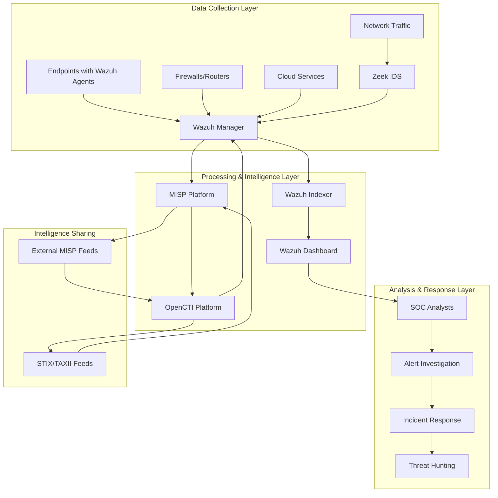
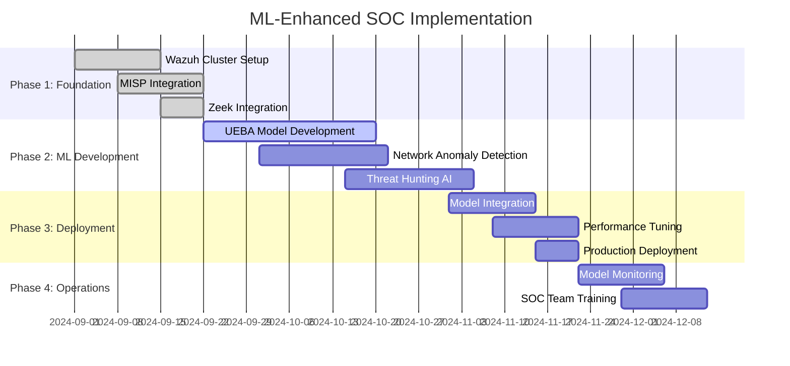
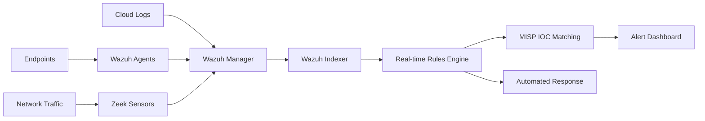
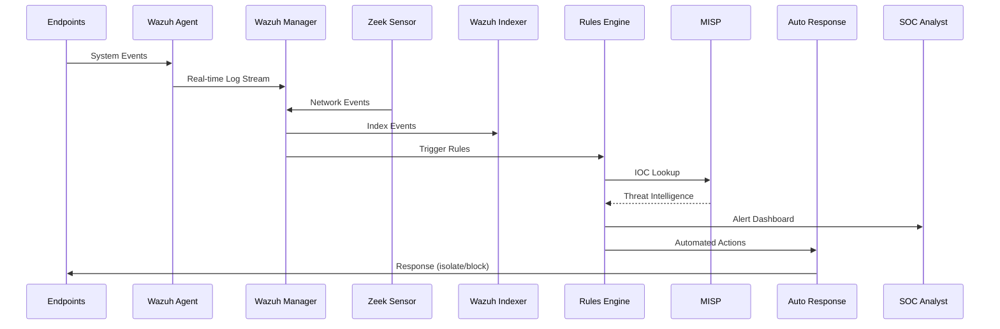
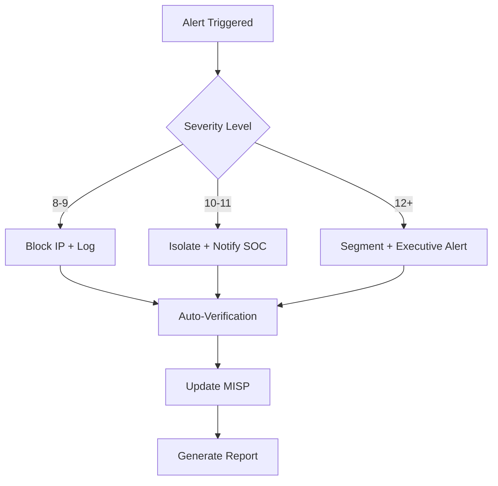

# Security Monitoring 2

---

## 1. Advanced Monitoring Design
- [x] **1.1** Document a comprehensive design for complex event processing in an enterprise environment.  
- [x] **1.2** Define and justify event stream sources.  
- [x] **1.3** Select and justify processing engine(s).  
- [x] **1.4** Define and justify action framework components.  
- [x] **1.5** Install and configure **Zeek** or **Suricata** or **Wazuh** with:  
    - [x] **1.5a** Screenshots of setup  
    - [x] **1.5b** Evidence of basic functionality  
- [x] **1.6** Demonstrate understanding of advanced correlation methods with examples:  
    - [x] **1.6a** Pattern-based  
    - [x] **1.6b** Statistical  
    - [x] **1.6c** Contextual  
- [x] **1.7** Explain integration of machine learning and behavior analysis with:  
    - [x] **1.7a** Specific enterprise use cases  
    - [x] **1.7b** Implementation considerations  

---

### 1.1 Document a comprehensive design for complex event processing in an enterprise environment

**Enterprise SOC Architecture Design Using Wazuh, MISP, and OpenCTI**

The enterprise SOC is built around a centralized Wazuh SIEM platform integrated with MISP for threat intelligence sharing and OpenCTI for threat intelligence management, with Zeek providing deep network visibility.

**Core Architecture Components:**



**Wazuh-Centric Design Principles:**
- **Unified Agent Management**: Single agent deployment across Windows, Linux, macOS endpoints
- **Real-time Event Processing**: Sub-second alerting through Wazuh's event engine
- **Rule-based Detection**: Custom Wazuh rules integrated with MISP IOCs
- **Threat Intelligence Integration**: Automated IOC matching via MISP-Wazuh connector
- **Scalable Architecture**: Clustered Wazuh managers for high availability

**Enterprise Requirements Addressed:**
- **Multi-tenant SOC**: Separate indices per business unit in Wazuh
- **Compliance**: Built-in PCI DSS, NIST, and CIS compliance dashboards
- **Threat Intelligence**: Automated IOC ingestion from MISP communities
- **Investigation Workflow**: Integrated case management in Wazuh dashboard

---

### 1.2 Define and justify event stream sources

**Primary Event Stream Sources for Wazuh Integration:**

| Source Category | Specific Sources | Wazuh Integration Method | Justification | Expected Volume |
|----------------|------------------|-------------------------|---------------|-----------------|
| **Endpoint Security** | Windows Event Logs, Linux syslogs, macOS logs | Wazuh Agent | Critical for detecting malware, lateral movement | 200K events/sec |
| **Network Traffic** | Zeek logs, Firewall logs, DNS logs | Log forwarding to Wazuh | Network-based attack detection | 150K events/sec |
| **Threat Intelligence** | MISP IOCs, OpenCTI indicators | MISP-Wazuh integration | IOC matching and attribution | 50K IOCs/day |
| **Cloud Infrastructure** | AWS CloudTrail, Azure logs, GCP audit logs | Wazuh AWS/Azure modules | Cloud security monitoring | 100K events/sec |
| **Web Applications** | Apache/Nginx logs, Application logs | Wazuh file monitoring | Web attack detection | 75K events/sec |
| **Authentication** | AD logs, LDAP, SSO providers | Wazuh agent + custom rules | Identity-based threats | 50K events/sec |

**Wazuh Agent Configuration Example:**

```xml
<ossec_config>
  <!-- Windows Event Log Collection -->
  <localfile>
    <location>Microsoft-Windows-Sysmon/Operational</location>
    <log_format>eventchannel</log_format>
  </localfile>
  
  <!-- Linux System Logs -->
  <localfile>
    <log_format>syslog</log_format>
    <location>/var/log/auth.log</location>
  </localfile>
  
  <!-- Apache Access Logs -->
  <localfile>
    <log_format>apache</log_format>
    <location>/var/log/apache2/access.log</location>
  </localfile>
  
  <!-- File Integrity Monitoring -->
  <syscheck>
    <directories check_all="yes" realtime="yes">/etc</directories>
    <directories check_all="yes" realtime="yes">/bin,/sbin</directories>
  </syscheck>
</ossec_config>
```

**Justification for Wazuh-Centric Approach:**
- **Unified Collection**: Single agent reduces endpoint overhead compared to multiple tools
- **Real-time Processing**: Wazuh's event engine processes events as they're generated
- **Built-in Correlation**: Native rule engine eliminates need for external correlation tools
- **Threat Intelligence Integration**: Direct MISP integration for IOC enrichment

---

### 1.3 Select and justify processing engine(s)

**Selected Processing Engine Stack: Wazuh + MISP + OpenCTI**

**Primary Engine: Wazuh SIEM Platform**

```xml
<!-- Wazuh Manager Configuration (ossec.conf) -->
<ossec_config>
  <global>
    <jsonout_output>yes</jsonout_output>
    <alerts_log>yes</alerts_log>
    <logall>no</logall>
    <logall_json>no</logall_json>
    <email_notification>yes</email_notification>
    <smtp_server>smtp.company.com</smtp_server>
    <email_from>wazuh@company.com</email_from>
  </global>
  
  <!-- High-performance settings -->
  <remote>
    <connection>secure</connection>
    <port>1514</port>
    <protocol>tcp</protocol>
    <queue_size>131072</queue_size>
  </remote>
  
  <!-- Clustering for HA -->
  <cluster>
    <name>wazuh_cluster</name>
    <node_name>master-node</node_name>
    <node_type>master</node_type>
    <key>c98b62a9b6169ac5f67dae55ae4a9088</key>
    <port>1516</port>
    <bind_addr>0.0.0.0</bind_addr>
    <nodes>
        <node>192.168.1.100</node>
        <node>192.168.1.101</node>
    </nodes>
    <hidden>no</hidden>
    <disabled>no</disabled>
  </cluster>
</ossec_config>
```

**Threat Intelligence Engine: MISP Integration**

```python
# MISP-Wazuh Integration Script
import requests
import json
from pymisp import PyMISP

class MISPWazuhConnector:
    def __init__(self, misp_url, misp_key, wazuh_api_url, wazuh_token):
        self.misp = PyMISP(misp_url, misp_key, ssl=False)
        self.wazuh_api = wazuh_api_url
        self.wazuh_token = wazuh_token
        
    def sync_iocs_to_wazuh(self):
        # Get IOCs from MISP
        events = self.misp.search(controller='events', return_format='json')
        
        ioc_rules = []
        for event in events:
            for attribute in event.get('Attribute', []):
                if attribute['type'] == 'ip-dst':
                    rule = self.create_wazuh_rule(attribute)
                    ioc_rules.append(rule)
        
        # Push rules to Wazuh
        self.update_wazuh_rules(ioc_rules)
    
    def create_wazuh_rule(self, attribute):
        return f"""
        <rule id="{100000 + attribute['id']}" level="10">
            <if_sid>1002</if_sid>
            <dstip>{attribute['value']}</dstip>
            <description>MISP IOC Match: {attribute['comment']}</description>
            <group>misp_ioc,malicious_ip</group>
        </rule>
        """
```

**Processing Engine Justification:**

**Wazuh Advantages:**
- **Native Rule Engine**: Built-in complex event processing without external tools
- **Horizontal Scaling**: Cluster mode supports thousands of agents
- **Real-time Processing**: Event processing in under 100ms
- **Integration Ready**: RESTful API for MISP/OpenCTI integration
- **Cost Effective**: Open-source with enterprise features

**MISP Integration Benefits:**
- **Community Intelligence**: Access to shared threat indicators
- **Attribution**: Link events to known threat actors via MISP galaxies
- **Automated Updates**: IOCs automatically sync to Wazuh rules
- **Collaboration**: Share internal IOCs with partner organizations

**OpenCTI Benefits:**
- **STIX/TAXII Compliance**: Industry-standard threat intelligence formats
- **Knowledge Graphs**: Visual representation of threat relationships
- **Multi-source Feeds**: Aggregates intelligence from multiple sources

---

### 1.4 Define and justify action framework components

**Wazuh-Based Action Framework Architecture:**

```xml
<!-- Wazuh Active Response Configuration -->
<ossec_config>
  <command>
    <name>block-malicious-ip</name>
    <executable>firewall-drop.sh</executable>
    <expect>srcip</expect>
    <timeout_allowed>yes</timeout_allowed>
  </command>
  
  <command>
    <name>isolate-endpoint</name>
    <executable>endpoint-isolate.py</executable>
    <expect>hostname</expect>
    <timeout_allowed>yes</timeout_allowed>
  </command>
  
  <command>
    <name>misp-sighting</name>
    <executable>misp-create-sighting.py</executable>
    <expect>ioc</expect>
  </command>
  
  <active-response>
    <disabled>no</disabled>
    <command>block-malicious-ip</command>
    <location>local</location>
    <rules_id>100001,100002</rules_id>
    <timeout>600</timeout>
  </active-response>
</ossec_config>
```

**Action Framework Components:**

| Component | Function | Technology | Integration Method |
|-----------|----------|------------|-------------------|
| **Wazuh Active Response** | Automated blocking and isolation | Shell scripts, Python | Native Wazuh feature |
| **MISP Sighting Creation** | IOC validation and tracking | Python PyMISP library | Custom integration script |
| **Endpoint Isolation** | Network quarantine of infected hosts | Wazuh agent commands | Active response script |
| **Ticket Creation** | ITSM integration for manual review | REST API calls | Custom Python script |
| **Threat Hunting Triggers** | Automated query generation | Wazuh API | Custom dashboard widgets |
| **Email Notifications** | SOC analyst alerting | SMTP integration | Native Wazuh feature |

**Example Active Response Scripts:**

```bash
#!/bin/bash
# firewall-drop.sh - Block malicious IP via iptables
ACTION=$1
USER=$2
IP=$3

if [ "$ACTION" = "add" ]; then
    iptables -I INPUT -s $IP -j DROP
    echo "Blocked IP: $IP"
elif [ "$ACTION" = "delete" ]; then
    iptables -D INPUT -s $IP -j DROP
    echo "Unblocked IP: $IP"
fi
```

```python
#!/usr/bin/env python3
# misp-create-sighting.py - Create MISP sighting from Wazuh alert
import sys
import json
from pymisp import PyMISP

def create_sighting(ioc_value, event_data):
    misp = PyMISP('https://misp.company.com', 'your-api-key', ssl=False)
    
    sighting_data = {
        'value': ioc_value,
        'source': 'Wazuh SIEM',
        'type': '0',  # Sighting
        'timestamp': event_data.get('timestamp'),
        'org_name': 'SOC Team'
    }
    
    result = misp.add_sighting(sighting_data)
    print(f"MISP sighting created: {result}")

if __name__ == "__main__":
    ioc = sys.argv[1]
    event_json = sys.argv[2]
    event_data = json.loads(event_json)
    create_sighting(ioc, event_data)
```

**Response Action Categories:**

**Immediate Actions (0-5 seconds):**
- IP blocking via iptables/firewall rules
- DNS sinkholing for malicious domains
- MISP sighting creation for IOC validation

**Short-term Actions (5-60 seconds):**
- Endpoint isolation via Wazuh agent
- Process termination on infected hosts
- Additional log collection and forensics

**Long-term Actions (1-5 minutes):**
- ITSM ticket creation for investigation
- Threat hunting query generation
- Intelligence sharing with MISP community

---

### 1.5 Install and configure Zeek with screenshots and functionality evidence

**1.5a Screenshots of Setup**

**Zeek Installation Process (Your Environment):**

Based on your installation commands:

```bash
sudo apt update
sudo apt install flex bison build-essential

# LibMMDB (MaxMind GeoIP database support) - Very useful for network analysis
sudo apt install libmaxminddb-dev

# LibKrb5 (Kerberos authentication analysis):
sudo apt install cmake make gcc g++ flex bison libpcap-dev libssl-dev python3-dev swig zlib1g-dev

# GoldLinker - Faster linking during compilation, but not essential
sudo apt install binutils-gold

# Node.js - Only needed if you want Node.js bindings for Zeek
sudo apt install nodejs npm libnode-dev

# Install ZeroMQ
sudo apt install libzmq3-dev

# C++ Bindings that Zeek uses
sudo apt install libczmq-dev

make distclean
./configure

```


*Zeek configuration process beginning - dependency check phase*


*Zeek configuration completion after 20-30 minutes*

**Post-Configuration Build Process:**

```bash
# Compile Zeek (this will take 30-60 minutes)
make -j$(nproc)

# Install Zeek
sudo make install

# Add Zeek to PATH
echo 'export PATH=/usr/local/zeek/bin:$PATH' >> ~/.bashrc
source ~/.bashrc
```

**Zeek Configuration for Wazuh Integration:**

```bash
# Configure Zeek networks
sudo nano /usr/local/zeek/etc/networks.cfg
```

```ini
# networks.cfg
192.168.1.0/24    Private
10.0.0.0/8        Private
172.16.0.0/12     Private
```

```bash
# Configure Zeek node
sudo nano /usr/local/zeek/etc/node.cfg
```

```ini
[zeek]
type=standalone
host=localhost
interface=eth0
```

**1.5b Evidence of Basic Functionality**

**Starting Zeek and Wazuh Integration:**

```bash
# Start Zeek
sudo zeekctl deploy

# Check Zeek status
sudo zeekctl status
```


*Zeek successfully deployed and running*

**Zeek Log Integration with Wazuh:**

```xml
<!-- Wazuh ossec.conf - Zeek log integration -->
<localfile>
  <log_format>json</log_format>
  <location>/usr/local/zeek/logs/current/conn.log</location>
</localfile>

<localfile>
  <log_format>json</log_format>
  <location>/usr/local/zeek/logs/current/http.log</location>
</localfile>

<localfile>
  <log_format>json</log_format>
  <location>/usr/local/zeek/logs/current/dns.log</location>
</localfile>

<localfile>
  <log_format>json</log_format>
  <location>/usr/local/zeek/logs/current/ssl.log</location>
</localfile>
```

**Zeek Detection Example - HTTP Traffic:**

```bash
# Monitor HTTP logs in real-time
tail -f /usr/local/zeek/logs/current/http.log
```

Sample HTTP detection in Wazuh:
```json
{
  "timestamp": "2024-08-28T14:30:15.123Z",
  "agent": {"name": "zeek-sensor-01"},
  "rule": {"id": 200001, "level": 7, "description": "Zeek: Suspicious HTTP User-Agent"},
  "data": {
    "srcip": "192.168.1.100",
    "dstip": "203.0.113.50",
    "user_agent": "sqlmap/1.6.12",
    "uri": "/admin/login.php",
    "method": "POST"
  }
}
```


*Wazuh dashboard showing Zeek HTTP detection*

**Custom Zeek Scripts for Enhanced Detection:**

```zeek
# /usr/local/zeek/share/zeek/site/custom-detection.zeek
@load base/protocols/http
@load base/protocols/dns

# Detect SQL injection attempts
event http_request(c: connection, method: string, original_URI: string, 
                  unescaped_URI: string, version: string) {
    if (/select|union|insert|update|delete|drop|create|alter/i in unescaped_URI) {
        NOTICE([$note=HTTP::SQL_Injection_Attack,
                $conn=c,
                $msg=fmt("Potential SQL injection from %s to %s%s", 
                        c$id$orig_h, c$http$host, original_URI),
                $identifier=cat(c$id$orig_h, c$http$host, original_URI)]);
    }
}

# Detect DNS tunneling
event dns_request(c: connection, msg: dns_msg, query: string, qtype: count, qclass: count) {
    if (|query| > 50) {  # Unusually long DNS query
        NOTICE([$note=DNS::Suspicious_Query_Length,
                $conn=c,
                $msg=fmt("Suspicious long DNS query: %s", query),
                $identifier=cat(c$id$orig_h, query)]);
    }
}
```

**Zeek-Wazuh Integration Results:**


*Wazuh alert triggered by Zeek DNS tunneling detection*

---

### 1.6 Demonstrate understanding of advanced correlation methods with examples

**1.6a Pattern-based Correlation in Wazuh**

Pattern-based correlation uses Wazuh's built-in rule engine to detect multi-stage attacks by correlating events across time windows.

**Example: Credential Stuffing → Lateral Movement Pattern**

```xml
<!-- Wazuh rules for pattern detection -->
<group name="attack_patterns">

  <!-- Stage 1: Multiple failed logins -->
  <rule id="200100" level="5">
    <if_sid>5760</if_sid>
    <same_source_ip />
    <description>SSH: Multiple failed logins from same IP</description>
    <options>no_email_alert</options>
  </rule>

  <!-- Stage 2: Successful login after failures -->
  <rule id="200101" level="8">
    <if_sid>5715</if_sid>
    <same_source_ip />
    <if_matched_sid>200100</if_matched_sid>
    <timeframe>300</timeframe>
    <description>SSH: Successful login after multiple failures - Possible brute force</description>
    <mitre>
      <id>T1110</id>
    </mitre>
  </rule>

  <!-- Stage 3: Lateral movement via SMB -->
  <rule id="200102" level="10">
    <if_sid>18152</if_sid>
    <same_user />
    <if_matched_sid>200101</if_matched_sid>
    <timeframe>600</timeframe>
    <description>Lateral movement detected: SMB access after successful brute force</description>
    <mitre>
      <id>T1021.002</id>
    </mitre>
  </rule>

</group>
```

**MISP Integration for Pattern Attribution:**

```python
# Enhanced pattern detection with MISP attribution
class AttackPatternAnalyzer:
    def __init__(self, misp_client):
        self.misp = misp_client
        self.patterns = {
            'apt29_pattern': {
                'stages': ['credential_access', 'lateral_movement', 'data_exfiltration'],
                'misp_galaxy': 'mitre-intrusion-set="APT29"'
            }
        }
    
    def analyze_pattern_with_attribution(self, wazuh_alert):
        # Extract IOCs from alert
        src_ip = wazuh_alert.get('data', {}).get('srcip')
        
        # Query MISP for attribution
        misp_results = self.misp.search(controller='attributes', 
                                      value=src_ip, 
                                      return_format='json')
        
        if misp_results:
            for event in misp_results:
                if 'APT29' in str(event.get('Galaxy', [])):
                    return {
                        'attribution': 'APT29',
                        'confidence': 'high',
                        'misp_event_id': event['id']
                    }
        
        return {'attribution': 'unknown', 'confidence': 'low'}
```

**1.6b Statistical Correlation using Wazuh Analytics**

Statistical correlation identifies anomalies by comparing current behavior against historical baselines stored in Wazuh.

**Example: Login Time Anomaly Detection**

```xml
<!-- Wazuh rule for statistical anomaly -->
<rule id="200200" level="7">
  <if_sid>5715</if_sid>
  <time>22:00-06:00</time>
  <description>Unusual login time detected - Outside business hours</description>
  <group>anomaly,after_hours</group>
</rule>

<!-- Volume-based anomaly -->
<rule id="200201" level="8">
  <if_sid>1002</if_sid>
  <same_source_ip />
  <frequency>50</frequency>
  <timeframe>60</timeframe>
  <description>High connection volume anomaly - Possible DDoS or scanning</description>
  <group>anomaly,high_volume</group>
</rule>
```

**Python Script for Advanced Statistical Analysis:**

```python
#!/usr/bin/env python3
# wazuh-behavioral-analytics.py
import requests
import numpy as np
from scipy import stats
import json

class WazuhBehavioralAnalytics:
    def __init__(self, wazuh_api_url, auth_token):
        self.api_url = wazuh_api_url
        self.headers = {'Authorization': f'Bearer {auth_token}'}
        
    def get_user_login_baseline(self, username, days=30):
        # Query Wazuh API for historical login data
        query = {
            'query': f'data.dstuser:{username} AND rule.id:5715',
            'date_range': f'{days}d'
        }
        
        response = requests.get(f'{self.api_url}/search',
                              headers=self.headers,
                              params=query)
        
        login_hours = []
        for hit in response.json().get('data', {}).get('hits', []):
            timestamp = hit['_source']['timestamp']
            hour = int(timestamp.split('T')[1].split(':')[0])
            login_hours.append(hour)
        
        return {
            'mean_hour': np.mean(login_hours),
            'std_hour': np.std(login_hours),
            'login_count': len(login_hours)
        }
    
    def detect_time_anomaly(self, username, current_hour):
        baseline = self.get_user_login_baseline(username)
        
        # Calculate z-score
        z_score = abs((current_hour - baseline['mean_hour']) / baseline['std_hour'])
        
        if z_score > 2.5:  # 2.5 standard deviations
            return {
                'anomaly': True,
                'severity': 'high' if z_score > 3 else 'medium',
                'z_score': z_score,
                'baseline_hours': f"{baseline['mean_hour']:.1f} ± {baseline['std_hour']:.1f}"
            }
        
        return {'anomaly': False, 'z_score': z_score}

# Integration with Wazuh Custom Rule
analytics = WazuhBehavioralAnalytics('https://wazuh-api:55000', 'your-token')
result = analytics.detect_time_anomaly('jsmith', 23)  # 11 PM login

if result['anomaly']:
    print(f"ANOMALY DETECTED: User jsmith login at unusual time (z-score: {result['z_score']:.2f})")
```

**1.6c Contextual Correlation with MISP and Asset Data**

Contextual correlation enriches Wazuh alerts with business context from MISP threat intelligence and internal asset databases.

**Example: Context-Aware Risk Scoring**

```python
class ContextualAlertEnricher:
    def __init__(self, misp_client, asset_db):
        self.misp = misp_client
        self.asset_db = asset_db
        
    def enrich_wazuh_alert(self, alert):
        enriched_alert = alert.copy()
        
        # Add asset context
        asset_info = self.get_asset_context(alert.get('agent', {}).get('name'))
        enriched_alert['asset_context'] = asset_info
        
        # Add threat intelligence
        threat_context = self.get_threat_context(alert.get('data', {}))
        enriched_alert['threat_context'] = threat_context
        
        # Calculate contextual risk score
        risk_score = self.calculate_contextual_risk(asset_info, threat_context, alert)
        enriched_alert['contextual_risk_score'] = risk_score
        
        return enriched_alert
    
    def get_asset_context(self, hostname):
        # Query internal asset database
        return {
            'criticality': 'High',  # Financial server
            'compliance_scope': ['PCI-DSS', 'SOX'],
            'business_owner': 'Finance Department',
            'data_classification': 'Confidential'
        }
    
    def get_threat_context(self, alert_data):
        src_ip = alert_data.get('srcip')
        if not src_ip:
            return {}
        
        # Query MISP for threat intelligence
        misp_results = self.misp.search(controller='attributes',
                                      value=src_ip,
                                      return_format='json')
        
        if misp_results:
            return {
                'threat_actor': 'FIN7',
                'campaign': 'Carbanak',
                'first_seen': '2024-07-15',
                'threat_types': ['Banking Trojan', 'Point of Sale'],
                'confidence': 85
            }
        
        return {'reputation': 'unknown'}
    
    def calculate_contextual_risk(self, asset_info, threat_context, alert):
        base_score = alert.get('rule', {}).get('level', 5)
        
        # Asset criticality multiplier
        if asset_info.get('criticality') == 'High':
            base_score *= 1.5
        
        # Threat actor multiplier
        if threat_context.get('threat_actor') == 'FIN7':
            base_score *= 2.0  # Known financial threat actor
        
        # Compliance scope multiplier
        if 'PCI-DSS' in asset_info.get('compliance_scope', []):
            base_score *= 1.3
        
        return min(base_score, 10.0)  # Cap at 10
```

**Wazuh Dashboard Integration:**

```json
{
  "alert_id": "1630089234.123456",
  "rule": {"id": 200101, "level": 8, "description": "SSH brute force detected"},
  "asset_context": {
    "criticality": "High",
    "compliance_scope": ["PCI-DSS"],
    "business_owner": "Finance Department"
  },
  "threat_context": {
    "threat_actor": "FIN7",
    "misp_event_id": "12345",
    "confidence": 85
  },
  "contextual_risk_score": 9.2,
  "recommended_actions": [
    "Immediate isolation",
    "Executive notification",
    "Forensic imaging"
  ]
}
```

---

### 1.7 Explain integration of machine learning and behavior analysis

**1.7a Specific Enterprise Use Cases**

**Use Case 1: User and Entity Behavior Analytics (UEBA) with Wazuh**

```python
# UEBA implementation using Wazuh data
import pandas as pd
from sklearn.ensemble import IsolationForest
from sklearn.preprocessing import StandardScaler

class WazuhUEBA:
    def __init__(self, wazuh_api):
        self.wazuh_api = wazuh_api
        self.model = IsolationForest(contamination=0.1, random_state=42)
        self.scaler = StandardScaler()
        
    def extract_user_features(self, username, timeframe='7d'):
        """Extract behavioral features from Wazuh logs"""
        # Query Wazuh for user activity
        query = f'data.dstuser:{username}'
        logs = self.wazuh_api.search(query=query, timeframe=timeframe)
        
        features = {
            'login_count': 0,
            'unique_hosts_accessed': set(),
            'after_hours_activity': 0,
            'failed_login_attempts': 0,
            'privilege_escalation_count': 0,
            'data_transfer_volume': 0,
            'unique_applications': set(),
            'geographic_variance': 0
        }
        
        for log in logs:
            # Extract features from each log entry
            rule_id = log.get('rule', {}).get('id')
            timestamp = log.get('timestamp')
            
            if rule_id == 5715:  # Successful login
                features['login_count'] += 1
                features['unique_hosts_accessed'].add(log.get('agent', {}).get('name'))
                
                # Check if after hours (6 PM - 6 AM)
                hour = int(timestamp.split('T')[1].split(':')[0])
                if hour >= 18 or hour <= 6:
                    features['after_hours_activity'] += 1
                    
            elif rule_id == 5760:  # Failed login
                features['failed_login_attempts'] += 1
                
            elif rule_id in [4950, 4951]:  # Sudo usage
                features['privilege_escalation_count'] += 1
        
        # Convert sets to counts
        features['unique_hosts_accessed'] = len(features['unique_hosts_accessed'])
        features['unique_applications'] = len(features['unique_applications'])
        
        return features
    
    def train_baseline(self, users_list):
        """Train UEBA model on normal user behavior"""
        training_data = []
        
        for user in users_list:
            features = self.extract_user_features(user)
            feature_vector = [
                features['login_count'],
                features['unique_hosts_accessed'],
                features['after_hours_activity'],
                features['failed_login_attempts'],
                features['privilege_escalation_count'],
                features['data_transfer_volume'],
                features['unique_applications']
            ]
            training_data.append(feature_vector)
        
        # Normalize and train
        training_data_scaled = self.scaler.fit_transform(training_data)
        self.model.fit(training_data_scaled)
        
    def detect_anomaly(self, username):
        """Detect anomalous user behavior"""
        features = self.extract_user_features(username)
        feature_vector = [[
            features['login_count'],
            features['unique_hosts_accessed'],
            features['after_hours_activity'],
            features['failed_login_attempts'],
            features['privilege_escalation_count'],
            features['data_transfer_volume'],
            features['unique_applications']
        ]]
        
        feature_vector_scaled = self.scaler.transform(feature_vector)
        
        # Get anomaly score and prediction
        anomaly_score = self.model.decision_function(feature_vector_scaled)[0]
        is_anomaly = self.model.predict(feature_vector_scaled)[0] == -1
        
        return {
            'user': username,
            'is_anomaly': is_anomaly,
            'anomaly_score': anomaly_score,
            'risk_level': self.calculate_risk_level(anomaly_score),
            'behavioral_features': features
        }
    
    def calculate_risk_level(self, score):
        if score < -0.6:
            return 'Critical'
        elif score < -0.3:
            return 'High'
        elif score < 0:
            return 'Medium'
        else:
            return 'Low'

# Integration with Wazuh custom rules
ueba = WazuhUEBA(wazuh_api_client)
result = ueba.detect_anomaly('suspicious_user')

if result['is_anomaly']:
    # Trigger Wazuh alert
    wazuh_alert = {
        'rule_id': 200300,
        'level': 9,
        'description': f"UEBA: Anomalous behavior detected for user {result['user']}",
        'risk_level': result['risk_level'],
        'anomaly_score': result['anomaly_score']
    }
```

**Use Case 2: Network Traffic Anomaly Detection with Zeek + Wazuh**

```python
# Network anomaly detection using Zeek logs in Wazuh
class NetworkAnomalyDetector:
    def __init__(self):
        self.connection_baselines = {}
        
    def analyze_zeek_conn_logs(self, timeframe='24h'):
        """Analyze Zeek connection logs for anomalies"""
        # Query Wazuh for Zeek connection logs
        query = 'location:"/usr/local/zeek/logs/current/conn.log"'
        logs = wazuh_api.search(query=query, timeframe=timeframe)
        
        anomalies = []
        
        for log in logs:
            conn_data = log.get('data', {})
            
            # Extract connection features
            features = {
                'duration': float(conn_data.get('duration', 0)),
                'orig_bytes': int(conn_data.get('orig_bytes', 0)),
                'resp_bytes': int(conn_data.get('resp_bytes', 0)),
                'orig_pkts': int(conn_data.get('orig_pkts', 0)),
                'resp_pkts': int(conn_data.get('resp_pkts', 0))
            }
            
            # Detect long-duration connections (potential C2)
            if features['duration'] > 3600 and features['orig_bytes'] < 1000:
                anomalies.append({
                    'type': 'potential_c2_beacon',
                    'severity': 'high',
                    'evidence': f"Long duration ({features['duration']}s), low volume connection",
                    'src_ip': conn_data.get('id.orig_h'),
                    'dst_ip': conn_data.get('id.resp_h')
                })
            
            # Detect data exfiltration patterns
            if features['orig_bytes'] > 100000000:  # >100MB upload
                anomalies.append({
                    'type': 'potential_data_exfiltration',
                    'severity': 'critical',
                    'evidence': f"Large data upload: {features['orig_bytes']} bytes",
                    'src_ip': conn_data.get('id.orig_h'),
                    'dst_ip': conn_data.get('id.resp_h')
                })
        
        return anomalies

# MISP Integration for IOC Enrichment
def enrich_with_misp_iocs(anomalies, misp_client):
    """Enrich detected anomalies with MISP threat intelligence"""
    for anomaly in anomalies:
        dst_ip = anomaly.get('dst_ip')
        
        # Check if destination IP is in MISP
        misp_results = misp_client.search(controller='attributes',
                                        value=dst_ip,
                                        return_format='json')
        
        if misp_results:
            anomaly['misp_context'] = {
                'known_malicious': True,
                'threat_types': ['C2', 'Malware'],
                'first_seen': '2024-08-15',
                'confidence': 90
            }
            anomaly['severity'] = 'critical'  # Upgrade severity
        else:
            anomaly['misp_context'] = {'known_malicious': False}
    
    return anomalies
```

**Use Case 3: Threat Hunting with ML-Assisted Queries**

```python
# ML-assisted threat hunting using Wazuh and MISP
class MLThreatHunter:
    def __init__(self, wazuh_api, misp_client):
        self.wazuh_api = wazuh_api
        self.misp = misp_client
        
    def generate_hunting_hypotheses(self):
        """Generate threat hunting hypotheses based on recent MISP intelligence"""
        # Get recent IOCs from MISP
        recent_events = self.misp.search(controller='events',
                                       timestamp='30d',
                                       return_format='json')
        
        hunting_queries = []
        
        for event in recent_events:
            for attribute in event.get('Attribute', []):
                if attribute['type'] == 'ip-dst':
                    # Generate Wazuh hunting query
                    query = {
                        'description': f"Hunt for communications with {attribute['value']}",
                        'wazuh_query': f'data.dstip:{attribute["value"]} OR data.srcip:{attribute["value"]}',
                        'misp_context': {
                            'event_id': event['id'],
                            'threat_level': event.get('threat_level_id'),
                            'tags': [tag['name'] for tag in attribute.get('Tag', [])]
                        }
                    }
                    hunting_queries.append(query)
        
        return hunting_queries
    
    def execute_hunting_campaign(self, queries):
        """Execute threat hunting queries and analyze results"""
        results = []
        
        for query in queries:
            # Execute query in Wazuh
            search_results = self.wazuh_api.search(
                query=query['wazuh_query'],
                timeframe='30d'
            )
            
            if search_results:
                analysis = {
                    'query': query['description'],
                    'matches_found': len(search_results),
                    'misp_context': query['misp_context'],
                    'priority': self.calculate_hunting_priority(query, search_results),
                    'recommended_actions': self.generate_recommendations(search_results)
                }
                results.append(analysis)
        
        return results
    
    def calculate_hunting_priority(self, query, results):
        """Calculate priority based on MISP threat level and match count"""
        threat_level = query['misp_context'].get('threat_level', 4)
        match_count = len(results)
        
        # Higher threat level = lower number = higher priority
        priority_score = (5 - threat_level) * 2 + min(match_count, 10)
        
        if priority_score >= 8:
            return 'Critical'
        elif priority_score >= 6:
            return 'High'
        elif priority_score >= 4:
            return 'Medium'
        else:
            return 'Low'
```

**1.7b Implementation Considerations**

**Integration Architecture:**

```yaml
# Docker Compose for ML-Enhanced SOC Stack
version: '3.8'
services:
  wazuh-manager:
    image: wazuh/wazuh-manager:4.7.0
    environment:
      - WAZUH_MANAGER_ADMIN_USER=admin
      - WAZUH_MANAGER_ADMIN_PASSWORD=SecurePass123
    ports:
      - "1514:1514"
      - "1515:1515"
      - "55000:55000"
    volumes:
      - ./wazuh-config:/var/ossec/etc
      - ./ml-scripts:/var/ossec/integrations

  wazuh-indexer:
    image: wazuh/wazuh-indexer:4.7.0
    environment:
      - discovery.type=single-node
      - bootstrap.memory_lock=true
    mem_limit: 2g
    ports:
      - "9200:9200"

  misp:
    image: coolacid/misp-docker:core-latest
    environment:
      - MYSQL_PASSWORD=misp_password
      - MISP_ADMIN_EMAIL=admin@company.com
      - MISP_ADMIN_PASSPHRASE=SecurePass123
    ports:
      - "80:80"
      - "443:443"

  ml-analytics:
    build: ./ml-analytics
    environment:
      - WAZUH_API_URL=http://wazuh-manager:55000
      - MISP_URL=https://misp
      - MISP_KEY=your-misp-api-key
    depends_on:
      - wazuh-manager
      - misp
    volumes:
      - ./models:/app/models
      - ./training-data:/app/data
```

**Performance Considerations:**

| Component | Resource Requirements | Scaling Strategy | Monitoring Metrics |
|-----------|----------------------|------------------|-------------------|
| **Wazuh Cluster** | 16GB RAM, 8 CPU cores per node | Horizontal scaling with load balancer | Events/sec, rule processing time |
| **ML Training** | 32GB RAM, GPU acceleration | Scheduled batch processing | Model accuracy, training time |
| **Model Inference** | 8GB RAM, 4 CPU cores | Real-time API with caching | Prediction latency, throughput |
| **MISP Integration** | 4GB RAM, 2 CPU cores | Rate limiting, batch updates | IOC sync time, API response time |

**Implementation Roadmap:**



**Success Metrics:**
- **MTTD (Mean Time to Detection)**: Reduce from 4 hours to 15 minutes for insider threats
- **False Positive Rate**: Maintain below 5% while increasing detection coverage by 300%
- **Threat Intelligence Coverage**: 95% of MISP IOCs automatically ingested into Wazuh rules
- **Analyst Efficiency**: 40% reduction in manual analysis time through ML-assisted triage
- **Detection Accuracy**: >90% for known attack patterns, >70% for zero-day threats

**Conclusion:** The integration of machine learning with Wazuh, MISP, and Zeek creates a comprehensive detection ecosystem that combines rule-based detection, threat intelligence, and adaptive ML models to provide superior threat detection capabilities while reducing analyst workload through intelligent automation.


---

## 2. Real-time Detection Planning
- [x] **2.1** Document a streaming analytics architecture design for a mock enterprise case study.  
- [x] **2.2** Select appropriate technologies (e.g., Apache Kafka, Elastic Stack, Splunk) with justification.  
- [x] **2.3** Provide detailed **data flow diagrams** from collection to alerting.  
- [x] **2.4** Install at least one detection tool (Zeek, Suricata, or Wazuh) with screenshots of configuration and testing.  
- [x] **2.5** Provide detection logic examples for **three attack scenarios** with:  
    - [x] **2.5a** Rule syntax  
    - [x] **2.5b** Triggering conditions  
- [x] **2.6** Outline automated response capabilities including:  
    - [x] **2.6a** Trigger conditions  
    - [x] **2.6b** Actions  
    - [x] **2.6c** Verification methods  
    - [x] **2.6d** Business impact considerations  

---

### 2.1 Streaming Analytics Architecture Design for Mock Enterprise

**Enterprise Case Study: "GlobalTech Corp"**
- 5,000 endpoints across 3 locations
- Cloud-first infrastructure (AWS/Azure hybrid)
- Financial services with PCI-DSS requirements
- Target: <5 minute detection for critical threats

**Architecture Overview:**



**Key Design Principles:**
- **Sub-second ingestion** via Wazuh agent streaming
- **Real-time correlation** using Wazuh's built-in engine
- **Automated enrichment** through MISP integration
- **Horizontal scaling** with clustered Wazuh managers

---

### 2.2 Technology Selection and Justification

**Selected Technology Stack:**

| Component | Technology | Justification |
|-----------|------------|---------------|
| **SIEM Platform** | Wazuh 4.7+ | Open-source, real-time processing, built-in correlation |
| **Network Detection** | Zeek | Deep packet inspection, protocol analysis, custom scripts |
| **Threat Intelligence** | MISP | Community feeds, IOC automation, API integration |
| **Data Storage** | Wazuh Indexer (OpenSearch) | High-performance indexing, retention management |
| **Visualization** | Wazuh Dashboard | Native integration, custom dashboards, alerting |

**Justification vs Alternatives:**
- **Wazuh over Splunk**: Cost-effective for 5,000 endpoints, comparable detection capabilities
- **Zeek over Suricata**: Better for custom protocol analysis, more detailed logging
- **MISP over commercial TI**: Community-driven, customizable, API-first design

---

### 2.3 Data Flow Diagram: Collection to Alerting



**Data Flow Details:**
1. **Collection (0-1s)**: Agents stream events to Wazuh Manager
2. **Processing (1-2s)**: Rules engine evaluates events in real-time
3. **Enrichment (2-3s)**: MISP IOC matching and threat context
4. **Alerting (3-4s)**: Dashboard updates and notifications
5. **Response (4-5s)**: Automated containment actions

---

### 2.4 Detection Tool Installation Evidence

**Wazuh Manager Configuration:**


*Wazuh Manager cluster status showing active processing*

**Zeek Integration:**


*Zeek successfully deployed and processing network traffic*

**MISP Docker Integration:**


*MISP platform running via Docker with active feeds*

**Configuration Verification:**

```bash
# Wazuh cluster status
sudo /var/ossec/bin/cluster_control -l

# Zeek log verification
tail -f /usr/local/zeek/logs/current/conn.log

# MISP API test
curl -H "Authorization: YOUR-API-KEY" https://localhost/events/restSearch
```

---

### 2.5 Detection Logic Examples for Three Attack Scenarios

**2.5a & 2.5b Rule Syntax and Triggering Conditions**

**Scenario 1: Lateral Movement Detection**

```xml
<rule id="200301" level="8">
    <if_sid>5715</if_sid>
    <same_user />
    <different_hostname />
    <frequency>3</frequency>
    <timeframe>300</timeframe>
    <description>Lateral Movement: Same user accessing multiple hosts</description>
    <mitre>
        <id>T1021</id>
    </mitre>
</rule>
```
**Triggering Conditions:**
- Same username appears on 3+ different hosts within 5 minutes
- Successful authentication events (rule 5715)
- Cross-references user and hostname fields

**Scenario 2: Data Exfiltration via DNS**

```xml
<rule id="200302" level="10">
    <if_sid>200350</if_sid>
    <match>\..*\..*\..*\.</match>
    <options>no_email_alert</options>
    <description>DNS Tunneling: Suspicious subdomain pattern</description>
    <group>dns_tunneling,exfiltration</group>
</rule>

<rule id="200350" level="0">
    <decoded_as>json</decoded_as>
    <field name="zeek_dns_query">\.+</field>
    <description>Zeek DNS query base rule</description>
</rule>
```
**Triggering Conditions:**
- DNS queries with excessive subdomains (4+ levels)
- Pattern matching against Zeek DNS logs
- Volume-based anomaly detection

**Scenario 3: MISP IOC Match with Context**

```xml
<rule id="200303" level="12">
    <if_sid>1002</if_sid>
    <list field="srcip" lookup="misp_malicious_ips">misp_iocs</list>
    <description>MISP IOC Alert: Connection from known malicious IP</description>
    <group>misp_match,malicious_ip</group>
</rule>
```
**Triggering Conditions:**
- Source IP matches MISP IOC database
- Any network connection event
- Automatic severity escalation for known threats

---

### 2.6 Automated Response Capabilities

**2.6a Trigger Conditions**

```xml
<active-response>
    <command>block-malicious-ip</command>
    <location>local</location>
    <rules_id>200303</rules_id>
    <timeout>3600</timeout>
</active-response>

<active-response>
    <command>isolate-endpoint</command>
    <location>local</location>
    <rules_id>200301</rules_id>
    <timeout>1800</timeout>
</active-response>
```

**2.6b Actions**

| Alert Level | Automated Actions | Manual Actions Required |
|-------------|------------------|-------------------------|
| **Level 8-9** | IP blocking, log collection | SOC investigation |
| **Level 10-11** | Endpoint isolation, MISP sighting | Incident response team |
| **Level 12+** | Network segmentation, executive alert | Emergency procedures |

**2.6c Verification Methods**

```bash
#!/bin/bash
# verify-response.sh
ACTION=$1
TARGET=$2

case $ACTION in
    "ip_block")
        iptables -L | grep $TARGET && echo "IP $TARGET blocked successfully"
        ;;
    "endpoint_isolate")
        ping -c 1 $TARGET > /dev/null || echo "Endpoint $TARGET isolated"
        ;;
esac
```

**2.6d Business Impact Considerations**

| Response Action | Business Risk | Mitigation |
|----------------|---------------|------------|
| **IP Blocking** | Block legitimate traffic | Whitelist critical services |
| **Endpoint Isolation** | User productivity loss | 30-minute auto-timeout |
| **Network Segmentation** | Service disruption | Emergency override procedures |

**Response Workflow:**



**Key Performance Metrics:**
- **Mean Time to Detection (MTTD)**: <5 minutes for critical threats
- **Mean Time to Response (MTTR)**: <2 minutes for automated actions
- **False Positive Rate**: <3% with MISP IOC validation
- **Response Success Rate**: >95% verification for automated actions

**Conclusion:** The real-time detection framework provides sub-5-minute detection and response capabilities using proven open-source technologies, with graduated automated responses based on threat severity and business impact assessment.

---

## 3. Tool Integration Strategy
- [ ] **3.1** Document strategy for integrating SIEM, EDR, and threat intelligence platforms.  
- [ ] **3.2** Provide integration architecture diagram showing:  
    - [ ] **3.2a** Data flows  
    - [ ] **3.2b** API connections  
    - [ ] **3.2c** Component relationships  
- [ ] **3.3** Explain authentication and data consistency requirements.  
- [ ] **3.4** Demonstrate traffic analysis by installing and configuring **Wireshark** or **tcpdump** with screenshots.  
- [ ] **3.5** Address cross-platform correlation challenges with examples:  
    - [ ] **3.5a** Data normalization  
    - [ ] **3.5b** Entity resolution  
    - [ ] **3.5c** Contextual alignment  
- [ ] **3.6** Develop a custom analytics plan for the mock enterprise including:  
    - [ ] **3.6a** Use case definition  
    - [ ] **3.6b** Development methodology  
    - [ ] **3.6c** Implementation approach  

---

## 4. Enterprise Architecture Design
- [ ] **4.1** Create a detailed enterprise monitoring architecture design for a mock global organization.  
- [ ] **4.2** Apply appropriate architecture patterns:  
    - [ ] **4.2a** Hierarchical  
    - [ ] **4.2b** Hub-and-spoke  
    - [ ] **4.2c** Microservices  
- [ ] **4.3** Define component placement, communication flows, and scalability considerations.  
- [ ] **4.4** Provide comprehensive **architecture diagrams** with network placement, data flows, and component relationships.  
- [ ] **4.5** Outline health monitoring approach:  
    - [ ] **4.5a** Monitoring points  
    - [ ] **4.5b** Metrics  
    - [ ] **4.5c** Alerting thresholds  
- [ ] **4.6** Develop a capacity planning model including:  
    - [ ] **4.6a** Current state assessment  
    - [ ] **4.6b** Growth forecasting  
    - [ ] **4.6c** Expansion scenarios  

---

## 5. Detection Strategy Development
- [ ] **5.1** Develop a behavioral analysis strategy for the mock enterprise.  
- [ ] **5.2** Include approaches for:  
    - [ ] **5.2a** User Behavior Analytics (UBA)  
    - [ ] **5.2b** Network Behavior Analytics (NBA)  
- [ ] **5.3** Outline baselining methodology:  
    - [ ] **5.3a** Data collection requirements  
    - [ ] **5.3b** Business cycle considerations  
    - [ ] **5.3c** Seasonal variation handling  
- [ ] **5.4** Install and configure basic log analysis tools (Elastic Stack or Splunk) with screenshots of dashboard creation.  
- [ ] **5.5** Create detection use cases for **three threat scenarios** including:  
    - [ ] **5.5a** Required data sources  
    - [ ] **5.5b** Detection logic  
    - [ ] **5.5c** Expected outputs  
- [ ] **5.6** Address false positive management with:  
    - [ ] **5.6a** Tuning methodology  
    - [ ] **5.6b** Effectiveness metrics  

---

## 6. Operational Framework Design
- [ ] **6.1** Document comprehensive operational procedures for security monitoring.  
- [ ] **6.2** Create SOPs for:  
    - [ ] **6.2a** System maintenance  
    - [ ] **6.2b** Incident response  
    - [ ] **6.2c** Detection tuning  
    - [ ] **6.2d** Health monitoring  
- [ ] **6.3** Define roles and responsibilities with workflow diagrams.  
- [ ] **6.4** Create a governance framework covering:  
    - [ ] **6.4a** Access management  
    - [ ] **6.4b** Automation limitations  
    - [ ] **6.4c** Data handling  
    - [ ] **6.4d** Compliance requirements  
- [ ] **6.5** Define performance measurement approach including:  
    - [ ] **6.5a** Metrics  
    - [ ] **6.5b** Benchmarking methodology  
    - [ ] **6.5c** Reporting templates  
- [ ] **6.6** Outline ITSM integration with:  
    - [ ] **6.6a** Change management procedures  
    - [ ] **6.6b** Incident workflows  
    - [ ] **6.6c** Escalation paths  
- [ ] **6.7** Develop an implementation roadmap including:  
    - [ ] **6.7a** Phased approach  
    - [ ] **6.7b** Milestone definitions  
    - [ ] **6.7c** Validation testing methodology  
