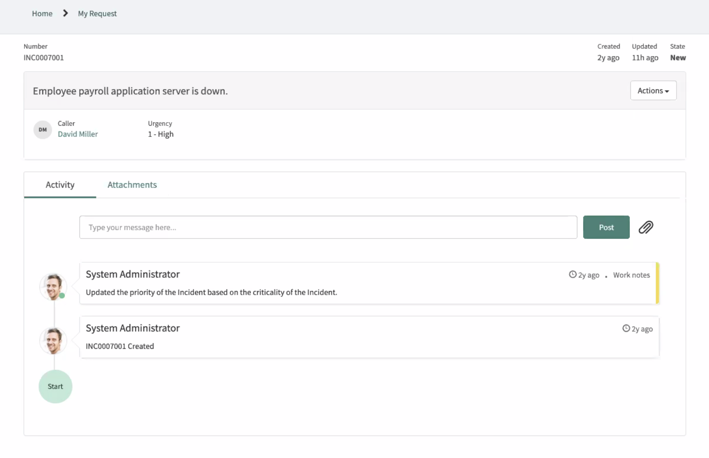
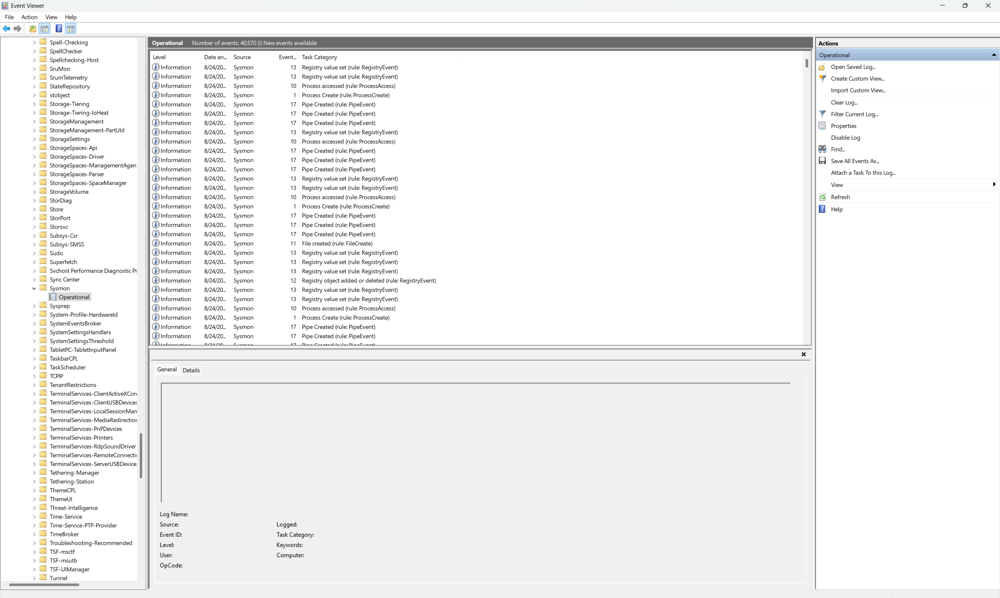
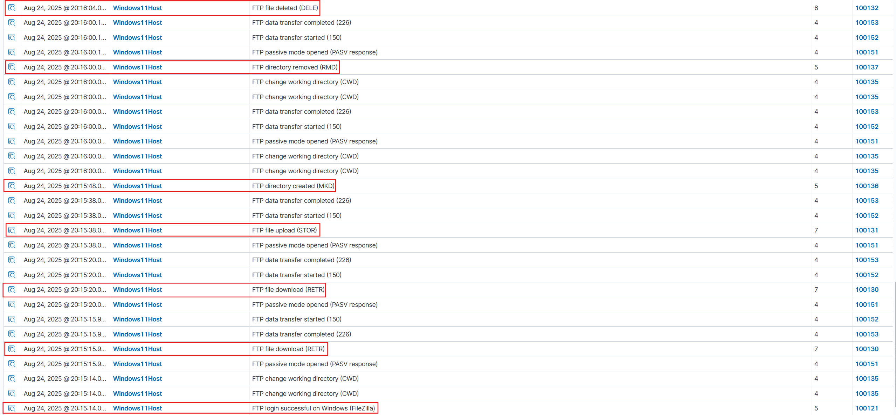
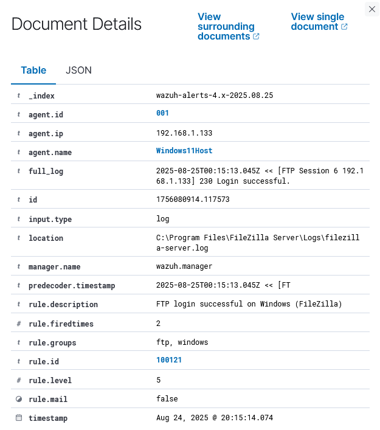
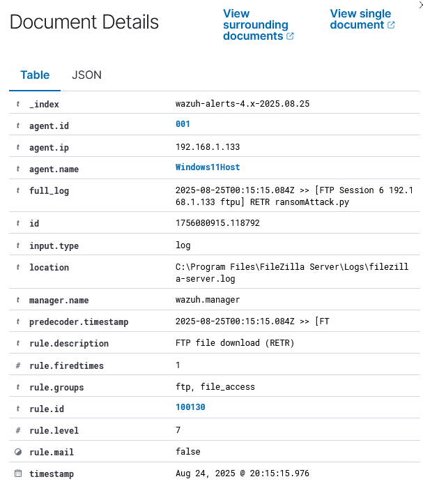
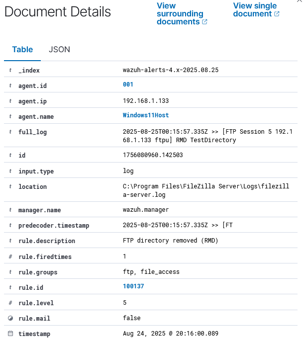
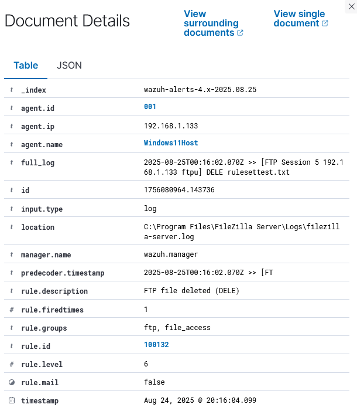

# Security Operations Center (SOC) 1

## 1. SOC Operations Documentation Checklist

- [x] **1.1** Identify at least one SIEM system, one ticketing platform, and one monitoring solution.  
- [x] **1.2** Explain the purpose and function for each SOC tool.  
- [x] **1.3** Include screenshots of each SOC tool interface.  
- [x] **1.4** Create a Mermaid diagram showing alert handling procedures and escalation paths.  
- [x] **1.5** Document the shift transition/handover process, including information to be passed on.  
    - [x] Include standard shift change timing and responsibilities.  
- [x] **1.6** Create a checklist for outgoing and incoming analysts.  
- [x] **1.7** Complete incident handling steps using the provided template. 

---

### 1.1-4 SOC Operations Documentation

### SOC Tools
- **SIEM System:** Wazuh (open-source SIEM platform).  
  - *Purpose:* Collects, correlates, and analyzes security logs.  
  - *Function:* Detects threats, provides dashboards, and triggers alerts.  


- **Ticketing Platform:** ServiceNow (or alternative: Jira, RTIR).  
  - *Purpose:* Tracks incidents and tasks.  
  - *Function:* Ensures alerts are assigned, escalated, and resolved.  



- **Monitoring Solution:** Sysmon + Filebeat.  
  - *Purpose:* Provides endpoint-level telemetry.  
  - *Function:* Logs process creation, network connections, and file modifications.  



---

### 1.4 Alert Handling & Escalation

```mermaid
flowchart TD
  A[Alert Generated in SIEM] --> B[Tier 1 SOC Analyst Review]
  B -->|False Positive| C[Close Ticket]
  B -->|Valid Alert| D[Tier 2 Escalation]
  D --> E[Containment / Eradication]
  E --> F[Incident Response Team]
  F --> G[Post-Incident Report]
```

---

### 1.5 Shift Transition / Handover Process

- **Timing:** Standard shifts are 8 hours (e.g., 08:00–16:00, 16:00–00:00, 00:00–08:00).  
- **Responsibilities:** Outgoing analyst documents open incidents, system health, pending escalations, and ongoing investigations. Incoming analyst verifies dashboards, SIEM health, and ticketing queue.  

---

### 1.6 Shift Handover Checklist

**Outgoing Analyst**
- [ ] Document all active alerts.  
- [ ] Update ticketing system with incident notes.  
- [ ] Report system health (agents online/offline).  
- [ ] Highlight pending escalations.  

**Incoming Analyst**
- [ ] Review current open tickets.  
- [ ] Verify SIEM connectivity and dashboards.  
- [ ] Confirm log sources are active.  
- [ ] Validate incident queues.  

---

### 1.7 Incident Handling Template

**Incident Title:** [Describe type, e.g., Brute-Force FTP Login]  
**Date/Time Detected:** [Timestamp]  
**Analyst on Duty:** [Name]  

**Steps Taken:**  
1. Initial detection [log snippet, screenshot].  
2. Verification of activity in SIEM.  
3. Containment action executed.  
4. Ticket created in ServiceNow.  

**Evidence:** [Screenshots, logs, hashes, IPs].  
**Status:** [Ongoing, Closed, Escalated].  
**Lessons Learned:** [Prevention steps].  


---

## 2. SIEM Implementation Documentation Checklist

- [x] **2.1** Describe each SIEM architecture component and its function.  
- [x] **2.2** Explain how SIEM components interact.  
- [x] **2.3** Create one sample correlation rule using the provided template/tool.  
- [x] **2.4** Document the correlation rule logic and intended use case.  
- [x] **2.5** Identify at least three different log sources.  
- [x] **2.6** Explain the significance of each log source for security monitoring.  
- [x] **2.7** Demonstrate configuration of SIEM notification settings.    

---

#### 2.1 SIEM Architecture

- **Agent:** Collects endpoint logs (e.g., Windows Event Channels, Sysmon, FileZilla).  
- **Manager:** Parses raw logs, applies decoders, and matches them against correlation rules.  
- **Indexer (OpenSearch/Elasticsearch):** Stores and indexes alerts/events for fast search.  
- **Dashboard (Kibana/Wazuh Dashboard):** Provides visualizations, search capabilities, and alert monitoring for SOC analysts.  

---

#### 2.2 Component Interaction

1. **Endpoint → Agent:**  
   - Sysmon, Windows Event Logs, and FileZilla logs are collected by the Wazuh agent.  
2. **Agent → Manager:**  
   - Logs are sent securely (AES-encrypted JSON via TCP/1514).  
   - Enrollment/keys handled on TCP/1515.  
3. **Manager → Indexer:**  
   - Alerts are processed, matched against rules, then stored in the Indexer.  
4. **Indexer → Dashboard:**  
   - Analysts query and visualize events through dashboards, alerts, and investigation workflows.  

---

#### 2.3-4 Sample Correlation Rule

**Rule Name:** FTP Brute-Force Attempt  
**Use Case:** Detect 5 failed FTP logins within 60 seconds.  

```xml
<group name="ftp,bruteforce">
  <rule id="200010" level="10" frequency="5" timeframe="60">
    <if_matched_sid>100120</if_matched_sid>
    <description>FTP Brute-Force Attempt Detected</description>
  </rule>
</group>
```

**Sample Logic:**

Tracks failed FTP login events (SID 100120).

If 5 or more failures occur within 60 seconds, an alert is triggered at level 10.

Intended Use Case: Brute-force activity detection against FTP services.

---

### 2.5-6 Log Sources

1. **Windows Security Logs**  
   - **Significance:** Provide visibility into authentication events (logon/logoff), privilege escalation attempts, account management changes, and policy enforcement.  
   - **Use Case:** Detect brute-force attempts, privilege misuse, or insider threats.  

2. **Sysmon Logs**  
   - **Significance:** Offer detailed endpoint telemetry, including process creation, command-line arguments, network connections, and registry modifications.  
   - **Use Case:** Detect malware execution, persistence techniques, and suspicious process trees.  

3. **FileZilla FTP Server Logs**  
   - **Significance:** Record FTP/TLS activity including user logins, file transfers (RETR/STOR), directory changes, and deletions.  
   - **Use Case:** Identify brute-force login attempts, file exfiltration (downloads), and potential staging of payloads (uploads).  

---

### 2.7 Notifications

- **Configuration:**  
  - SIEM configured to raise alerts for rule levels ≥7 (high and critical).  
  - Notifications sent automatically when correlation rules are triggered (e.g., brute-force, ransomware-like behavior).  

- **Notification Methods:**  
    - **Email Alerts**  
        - **Configuration:** Controlled by `<email_alert_level>` in `ossec.conf`.  
        - **Example:**  

            ```xml
            <global>
            <email_alert_level>7</email_alert_level>
            <email_from>wazuh@company.com</email_from>
            <email_to>soc-alerts@company.com</email_to>
            <smtp_server>mail.company.com</smtp_server>
            </global> 
            ```
  - **Chat Integration:** Slack / Microsoft Teams webhook integration for real-time collaboration.  
  - **SMS/PagerDuty:** Reserved for critical alerts (severity ≥10, e.g., confirmed exfiltration).  

- **Example Settings in Wazuh Dashboard:**  
  - Define alert threshold level.  
  - Configure output modules (`email_output`, `slack_output`).  
  - Map rule IDs to alert channels.  

---

## 3. Threat Detection Principles Documentation Checklist

- [x] **3.1** Explain detection rule mechanisms (signature, anomaly, behavioral).  
- [x] **3.2** Provide examples for each detection mechanism.  
- [x] **3.3** Document three detection scenarios (attack type, trigger, detection method).  
- [x] **3.4** Describe various threat indicator categories (e.g., IP, domain, hash, registry key).  
- [x] **3.5** Explain the application of each threat indicator category in monitoring.  
- [x] **3.6** Outline structured threat analysis methodology following guidelines.  
- [x] **3.7** Complete alert investigation exercise for pre-configured scenario.  
- [x] **3.8** Document investigation steps, findings, and conclusions with screenshots.  

---

### 3.1 Detection Rule Mechanisms

- **Signature-based Detection**  
  Matches events against known patterns (strings, hashes, error codes).  
  *Example:* Trigger on the log string `530 Login incorrect` in FileZilla server logs.  

- **Anomaly-based Detection**  
  Alerts on deviations from a defined baseline.  
  *Example:* Alert if more than 20 FTP operations occur within one minute, where the normal baseline is fewer than 5/minute.  

- **Behavioral Detection**  
  Correlates sequences of related actions to identify malicious activity.  
  *Example:* Successful login followed immediately by file exfiltration (`RETR`) and deletion (`DELE`) indicates suspicious behavior.  

---

### 3.2 Examples of Detection Mechanisms

- **Signature Example:**  
  Wazuh rule to detect failed FTP logins: 

  ```xml
  <rule id="200011" level="6">
    <match>530 Login incorrect</match>
    <description>FTP login failed (FileZilla)</description>
  </rule>
  ```

---

#### 3.3 Detection Scenarios

1. **Brute Force Attack**  
   - **Trigger:** 5 failed FTP logins within 60 seconds.  
   - **Detection Method:** Signature (login error code) + anomaly (frequency rule).  

2. **Ransomware Simulation**  
   - **Trigger:** Mass file modifications and deletions in <2 minutes.  
   - **Detection Method:** Anomaly (baseline deviation) + behavioral (sequence of file changes).  

3. **Policy Violation**  
   - **Trigger:** Repeated “Access restricted by administrator” events (rule ID 61065).  
   - **Detection Method:** Signature (specific EventID) + anomaly (repeated violations).  

---

### 3.4 Threat Indicator Categories

- **IP Address:** Tracks source or destination of suspicious network traffic.  
- **Domain Name:** Identifies malicious or suspicious command-and-control servers.  
- **File Hash (MD5/SHA256):** Confirms whether a file matches a known malware sample.  
- **Registry Key:** Detects persistence mechanisms in Windows environments.  
- **Process Name / Path:** Flags suspicious binaries executed from non-standard directories.  

---

### 3.5 Application of Threat Indicators

- **IP Addresses:** Monitored against blocklists in SIEM rules; alerts raised on traffic from malicious IPs.  
- **Domains:** Checked against DNS threat feeds to detect phishing or C2 activity.  
- **Hashes:** Compared with malware repositories (VirusTotal, OpenCTI) to confirm if files are malicious.  
- **Registry Keys:** Watched with Sysmon and Wazuh FIM to detect unauthorized persistence.  
- **Process Paths:** Baselines help distinguish legitimate processes from malicious ones (e.g., `svchost.exe` in unusual directories).  

---

### 3.6 Structured Threat Analysis Methodology

1. **Alert Identification** – SIEM raises an alert based on defined rules.  
2. **IoC Collection** – Extract related IPs, domains, hashes, registry keys.  
3. **Threat Intel Enrichment** – Validate IoCs using intelligence feeds (MITRE ATT&CK, VirusTotal, OpenCTI).  
4. **Correlation** – Align IoCs with multiple log sources (Sysmon, FTP logs, Windows Event Logs).  
5. **Severity Assessment** – Assign risk level based on system impact and scope of activity.  
6. **Response & Documentation** – Contain the threat, escalate as needed, and record findings in the case system.  

---

### 3.7 Alert Investigation Exercise

**Scenario:** FTP file exfiltration detected in FileZilla logs.  

**Log Evidence:**  
```text
2025-08-25T00:15:15.084Z >> [FTP Session 6 192.168.1.133 ftpu] RETR ransomAttack.py
2025-08-25T00:15:15.088Z << [FTP Session 6 192.168.1.133 ftpu] 226 Operation successful
2025-08-25T00:15:19.560Z >> [FTP Session 6 192.168.1.133 ftpu] RETR wazuh_rules.md
2025-08-25T00:15:19.565Z << [FTP Session 6 192.168.1.133 ftpu] 226 Operation successful
```

---

### 3.8 Investigation Steps, Findings, and Conclusions

**Investigation Steps:**  
1. **Validate Alert:** Confirm SIEM raised the alert for suspicious FTP activity.  
2. **Review Logs:** Inspect FileZilla logs for file operations (`RETR`, `STOR`, `RMD`, `DELE`).  
````text
2025-08-25T00:15:37.397Z >> [FTP Session 5 192.168.1.133 ftpu] STOR rulesettest.txt
2025-08-25T00:15:47.634Z >> [FTP Session 5 192.168.1.133 ftpu] MKD TestDirectory
2025-08-25T00:15:57.335Z >> [FTP Session 5 192.168.1.133 ftpu] RMD TestDirectory
2025-08-25T00:16:02.070Z >> [FTP Session 5 192.168.1.133 ftpu] DELE rulesettest.txt
````  
3. **Cross-correlate:** Check Wazuh agent logs (`ossec.log`) for connectivity during this timeframe.  
4. **Threat Intel Check:** Hash files (`ransomAttack.py`, `wazuh_rules.md`) and verify against VirusTotal / threat feeds.  
5. **Escalation:** Open ticket in case management system (e.g., ServiceNow) with evidence, assign severity level, and escalate to Tier 2 SOC analyst if required.  

---

**Findings:**  
- File exfiltration confirmed (`ransomAttack.py`, `wazuh_rules.md`).  
- Activity occurred during partial loss of agent connectivity, creating a monitoring blind spot.  
- User performed multiple suspicious operations: retrieval, upload, directory creation/deletion, and cleanup (`DELE`).  
- Sensitive Wazuh configuration file (`wazuh_rules.md`) was accessed, suggesting reconnaissance of SIEM defenses.  

---

**Conclusions:**  
- The attacker leveraged FTP access to exfiltrate sensitive files and test file operations while monitoring visibility was reduced.  
- This highlights the criticality of agent stability and correlation rules to detect suspicious FTP sequences.  
- **Recommended Actions:**  
  - Implement stricter FTP monitoring rules for file transfers and directory operations.  
  - Configure alerts for Wazuh agent connectivity failures that coincide with active sessions.  
  - Review access permissions and disable unused FTP accounts.  
  - Perform threat hunting for additional IoCs related to the suspicious session.  


Above is the Wazuh correlation ruleset in action showing the file exfiltration event notifications

---

## 4. Incident Response Methodology Documentation Checklist

- [x] **4.1** Document initial response protocols for chosen incident type.  
- [x] **4.2** Describe containment measures for chosen incident type.  
- [x] **4.3** Provide detailed description of case management system components.  
- [x] **4.4** Explain the operational purpose of the case management system.  
- [x] **4.5** Document comprehensive escalation criteria and communication protocols.  
- [x] **4.6** Define decision points for severity levels.  
- [x] **4.7** Complete incident response template for the provided scenario.  
- [x] **4.8** Include timestamps, actions taken, and evidence collected.  

---

### 4.1 Initial Response Protocols

**Incident Type:** FTP Brute-Force Attack Leading to File Exfiltration  

- **Step 1:** Confirm alert from SIEM (e.g., Wazuh rule detecting multiple failed logins or suspicious FTP file transfers).  
- **Step 2:** Validate alert against raw logs (FileZilla, Windows Event Logs, Sysmon).  
- **Step 3:** Open an incident ticket in the case management system.  
- **Step 4:** Notify Tier 1 SOC Analyst for immediate triage.  
- **Step 5:** Escalate to Tier 2 if the incident appears persistent or involves sensitive files.  

---

### 4.2 Containment Measures

- Isolate the affected endpoint from the network.  
- Disable the compromised FTP account (`ftpu`).  
- Block the suspicious IP address at the firewall.  
- Prevent further access attempts by revoking exposed credentials.  
- Coordinate with IT to preserve logs for forensic analysis.  

---

### 4.3 Case Management System Components

- **Ticketing Module:** Tracks incident from detection to closure.  
- **Escalation Workflow:** Ensures unresolved incidents are passed to higher tiers.  
- **Evidence Repository:** Stores logs, screenshots, hashes, and IoCs.  
- **Reporting Dashboard:** Displays open/closed incidents, MTTR, and severity levels.  
- **Collaboration Tools:** Chat and email integration for cross-team communication.  

---

### 4.4 Operational Purpose of Case Management System

- Provide a **single source of truth** for all incidents.  
- Ensure accountability by assigning tickets to analysts.  
- Maintain evidence chain for legal and compliance needs.  
- Support metrics collection (MTTR, escalation frequency, false positive rate).  
- Facilitate knowledge transfer between shifts.  

---

### 4.5 Escalation Criteria and Communication Protocols

- **Low Severity (Tier 1 Analyst):** Handled if single login failure or low-risk anomaly.  
- **Medium Severity (Escalate to Tier 2):** Multiple failed logins, repeated suspicious commands, or attempts at persistence.  
- **High Severity (Incident Response Team):** Confirmed data exfiltration, compromised credentials, or malware execution.  

**Communication Protocols:**  
- Notify SOC lead via email/Slack for medium and high severity.  
- Critical incidents communicated via SMS or pager to ensure rapid response.  
- Incident reports distributed to IT Security and Management post-resolution.  

---

### 4.6 Decision Points for Severity Levels

- **Authentication Failures Only:** Low.  
- **Authentication + Suspicious File Activity:** Medium.  
- **Exfiltration of Sensitive Files + Agent Blind Spots:** High.  
- **Multiple Hosts Impacted or Ransomware Indicators:** Critical.  

---

### 4.7 Incident Response Template

**Incident Title:** FTP Exfiltration via Compromised Account  
**Date/Time:** 2025-08-25 00:15:15 UTC  
**Incident Type:** Brute-force → File Exfiltration  
**Severity:** High  

**Initial Actions Taken:**  
- Validated SIEM alert.  
- Reviewed FileZilla logs showing file retrieval operations.  

**Containment Actions:**  
- FTP user account disabled.  
- Host temporarily isolated from production network.  

**Escalation Path:**  
- Tier 1 SOC Analyst → Tier 2 Escalation → Incident Response Team.  

**Evidence Collected:**  
```text
2025-08-25T00:15:15.084Z >> [FTP Session 6 192.168.1.133 ftpu] RETR ransomAttack.py
2025-08-25T00:15:15.088Z << [FTP Session 6 192.168.1.133 ftpu] 226 Operation successful
2025-08-25T00:15:19.560Z >> [FTP Session 6 192.168.1.133 ftpu] RETR wazuh_rules.md
2025-08-25T00:15:19.565Z << [FTP Session 6 192.168.1.133 ftpu] 226 Operation successful
```

**Resolution:**
- Incident closed after confirmation that credentials were rotated, system was hardened, and monitoring rules were updated.

### 4.8 Timestamps, Actions, and Evidence

**Incident Timeline:**

- **00:15:13 UTC** – FTP login successful using account `ftpu`.  
- **00:15:15 UTC** – Suspicious file retrieved: `ransomAttack.py`.  
- **00:15:19 UTC** – Additional sensitive file exfiltrated: `wazuh_rules.md`.  
- **00:15:37 UTC** – Malicious file uploaded: `STOR rulesettest.txt`.  
- **00:15:47 UTC** – New directory created: `MKD TestDirectory`.  
- **00:15:57 UTC** – Directory removed: `RMD TestDirectory`.  
- **00:16:02 UTC** – Uploaded file deleted: `DELE rulesettest.txt`.  
- **00:17:00 UTC** – Containment measures applied (FTP account disabled, host isolated).  
- **00:25:00 UTC** – Escalated to Tier 2 → Incident Response Team.  
- **00:45:00 UTC** – Evidence packaged and incident report drafted.  










**Collected Log Evidence:**  
```text
2025-08-25T00:15:13.045Z << [FTP Session 6 192.168.1.133] 230 Login successful
2025-08-25T00:15:15.084Z >> [FTP Session 6 192.168.1.133 ftpu] RETR ransomAttack.py
2025-08-25T00:15:15.088Z << [FTP Session 6 192.168.1.133 ftpu] 226 Operation successful
2025-08-25T00:15:19.560Z >> [FTP Session 6 192.168.1.133 ftpu] RETR wazuh_rules.md
2025-08-25T00:15:19.565Z << [FTP Session 6 192.168.1.133 ftpu] 226 Operation successful
2025-08-25T00:15:37.397Z >> [FTP Session 5 192.168.1.133 ftpu] STOR rulesettest.txt
2025-08-25T00:15:47.634Z >> [FTP Session 5 192.168.1.133 ftpu] MKD TestDirectory
2025-08-25T00:15:57.335Z >> [FTP Session 5 192.168.1.133 ftpu] RMD TestDirectory
2025-08-25T00:16:02.070Z >> [FTP Session 5 192.168.1.133 ftpu] DELE rulesettest.txt
```

**Summary of Actions Taken:**

- SIEM alert validated.
- FTP log entries extracted and analyzed.
- Threat intelligence checks initiated for suspicious files.
- Account ftpu disabled and system isolated from network.
- Case escalated to Tier 2 SOC → IR Team.
- Incident documentation created with evidence and mitigation details.

